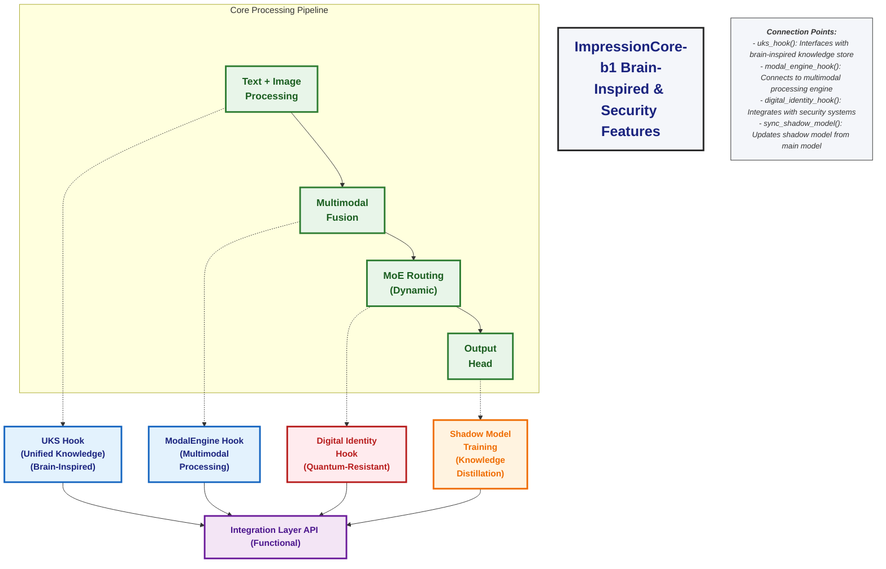

# Impressioncore B1 Brain Security

**Created:** April 16, 2025  
**Updated:** December 29, 2025  
**Author:** Kirk LaSalle; GitHub Copilot  
**Tags:** #ids #standardized_header #docs\reference\impressioncore_b1_brain_security.md #api #documentation #multimodal #security #training  
**Category:** Reference Documentation  
**Status:** Active
**IDS Integration:** This document is indexed and searchable via the ImpressionCore Documentation System (IDS).

---

