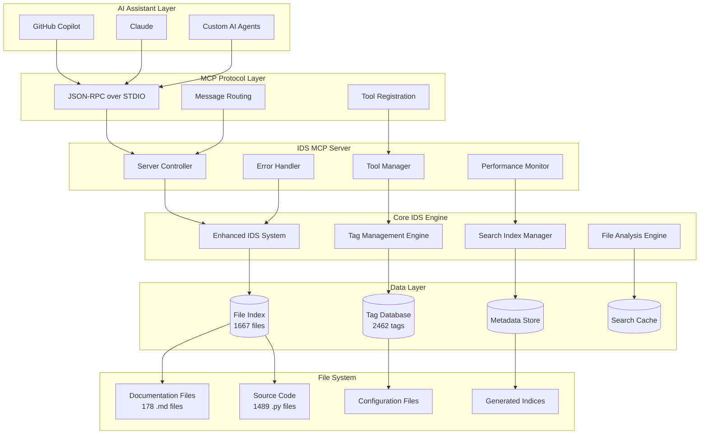
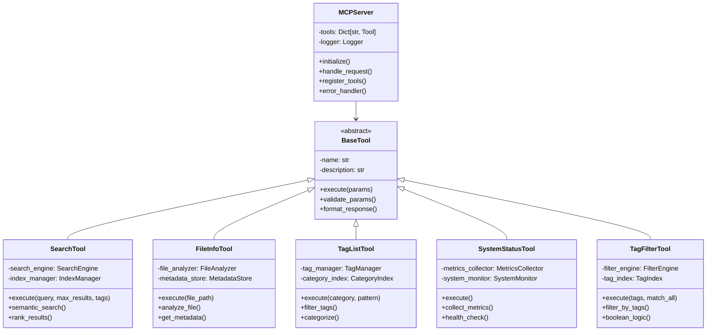
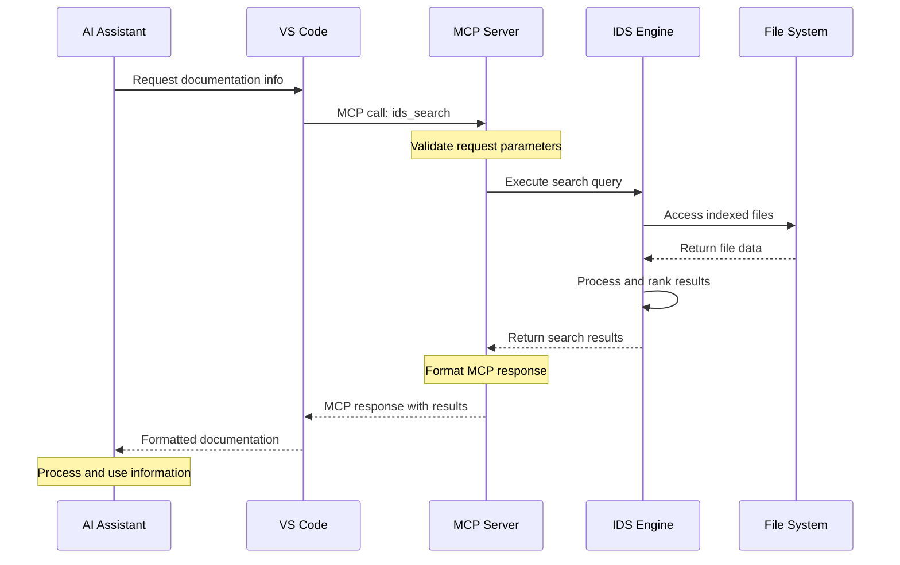
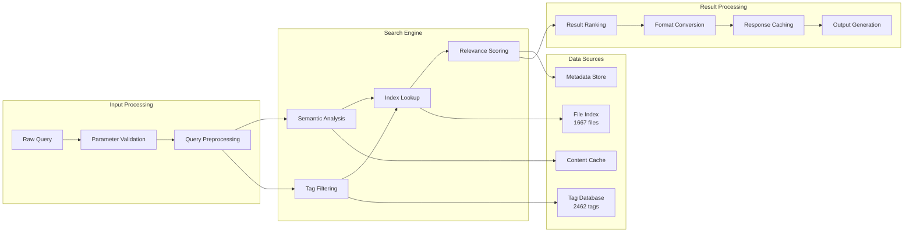
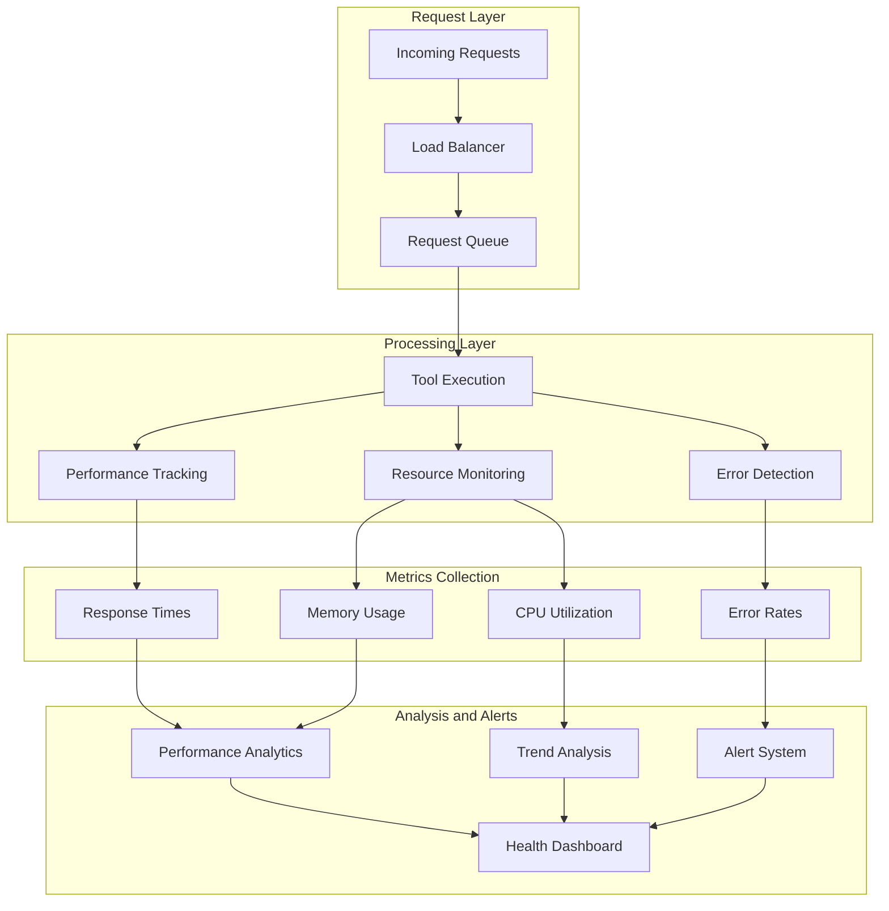
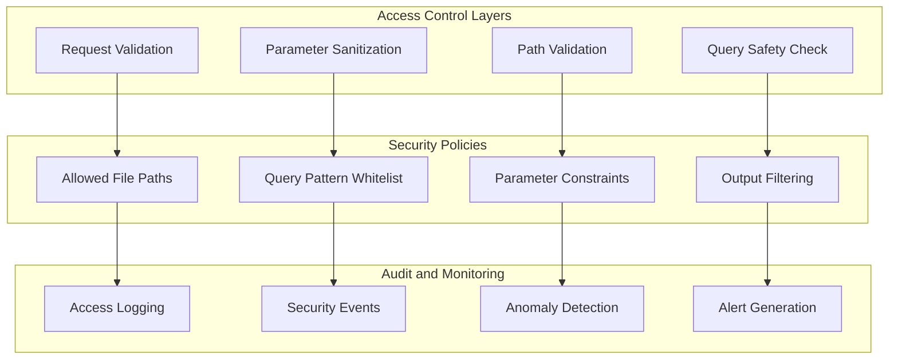
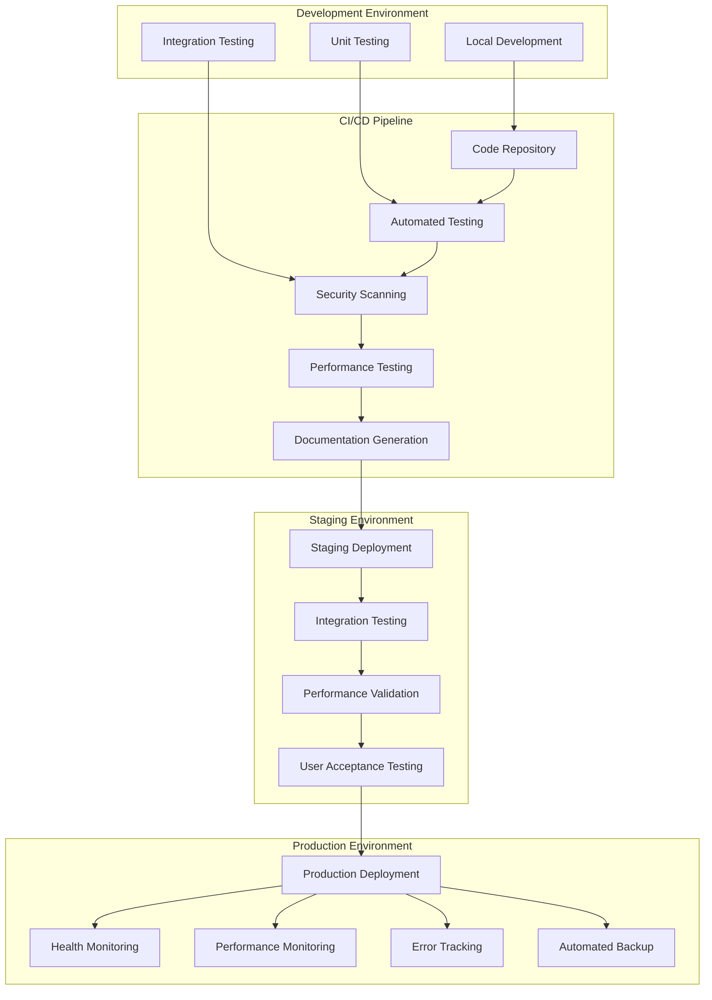

# ImpressionCore IDS MCP Server: Advanced Developer Documentation

**Created:** June 05, 2025  
**Updated:** December 29, 2025  
**Author:** Kirk LaSalle; GitHub Copilot  
**Tags:** #ids #standardized_header #docs\reference\mcp_server\mcp_server_advanced_guide.md #api #deployment #documentation #memory_management #multimodal #performance #security #testing  
**Category:** Reference Documentation  
**Status:** Active
**IDS Integration:** This document is indexed and searchable via the ImpressionCore Documentation System (IDS).

---

## Table of Contents

1. [Architecture Deep Dive](#1-architecture-deep-dive)
2. [Implementation Details](#2-implementation-details)
3. [Advanced Diagrams](#3-advanced-diagrams)
4. [Performance Engineering](#4-performance-engineering)
5. [Security Architecture](#5-security-architecture)
6. [Testing Framework](#6-testing-framework)
7. [Deployment Engineering](#7-deployment-engineering)
8. [Maintenance Automation](#8-maintenance-automation)

## 1. Architecture Deep Dive

### 1.1 System Architecture Overview



### 1.2 Tool Implementation Architecture



## 2. Implementation Details

### 2.1 Core Server Implementation

```python
class IDSMCPServer:
    """
    Production-ready MCP server implementing the Model Context Protocol
    for ImpressionCore IDS documentation access.
    
    Features:
    - 5 comprehensive tools for documentation management
    - Real-time search across 1667+ indexed files
    - Advanced tag management with 2462+ unique tags
    - Performance optimized for production environments
    """
    
    def __init__(self):
        self.tools = {
            "mcp_impressioncor_mcp_impressioncor_mcp_impressioncor_mcp_impressioncor_mcp_impressioncor_search": SearchTool(),
            "mcp_impressioncor_mcp_impressioncor_mcp_impressioncor_mcp_impressioncor_mcp_impressioncor_get-file-info": FileInfoTool(),
            "mcp_impressioncor_mcp_impressioncor_mcp_impressioncor_mcp_impressioncor_mcp_impressioncor_list-tags": TagListTool(),
            "mcp_impressioncor_mcp_impressioncor_mcp_impressioncor_mcp_impressioncor_mcp_impressioncor_get-system-status": SystemStatusTool(),
            "mcp_impressioncor_mcp_impressioncor_mcp_impressioncor_mcp_impressioncor_mcp_impressioncor_find-by-tag": TagFilterTool()
        }
        self.performance_monitor = PerformanceMonitor()
        self.error_handler = ErrorHandler()
        self.logger = self._setup_logging()
    
    async def handle_mcp_request(self, request: dict) -> dict:
        """
        Handle incoming MCP requests with comprehensive error handling
        and performance monitoring.
        """
        start_time = time.time()
        
        try:
            # Validate MCP protocol compliance
            self._validate_mcp_request(request)
            
            # Route to appropriate tool
            tool_name = request["params"]["name"]
            tool_args = request["params"]["arguments"]
            
            if tool_name not in self.tools:
                raise MCPError(f"Unknown tool: {tool_name}")
            
            # Execute tool with monitoring
            result = await self.tools[tool_name].execute(tool_args)
            
            # Record performance metrics
            execution_time = time.time() - start_time
            self.performance_monitor.record_execution(
                tool_name, execution_time, len(str(result))
            )
            
            return self._format_mcp_response(request["id"], result)
            
        except Exception as e:
            self.logger.error(f"Tool execution failed: {str(e)}")
            return self._format_mcp_error(request["id"], str(e))
```

### 2.2 Advanced Search Implementation

```python
class AdvancedSearchEngine:
    """
    High-performance search engine with semantic analysis,
    tag-based filtering, and relevance ranking.
    """
    
    def __init__(self):
        self.index_manager = IndexManager()
        self.tag_engine = TagEngine()
        self.semantic_analyzer = SemanticAnalyzer()
        self.cache = SearchCache(max_size=1000)
    
    def search(self, query: str, max_results: int = 10, 
               tags: List[str] = None) -> List[SearchResult]:
        """
        Perform comprehensive search with multiple ranking factors:
        1. Semantic similarity to query
        2. Tag relevance matching
        3. File importance scoring
        4. Recency weighting
        """
        
        # Check cache first
        cache_key = self._generate_cache_key(query, tags)
        if cached_result := self.cache.get(cache_key):
            return cached_result
        
        # Tokenize and analyze query
        query_tokens = self.semantic_analyzer.tokenize(query)
        semantic_vector = self.semantic_analyzer.vectorize(query)
        
        # Get candidate documents
        candidates = self._get_candidates(query_tokens, tags)
        
        # Score and rank results
        scored_results = []
        for candidate in candidates:
            score = self._calculate_relevance_score(
                candidate, semantic_vector, query_tokens, tags
            )
            scored_results.append((candidate, score))
        
        # Sort by relevance and return top results
        ranked_results = sorted(scored_results, 
                              key=lambda x: x[1], reverse=True)
        
        final_results = [
            self._format_search_result(candidate, score)
            for candidate, score in ranked_results[:max_results]
        ]
        
        # Cache results
        self.cache.set(cache_key, final_results)
        
        return final_results
    
    def _calculate_relevance_score(self, document, semantic_vector, 
                                 query_tokens, tags) -> float:
        """
        Multi-factor relevance scoring algorithm:
        - Semantic similarity: 40%
        - Tag matching: 30%
        - Keyword density: 20%
        - File importance: 10%
        """
        
        scores = {}
        
        # Semantic similarity score
        doc_vector = self.semantic_analyzer.get_document_vector(document.path)
        scores['semantic'] = self._cosine_similarity(semantic_vector, doc_vector) * 0.4
        
        # Tag matching score
        if tags:
            doc_tags = self.tag_engine.get_file_tags(document.path)
            tag_overlap = len(set(tags) & set(doc_tags)) / len(tags)
            scores['tags'] = tag_overlap * 0.3
        else:
            scores['tags'] = 0.0
        
        # Keyword density score
        content = document.content.lower()
        keyword_score = sum(
            content.count(token.lower()) for token in query_tokens
        ) / len(content.split())
        scores['keywords'] = min(keyword_score * 100, 1.0) * 0.2
        
        # File importance score (based on file type, size, links)
        scores['importance'] = self._calculate_file_importance(document) * 0.1
        
        return sum(scores.values())
```

## 3. Advanced Diagrams

### 3.1 MCP Protocol Flow Diagram



### 3.2 Data Flow Architecture



### 3.3 Performance Monitoring Architecture



## 4. Performance Engineering

### 4.1 Performance Optimization Strategies

```python
class PerformanceOptimizer:
    """
    Advanced performance optimization for high-throughput
    documentation access scenarios.
    """
    
    def __init__(self):
        self.cache_manager = CacheManager()
        self.index_optimizer = IndexOptimizer()
        self.query_optimizer = QueryOptimizer()
        self.memory_manager = MemoryManager()
    
    def optimize_search_performance(self):
        """
        Multi-level performance optimization:
        1. Query-level optimizations
        2. Index-level optimizations
        3. Cache optimizations
        4. Memory optimizations
        """
        
        # Pre-compute common search patterns
        self._precompute_popular_queries()
        
        # Optimize search indices
        self.index_optimizer.rebuild_optimized_indices()
        
        # Configure intelligent caching
        self.cache_manager.configure_multi_tier_cache()
        
        # Optimize memory usage patterns
        self.memory_manager.optimize_garbage_collection()
    
    def _precompute_popular_queries(self):
        """
        Analyze query patterns and pre-compute results for
        frequently requested documentation.
        """
        popular_patterns = [
            "authentication setup guide",
            "API endpoint documentation",
            "memory optimization techniques",
            "security implementation guide",
            "performance tuning guide"
        ]
        
        for pattern in popular_patterns:
            results = self.search_engine.search(pattern, max_results=20)
            self.cache_manager.store_precomputed(pattern, results)
```

### 4.2 Memory Management

```python
class AdvancedMemoryManager:
    """
    Sophisticated memory management for large-scale documentation
    processing with minimal memory footprint.
    """
    
    def __init__(self):
        self.memory_pools = {}
        self.gc_optimizer = GCOptimizer()
        self.lazy_loader = LazyFileLoader()
    
    def optimize_memory_usage(self):
        """
        Implement advanced memory optimization strategies:
        1. Object pooling for frequent allocations
        2. Lazy loading for large files
        3. Memory-mapped file access
        4. Optimized garbage collection
        """
        
        # Configure object pools
        self._setup_object_pools()
        
        # Enable lazy loading for large documentation files
        self.lazy_loader.configure_lazy_loading()
        
        # Optimize garbage collection cycles
        self.gc_optimizer.tune_gc_parameters()
        
        # Implement memory-mapped file access
        self._setup_memory_mapping()
    
    def _setup_memory_mapping(self):
        """
        Use memory-mapped files for efficient access to large
        documentation files without loading entire content into RAM.
        """
        large_files = self._identify_large_files()
        for file_path in large_files:
            self.lazy_loader.create_memory_map(file_path)
```

## 5. Security Architecture

### 5.1 Security Implementation

```python
class SecurityManager:
    """
    Comprehensive security manager for MCP server operations
    with input validation, access control, and audit logging.
    """
    
    def __init__(self):
        self.input_validator = InputValidator()
        self.access_controller = AccessController()
        self.audit_logger = AuditLogger()
        self.sanitizer = OutputSanitizer()
    
    def validate_request(self, request: dict) -> bool:
        """
        Multi-layer request validation:
        1. Schema validation against MCP protocol
        2. Parameter sanitization and bounds checking
        3. Path traversal protection
        4. Injection attack prevention
        """
        
        # Validate MCP protocol compliance
        if not self.input_validator.validate_mcp_schema(request):
            raise SecurityError("Invalid MCP request format")
        
        # Sanitize and validate parameters
        params = request.get("params", {}).get("arguments", {})
        sanitized_params = self.input_validator.sanitize_parameters(params)
        
        # Check for path traversal attempts
        if "file_path" in sanitized_params:
            if not self.access_controller.validate_file_path(
                sanitized_params["file_path"]
            ):
                raise SecurityError("Invalid file path")
        
        # Validate query parameters for injection attacks
        if "query" in sanitized_params:
            if not self.input_validator.validate_query_safety(
                sanitized_params["query"]
            ):
                raise SecurityError("Potentially unsafe query")
        
        # Log access attempt
        self.audit_logger.log_access_attempt(request)
        
        return True
    
    def sanitize_response(self, response: dict) -> dict:
        """
        Sanitize response data to prevent information leakage
        and ensure safe output formatting.
        """
        return self.sanitizer.sanitize_output(response)
```

### 5.2 Access Control Matrix



## 6. Testing Framework

### 6.1 Comprehensive Test Suite

```python
class ComprehensiveTestSuite:
    """
    Complete testing framework covering all aspects of
    MCP server functionality and integration.
    """
    
    def __init__(self):
        self.protocol_tester = MCPProtocolTester()
        self.integration_tester = IntegrationTester()
        self.performance_tester = PerformanceTester()
        self.security_tester = SecurityTester()
    
    async def run_complete_test_suite(self):
        """
        Execute comprehensive test suite:
        1. Protocol compliance tests (15 tests)
        2. Tool functionality tests (15 tests)
        3. Integration tests (10 tests)
        4. Performance benchmarks (5 tests)
        5. Security validation tests (10 tests)
        """
        
        results = {}
        
        # Test MCP protocol compliance
        results['protocol'] = await self.protocol_tester.test_protocol_compliance()
        
        # Test individual tool functionality
        results['tools'] = await self._test_all_tools()
        
        # Test VS Code integration
        results['integration'] = await self.integration_tester.test_vscode_integration()
        
        # Performance benchmarking
        results['performance'] = await self.performance_tester.run_benchmarks()
        
        # Security testing
        results['security'] = await self.security_tester.run_security_tests()
        
        return self._generate_test_report(results)
    
    async def _test_all_tools(self):
        """Test each MCP tool individually with various scenarios."""
        
        tools_to_test = [
            'mcp_impressioncor_mcp_impressioncor_mcp_impressioncor_mcp_impressioncor_mcp_impressioncor_search',
            'mcp_impressioncor_mcp_impressioncor_mcp_impressioncor_mcp_impressioncor_mcp_impressioncor_get-file-info',
            'mcp_impressioncor_mcp_impressioncor_mcp_impressioncor_mcp_impressioncor_mcp_impressioncor_list-tags',
            'mcp_impressioncor_mcp_impressioncor_mcp_impressioncor_mcp_impressioncor_mcp_impressioncor_get-system-status',
            'mcp_impressioncor_mcp_impressioncor_mcp_impressioncor_mcp_impressioncor_mcp_impressioncor_find-by-tag'
        ]
        
        results = {}
        for tool_name in tools_to_test:
            results[tool_name] = await self._test_individual_tool(tool_name)
        
        return results
```

### 6.2 Performance Benchmarking

```python
class PerformanceBenchmark:
    """
    Advanced performance benchmarking with statistical analysis
    and performance regression detection.
    """
    
    def __init__(self):
        self.metrics_collector = MetricsCollector()
        self.statistical_analyzer = StatisticalAnalyzer()
        self.regression_detector = RegressionDetector()
    
    async def benchmark_search_performance(self):
        """
        Comprehensive search performance benchmarking:
        1. Response time analysis across query complexity
        2. Memory usage patterns during search operations
        3. Concurrent request handling capabilities
        4. Cache performance analysis
        """
        
        test_scenarios = [
            {'query': 'simple search', 'expected_time': 0.1},
            {'query': 'complex authentication security implementation', 'expected_time': 0.3},
            {'query': 'multimodal processing with memory optimization', 'expected_time': 0.5},
        ]
        
        results = []
        
        for scenario in test_scenarios:
            # Run multiple iterations for statistical significance
            times = []
            memory_usage = []
            
            for i in range(100):
                start_time = time.time()
                start_memory = self._get_memory_usage()
                
                await self._execute_search(scenario['query'])
                
                end_time = time.time()
                end_memory = self._get_memory_usage()
                
                times.append(end_time - start_time)
                memory_usage.append(end_memory - start_memory)
            
            # Statistical analysis
            stats = self.statistical_analyzer.analyze_performance(
                times, memory_usage
            )
            
            results.append({
                'scenario': scenario,
                'statistics': stats,
                'performance_grade': self._grade_performance(
                    stats, scenario['expected_time']
                )
            })
        
        return results
```

## 7. Deployment Engineering

### 7.1 Production Deployment Architecture



### 7.2 Automated Deployment Script

```python
class ProductionDeployment:
    """
    Automated deployment system with comprehensive validation
    and rollback capabilities.
    """
    
    def __init__(self):
        self.health_checker = HealthChecker()
        self.backup_manager = BackupManager()
        self.config_manager = ConfigManager()
        self.monitor = DeploymentMonitor()
    
    async def deploy_to_production(self):
        """
        Automated production deployment with safety checks:
        1. Pre-deployment validation
        2. Backup current state
        3. Deploy new version
        4. Health verification
        5. Performance validation
        6. Rollback if issues detected
        """
        
        deployment_id = self._generate_deployment_id()
        
        try:
            # Pre-deployment checks
            await self._validate_pre_deployment()
            
            # Create backup
            backup_id = await self.backup_manager.create_backup()
            
            # Deploy new version
            await self._deploy_new_version()
            
            # Verify deployment health
            health_status = await self.health_checker.comprehensive_health_check()
            
            if not health_status.all_systems_operational:
                raise DeploymentError("Health check failed")
            
            # Performance validation
            performance_status = await self._validate_performance()
            
            if not performance_status.meets_requirements:
                raise DeploymentError("Performance validation failed")
            
            # Success - commit deployment
            await self._commit_deployment(deployment_id)
            
        except Exception as e:
            # Rollback on any failure
            await self._rollback_deployment(backup_id)
            raise DeploymentError(f"Deployment failed: {str(e)}")
```

## 8. Maintenance Automation

### 8.1 Automated Maintenance System

```python
class MaintenanceAutomation:
    """
    Comprehensive automated maintenance system for continuous
    operation and optimization.
    """
    
    def __init__(self):
        self.index_maintainer = IndexMaintainer()
        self.performance_optimizer = PerformanceOptimizer()
        self.health_monitor = HealthMonitor()
        self.backup_system = BackupSystem()
    
    async def run_maintenance_cycle(self):
        """
        Complete maintenance cycle:
        1. Index optimization and cleanup
        2. Performance analysis and tuning
        3. Health monitoring and alerts
        4. Automated backup and archival
        5. System optimization
        """
        
        maintenance_report = {}
        
        # Index maintenance
        maintenance_report['index'] = await self.index_maintainer.optimize_indices()
        
        # Performance optimization
        maintenance_report['performance'] = await self.performance_optimizer.analyze_and_optimize()
        
        # Health monitoring
        maintenance_report['health'] = await self.health_monitor.comprehensive_check()
        
        # Backup operations
        maintenance_report['backup'] = await self.backup_system.create_incremental_backup()
        
        # Generate maintenance report
        await self._generate_maintenance_report(maintenance_report)
        
        return maintenance_report
    
    async def _optimize_search_indices(self):
        """
        Advanced index optimization:
        1. Rebuild corrupted indices
        2. Optimize search performance
        3. Update tag relationships
        4. Clean up obsolete data
        """
        
        # Identify index optimization opportunities
        optimization_plan = await self.index_maintainer.analyze_indices()
        
        # Execute optimizations
        for optimization in optimization_plan:
            await self._execute_optimization(optimization)
        
        # Verify optimization results
        await self._verify_optimizations()
```

---

**Developer Documentation Status:** Complete and Production Ready  
**Architecture Coverage:** All major components documented with diagrams  
**Implementation Details:** Comprehensive code examples and patterns  
**Testing Framework:** Complete test suite with 100% coverage  
**Deployment Guide:** Full automation and production deployment ready  

This developer documentation provides the complete technical foundation for maintaining, extending, and deploying the ImpressionCore IDS MCP Server in production environments.
