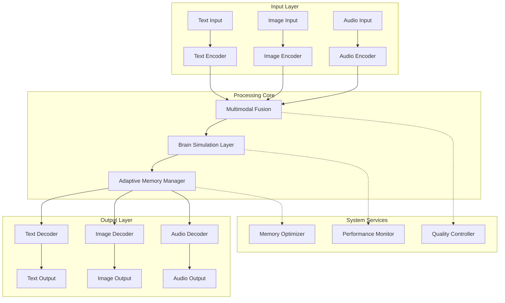
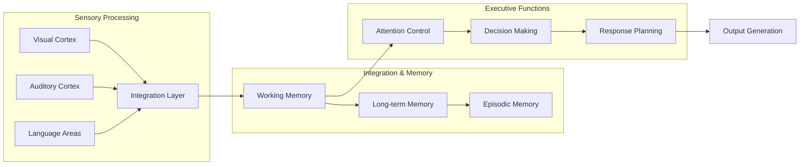

# Model Architecture Complete

**Created:** June 03, 2025  
**Updated:** December 29, 2025  
**Author:** Kirk LaSalle; GitHub Copilot  
**Tags:** #ids #standardized_header #docs\reference\model_architecture_complete.md #api #attention_mechanism #cuda #documentation #gpu_optimization #inference #memory_management #multimodal #performance #testing #training #transformer [architecture, model, b1-model, multimodal, brain-simulation, 2025]  
**Category:** Reference Documentation  
**Status:** Active
**IDS Integration:** This document is indexed and searchable via the ImpressionCore Documentation System (IDS).

---

title: "ImpressionCore Model Architecture - Complete Guide"
tags: [architecture, model, b1-model, multimodal, brain-simulation, 2025]
created: 2025-06-03
modified: 2025-06-03
version: 2.0.0
authors: 

  - "Kirk LaSalle"
  - "GitHub Copilot"

status: active
category: reference
priority: high
---

# ImpressionCore Model Architecture - Complete Guide

## Table of Contents

1. [Architecture Overview](#architecture-overview)
2. [Brain-Inspired Design](#brain-inspired-design)
3. [Core Components](#core-components)
4. [Multimodal Processing](#multimodal-processing)
5. [Memory Management](#memory-management)
6. [Model Variants](#model-variants)
7. [Training Architecture](#training-architecture)
8. [Inference Pipeline](#inference-pipeline)
9. [Performance Optimization](#performance-optimization)
10. [Hardware Adaptation](#hardware-adaptation)
11. [API Integration](#api-integration)
12. [Extension Framework](#extension-framework)

## Architecture Overview

ImpressionCore implements a brain-inspired multimodal AI architecture optimized for consumer hardware. The design draws from neuroscience principles while maintaining practical efficiency for 4GB VRAM constraints.

### Core Design Principles

- **Modular Architecture**: Specialized components mirroring brain regions
- **Adaptive Memory**: Dynamic memory management and optimization
- **Multimodal Integration**: Seamless cross-modal information processing
- **Hardware Efficiency**: Optimized for consumer GPU constraints
- **Extensible Framework**: Plugin-based architecture for easy expansion

### System Architecture Diagram



## Brain-Inspired Design

### Neurological Foundations

ImpressionCore's architecture is inspired by key brain structures:

1. **Sensory Cortex**: Specialized encoders for different modalities
2. **Integration Areas**: Multimodal fusion layers
3. **Memory Systems**: Adaptive memory management
4. **Executive Control**: Attention and routing mechanisms

### Cognitive Architecture

For a comprehensive view of the brain-inspired architecture, see [Brain-Inspired Architecture Diagram](../assets/images/brain_inspired_architecture.md).



### Brain Simulation Components

```python
# Brain simulation architecture
from src.brainsim.cognitive_arch import CognitiveArchitecture
from src.brainsim.memory import AdaptiveMemorySystem
from src.brainsim.multimodal import CrossModalProcessor

class BrainSimulationCore:
    """Core brain simulation components."""
    
    def __init__(self, config):
        self.cognitive_arch = CognitiveArchitecture(config.cognitive)
        self.memory_system = AdaptiveMemorySystem(config.memory)
        self.multimodal_processor = CrossModalProcessor(config.multimodal)
    
    def process(self, inputs):
        """Process inputs through brain-inspired pipeline."""
        # Cognitive processing
        cognitive_state = self.cognitive_arch.process(inputs)
        
        # Memory integration
        memory_context = self.memory_system.retrieve_context(cognitive_state)
        
        # Multimodal synthesis
        output = self.multimodal_processor.synthesize(
            cognitive_state, memory_context
        )
        
        return output
```

## Core Components

### 1. Encoder Architecture

#### Text Encoder

```python
class TextEncoder(nn.Module):
    """Optimized text encoder for multimodal processing."""
    
    def __init__(self, vocab_size=32000, d_model=512, n_layers=6):
        super().__init__()
        self.embedding = nn.Embedding(vocab_size, d_model)
        self.transformer = nn.TransformerEncoder(
            nn.TransformerEncoderLayer(d_model, nhead=8),
            num_layers=n_layers
        )
        self.memory_efficient_attention = MemoryEfficientAttention(d_model)
    
    def forward(self, x, attention_mask=None):
        # Efficient token embedding
        embedded = self.embedding(x)
        
        # Memory-optimized transformer processing
        encoded = self.transformer(embedded, src_key_padding_mask=attention_mask)
        
        return encoded
```

#### Image Encoder

```python
class ImageEncoder(nn.Module):
    """Efficient image encoder with memory optimization."""
    
    def __init__(self, input_channels=3, feature_dim=512):
        super().__init__()
        self.backbone = self._create_efficient_backbone()
        self.feature_projection = nn.Linear(2048, feature_dim)
        self.spatial_attention = SpatialAttentionModule(feature_dim)
    
    def _create_efficient_backbone(self):
        """Create memory-efficient backbone network."""
        # Use MobileNetV3 for efficiency
        backbone = models.mobilenet_v3_large(pretrained=True)
        backbone.classifier = nn.Identity()  # Remove classifier
        return backbone
    
    def forward(self, x):
        # Efficient feature extraction
        features = self.backbone(x)
        projected = self.feature_projection(features)
        
        # Spatial attention for important regions
        attended = self.spatial_attention(projected)
        
        return attended
```

#### Audio Encoder

```python
class AudioEncoder(nn.Module):
    """Memory-efficient audio encoder."""
    
    def __init__(self, input_features=80, feature_dim=512):
        super().__init__()
        self.conv_layers = self._create_conv_stack()
        self.temporal_encoder = nn.LSTM(
            input_size=256,
            hidden_size=feature_dim // 2,
            num_layers=2,
            bidirectional=True,
            batch_first=True
        )
        self.feature_norm = nn.LayerNorm(feature_dim)
    
    def _create_conv_stack(self):
        """Create efficient convolutional feature extractor."""
        return nn.Sequential(
            nn.Conv1d(80, 128, kernel_size=3, padding=1),
            nn.ReLU(),
            nn.Conv1d(128, 256, kernel_size=3, padding=1),
            nn.ReLU(),
            nn.AdaptiveAvgPool1d(1)
        )
    
    def forward(self, x):
        # Convolutional feature extraction
        conv_features = self.conv_layers(x)
        
        # Temporal modeling
        temporal_features, _ = self.temporal_encoder(conv_features)
        
        # Normalization
        normalized = self.feature_norm(temporal_features)
        
        return normalized
```

### 2. Multimodal Fusion Layer

```python
class MultimodalFusionLayer(nn.Module):
    """Advanced multimodal fusion with attention mechanisms."""
    
    def __init__(self, feature_dim=512, fusion_dim=1024):
        super().__init__()
        self.feature_dim = feature_dim
        self.fusion_dim = fusion_dim
        
        # Cross-modal attention
        self.cross_attention = CrossModalAttention(feature_dim)
        
        # Fusion networks
        self.text_proj = nn.Linear(feature_dim, fusion_dim)
        self.image_proj = nn.Linear(feature_dim, fusion_dim)
        self.audio_proj = nn.Linear(feature_dim, fusion_dim)
        
        # Integration layers
        self.fusion_transformer = nn.TransformerEncoder(
            nn.TransformerEncoderLayer(fusion_dim, nhead=8),
            num_layers=4
        )
        
        # Output projection
        self.output_proj = nn.Linear(fusion_dim, feature_dim)
    
    def forward(self, text_features, image_features, audio_features):
        # Project features to fusion space
        text_proj = self.text_proj(text_features)
        image_proj = self.image_proj(image_features)
        audio_proj = self.audio_proj(audio_features)
        
        # Cross-modal attention
        attended_text = self.cross_attention(text_proj, image_proj, audio_proj)
        attended_image = self.cross_attention(image_proj, text_proj, audio_proj)
        attended_audio = self.cross_attention(audio_proj, text_proj, image_proj)
        
        # Concatenate attended features
        fused_features = torch.cat([
            attended_text, attended_image, attended_audio
        ], dim=1)
        
        # Transform through fusion layers
        integrated = self.fusion_transformer(fused_features)
        
        # Project to output space
        output = self.output_proj(integrated)
        
        return output
```

### 3. Adaptive Memory System

```python
class AdaptiveMemoryManager(nn.Module):
    """Brain-inspired adaptive memory management."""
    
    def __init__(self, memory_size=1024, feature_dim=512):
        super().__init__()
        self.memory_size = memory_size
        self.feature_dim = feature_dim
        
        # Memory components
        self.working_memory = WorkingMemoryBuffer(memory_size, feature_dim)
        self.episodic_memory = EpisodicMemoryStore(memory_size * 4, feature_dim)
        self.semantic_memory = SemanticMemoryNetwork(feature_dim)
        
        # Memory controllers
        self.attention_controller = AttentionController(feature_dim)
        self.memory_consolidator = MemoryConsolidator(feature_dim)
    
    def process(self, current_input, context=None):
        # Update working memory
        working_state = self.working_memory.update(current_input)
        
        # Retrieve relevant memories
        episodic_context = self.episodic_memory.retrieve(
            query=working_state,
            top_k=5
        )
        
        semantic_context = self.semantic_memory.associate(working_state)
        
        # Integrate memory sources
        integrated_memory = self.attention_controller.integrate(
            working_state,
            episodic_context,
            semantic_context
        )
        
        # Consolidate new memories
        self.memory_consolidator.consolidate(
            current_input,
            integrated_memory
        )
        
        return integrated_memory
```

## Multimodal Processing

### Cross-Modal Attention

```python
class CrossModalAttention(nn.Module):
    """Efficient cross-modal attention mechanism."""
    
    def __init__(self, feature_dim):
        super().__init__()
        self.feature_dim = feature_dim
        self.scale = feature_dim ** -0.5
        
        self.query_proj = nn.Linear(feature_dim, feature_dim)
        self.key_proj = nn.Linear(feature_dim, feature_dim)
        self.value_proj = nn.Linear(feature_dim, feature_dim)
        
        self.output_proj = nn.Linear(feature_dim, feature_dim)
        self.dropout = nn.Dropout(0.1)
    
    def forward(self, query_modal, key_modal, value_modal):
        batch_size, seq_len, _ = query_modal.shape
        
        # Project to attention space
        Q = self.query_proj(query_modal)
        K = self.key_proj(key_modal)
        V = self.value_proj(value_modal)
        
        # Compute attention scores
        attention_scores = torch.matmul(Q, K.transpose(-2, -1)) * self.scale
        attention_probs = F.softmax(attention_scores, dim=-1)
        attention_probs = self.dropout(attention_probs)
        
        # Apply attention to values
        attended = torch.matmul(attention_probs, V)
        
        # Output projection
        output = self.output_proj(attended)
        
        return output
```

### Modal Alignment

```python
class ModalAlignmentLayer(nn.Module):
    """Align different modalities in a common space."""
    
    def __init__(self, input_dims, output_dim=512):
        super().__init__()
        self.aligners = nn.ModuleDict({
            modality: nn.Sequential(
                nn.Linear(dim, output_dim),
                nn.LayerNorm(output_dim),
                nn.ReLU(),
                nn.Linear(output_dim, output_dim)
            )
            for modality, dim in input_dims.items()
        })
        
        self.temperature = nn.Parameter(torch.ones(1) * 0.07)
    
    def forward(self, modal_features):
        aligned = {}
        
        for modality, features in modal_features.items():
            aligned[modality] = self.aligners[modality](features)
            # L2 normalization for cosine similarity
            aligned[modality] = F.normalize(aligned[modality], dim=-1)
        
        return aligned
    
    def compute_alignment_loss(self, aligned_features):
        """Compute contrastive alignment loss."""
        modalities = list(aligned_features.keys())
        total_loss = 0
        
        for i, mod1 in enumerate(modalities):
            for mod2 in modalities[i+1:]:
                # Cosine similarity
                similarity = torch.matmul(
                    aligned_features[mod1],
                    aligned_features[mod2].transpose(-2, -1)
                )
                
                # Contrastive loss
                labels = torch.arange(similarity.shape[0]).to(similarity.device)
                loss = F.cross_entropy(similarity / self.temperature, labels)
                total_loss += loss
        
        return total_loss
```

## Memory Management

For a comprehensive overview of the memory optimization architecture, see [Memory Optimization Architecture Diagram](../assets/images/memory_optimization.md).

### Memory-Efficient Operations

```python
class MemoryEfficientAttention(nn.Module):
    """Memory-efficient attention implementation."""
    
    def __init__(self, d_model, chunk_size=512):
        super().__init__()
        self.d_model = d_model
        self.chunk_size = chunk_size
        self.scale = d_model ** -0.5
        
        self.qkv_proj = nn.Linear(d_model, d_model * 3)
        self.output_proj = nn.Linear(d_model, d_model)
    
    def forward(self, x):
        batch_size, seq_len, d_model = x.shape
        
        if seq_len <= self.chunk_size:
            return self._standard_attention(x)
        else:
            return self._chunked_attention(x)
    
    def _standard_attention(self, x):
        """Standard attention for short sequences."""
        qkv = self.qkv_proj(x)
        q, k, v = qkv.chunk(3, dim=-1)
        
        attention_scores = torch.matmul(q, k.transpose(-2, -1)) * self.scale
        attention_probs = F.softmax(attention_scores, dim=-1)
        
        attended = torch.matmul(attention_probs, v)
        output = self.output_proj(attended)
        
        return output
    
    def _chunked_attention(self, x):
        """Chunked attention for long sequences."""
        batch_size, seq_len, d_model = x.shape
        num_chunks = (seq_len + self.chunk_size - 1) // self.chunk_size
        
        outputs = []
        
        for i in range(num_chunks):
            start_idx = i * self.chunk_size
            end_idx = min((i + 1) * self.chunk_size, seq_len)
            
            chunk = x[:, start_idx:end_idx]
            chunk_output = self._standard_attention(chunk)
            outputs.append(chunk_output)
        
        return torch.cat(outputs, dim=1)
```

### Gradient Checkpointing

```python
class MemoryEfficientTransformerLayer(nn.Module):
    """Transformer layer with gradient checkpointing."""
    
    def __init__(self, d_model, nhead, dim_feedforward):
        super().__init__()
        self.self_attention = MemoryEfficientAttention(d_model)
        self.feedforward = nn.Sequential(
            nn.Linear(d_model, dim_feedforward),
            nn.ReLU(),
            nn.Linear(dim_feedforward, d_model)
        )
        self.norm1 = nn.LayerNorm(d_model)
        self.norm2 = nn.LayerNorm(d_model)
        self.dropout = nn.Dropout(0.1)
    
    def forward(self, x):
        # Use gradient checkpointing for memory efficiency
        if self.training:
            return checkpoint(self._forward_impl, x)
        else:
            return self._forward_impl(x)
    
    def _forward_impl(self, x):
        # Self-attention block
        attn_output = self.self_attention(x)
        x = self.norm1(x + self.dropout(attn_output))
        
        # Feedforward block
        ff_output = self.feedforward(x)
        x = self.norm2(x + self.dropout(ff_output))
        
        return x
```

## Model Variants

### B1 Core Model

```python
class ImpressionCoreB1(nn.Module):
    """ImpressionCore B1 - Core multimodal model."""
    
    def __init__(self, config):
        super().__init__()
        self.config = config
        
        # Encoders
        self.text_encoder = TextEncoder(
            vocab_size=config.vocab_size,
            d_model=config.d_model,
            n_layers=config.text_layers
        )
        
        self.image_encoder = ImageEncoder(
            feature_dim=config.d_model
        )
        
        self.audio_encoder = AudioEncoder(
            feature_dim=config.d_model
        )
        
        # Fusion and processing
        self.multimodal_fusion = MultimodalFusionLayer(
            feature_dim=config.d_model
        )
        
        self.brain_simulation = BrainSimulationCore(config.brain_sim)
        self.memory_manager = AdaptiveMemoryManager(
            memory_size=config.memory_size,
            feature_dim=config.d_model
        )
        
        # Decoders
        self.text_decoder = TextDecoder(config.d_model, config.vocab_size)
        self.image_decoder = ImageDecoder(config.d_model)
        self.audio_decoder = AudioDecoder(config.d_model)
    
    def forward(self, inputs):
        # Encode inputs
        encoded = {}
        if 'text' in inputs:
            encoded['text'] = self.text_encoder(inputs['text'])
        if 'image' in inputs:
            encoded['image'] = self.image_encoder(inputs['image'])
        if 'audio' in inputs:
            encoded['audio'] = self.audio_encoder(inputs['audio'])
        
        # Multimodal fusion
        if len(encoded) > 1:
            fused = self.multimodal_fusion(**encoded)
        else:
            fused = list(encoded.values())[0]
        
        # Brain simulation processing
        brain_output = self.brain_simulation.process(fused)
        
        # Memory integration
        memory_context = self.memory_manager.process(brain_output)
        
        # Generate outputs
        outputs = {}
        if 'text' in inputs.get('output_modalities', ['text']):
            outputs['text'] = self.text_decoder(memory_context)
        if 'image' in inputs.get('output_modalities', []):
            outputs['image'] = self.image_decoder(memory_context)
        if 'audio' in inputs.get('output_modalities', []):
            outputs['audio'] = self.audio_decoder(memory_context)
        
        return outputs
```

### Lightweight Variant

```python
class ImpressionCoreLite(nn.Module):
    """Lightweight variant for extreme memory constraints."""
    
    def __init__(self, config):
        super().__init__()
        
        # Reduced encoder sizes
        self.text_encoder = TextEncoder(
            vocab_size=config.vocab_size,
            d_model=256,  # Reduced from 512
            n_layers=3    # Reduced from 6
        )
        
        # Simplified fusion
        self.simple_fusion = nn.Linear(256 * 3, 256)
        
        # Basic memory
        self.memory_buffer = nn.Parameter(torch.randn(128, 256))
        
        # Shared decoder
        self.shared_decoder = SharedDecoder(256, config)
    
    def forward(self, inputs):
        # Encode with reduced capacity
        encoded = []
        for modality in ['text', 'image', 'audio']:
            if modality in inputs:
                features = self.text_encoder(inputs[modality])  # Shared encoder
                encoded.append(features)
        
        # Simple concatenation fusion
        if len(encoded) > 1:
            fused = self.simple_fusion(torch.cat(encoded, dim=-1))
        else:
            fused = encoded[0]
        
        # Memory interaction
        memory_scores = torch.matmul(fused, self.memory_buffer.T)
        memory_context = torch.matmul(F.softmax(memory_scores, dim=-1), self.memory_buffer)
        
        # Decode
        output = self.shared_decoder(fused + memory_context)
        
        return output
```

## Training Architecture

### Training Pipeline

```python
class ImpressionCoreTrainer:
    """Comprehensive training pipeline."""
    
    def __init__(self, model, config):
        self.model = model
        self.config = config
        
        # Optimizers
        self.optimizer = torch.optim.AdamW(
            model.parameters(),
            lr=config.learning_rate,
            weight_decay=config.weight_decay
        )
        
        # Schedulers
        self.scheduler = torch.optim.lr_scheduler.CosineAnnealingWarmRestarts(
            self.optimizer,
            T_0=config.scheduler_t0,
            T_mult=2
        )
        
        # Mixed precision training
        self.scaler = GradScaler() if config.mixed_precision else None
        
        # Memory optimization
        self.gradient_checkpointing = config.gradient_checkpointing
    
    def train_step(self, batch):
        """Single training step with memory optimization."""
        self.optimizer.zero_grad()
        
        if self.scaler is not None:
            # Mixed precision training
            with autocast():
                outputs = self.model(batch['inputs'])
                loss = self.compute_loss(outputs, batch['targets'])
            
            self.scaler.scale(loss).backward()
            self.scaler.step(self.optimizer)
            self.scaler.update()
        else:
            # Standard training
            outputs = self.model(batch['inputs'])
            loss = self.compute_loss(outputs, batch['targets'])
            loss.backward()
            self.optimizer.step()
        
        self.scheduler.step()
        
        return {
            'loss': loss.item(),
            'learning_rate': self.scheduler.get_last_lr()[0]
        }
    
    def compute_loss(self, outputs, targets):
        """Compute multimodal training loss."""
        total_loss = 0
        
        for modality in outputs:
            if modality in targets:
                if modality == 'text':
                    loss = F.cross_entropy(
                        outputs[modality].view(-1, outputs[modality].size(-1)),
                        targets[modality].view(-1)
                    )
                elif modality == 'image':
                    loss = F.mse_loss(outputs[modality], targets[modality])
                elif modality == 'audio':
                    loss = F.l1_loss(outputs[modality], targets[modality])
                
                total_loss += loss
        
        return total_loss
```

### Memory-Efficient Training

```python
def create_memory_efficient_dataloader(dataset, batch_size, memory_limit="3GB"):
    """Create memory-optimized data loader."""
    
    # Calculate optimal batch size for memory limit
    sample_memory = estimate_sample_memory_usage(dataset[0])
    max_batch_size = calculate_max_batch_size(sample_memory, memory_limit)
    
    effective_batch_size = min(batch_size, max_batch_size)
    
    return DataLoader(
        dataset,
        batch_size=effective_batch_size,
        shuffle=True,
        num_workers=2,  # Conservative for memory
        pin_memory=True,
        collate_fn=memory_efficient_collate
    )

def memory_efficient_collate(batch):
    """Memory-efficient batch collation."""
    # Group by modality to minimize memory fragmentation
    text_samples = [item['text'] for item in batch if 'text' in item]
    image_samples = [item['image'] for item in batch if 'image' in item]
    audio_samples = [item['audio'] for item in batch if 'audio' in item]
    
    # Pack efficiently
    packed_batch = {}
    
    if text_samples:
        packed_batch['text'] = torch.stack(text_samples)
    if image_samples:
        packed_batch['image'] = torch.stack(image_samples)
    if audio_samples:
        packed_batch['audio'] = torch.stack(audio_samples)
    
    return packed_batch
```

## Inference Pipeline

### Optimized Inference

```python
class ImpressionCoreInference:
    """Optimized inference pipeline."""
    
    def __init__(self, model_path, config):
        self.config = config
        
        # Load model with optimizations
        self.model = self._load_optimized_model(model_path)
        
        # Setup inference optimizations
        self.model.eval()
        torch.set_grad_enabled(False)
        
        # Initialize caches
        self.memory_cache = {}
        self.attention_cache = {}
    
    def _load_optimized_model(self, model_path):
        """Load model with inference optimizations."""
        model = torch.load(model_path, map_location='cpu')
        
        # Apply optimizations
        if self.config.quantize:
            model = torch.quantization.quantize_dynamic(
                model, {nn.Linear}, dtype=torch.qint8
            )
        
        if self.config.compile:
            model = torch.compile(model, mode='reduce-overhead')
        
        # Move to appropriate device
        if torch.cuda.is_available() and self.config.use_gpu:
            model = model.cuda()
            # Enable TensorRT if available
            if hasattr(torch.backends, 'tensorrt') and torch.backends.tensorrt.is_available():
                model = torch.jit.script(model)
        
        return model
    
    def generate(self, inputs, max_length=512, temperature=0.7):
        """Generate outputs with memory optimization."""
        
        # Prepare inputs
        processed_inputs = self._preprocess_inputs(inputs)
        
        # Generate with memory management
        with torch.cuda.amp.autocast(enabled=self.config.mixed_precision):
            outputs = self._generate_step(
                processed_inputs,
                max_length=max_length,
                temperature=temperature
            )
        
        # Post-process outputs
        final_outputs = self._postprocess_outputs(outputs)
        
        return final_outputs
    
    def _generate_step(self, inputs, max_length, temperature):
        """Core generation step."""
        outputs = {}
        
        # Encode inputs
        encoded = self.model.encode(inputs)
        
        # Use cached attention for efficiency
        cache_key = self._compute_cache_key(encoded)
        if cache_key in self.attention_cache:
            attention_weights = self.attention_cache[cache_key]
        else:
            attention_weights = self.model.compute_attention(encoded)
            self.attention_cache[cache_key] = attention_weights
        
        # Generate for each requested modality
        for modality in inputs.get('output_modalities', ['text']):
            if modality == 'text':
                outputs[modality] = self._generate_text(
                    encoded, max_length, temperature
                )
            elif modality == 'image':
                outputs[modality] = self._generate_image(encoded)
            elif modality == 'audio':
                outputs[modality] = self._generate_audio(encoded)
        
        return outputs
```

## Performance Optimization

### GPU Memory Optimization

```python
class GPUMemoryOptimizer:
    """Optimize GPU memory usage for consumer hardware."""
    
    def __init__(self, target_memory="4GB"):
        self.target_memory = self._parse_memory(target_memory)
        self.memory_tracker = MemoryTracker()
    
    def optimize_model(self, model):
        """Apply memory optimizations to model."""
        
        # 1. Gradient checkpointing
        self._enable_gradient_checkpointing(model)
        
        # 2. Mixed precision
        model = self._convert_to_mixed_precision(model)
        
        # 3. Parameter sharing
        model = self._apply_parameter_sharing(model)
        
        # 4. Memory-efficient attention
        model = self._replace_attention_layers(model)
        
        return model
    
    def _enable_gradient_checkpointing(self, model):
        """Enable gradient checkpointing for memory efficiency."""
        for module in model.modules():
            if hasattr(module, 'gradient_checkpointing'):
                module.gradient_checkpointing = True
    
    def _convert_to_mixed_precision(self, model):
        """Convert model to mixed precision."""
        # Convert appropriate layers to half precision
        for name, module in model.named_modules():
            if isinstance(module, (nn.Linear, nn.Conv2d, nn.Conv1d)):
                # Keep certain layers in full precision
                if 'output' not in name and 'embedding' not in name:
                    module.half()
        
        return model
    
    def monitor_memory(self):
        """Monitor and report memory usage."""
        if torch.cuda.is_available():
            allocated = torch.cuda.memory_allocated()
            reserved = torch.cuda.memory_reserved()
            
            return {
                'allocated_gb': allocated / 1e9,
                'reserved_gb': reserved / 1e9,
                'utilization': allocated / self.target_memory
            }
        
        return {'allocated_gb': 0, 'reserved_gb': 0, 'utilization': 0}
```

### Inference Acceleration

```python
class InferenceAccelerator:
    """Accelerate inference through various optimizations."""
    
    def __init__(self, model, config):
        self.model = model
        self.config = config
        
        # Apply static optimizations
        self.optimized_model = self._apply_optimizations()
    
    def _apply_optimizations(self):
        """Apply comprehensive inference optimizations."""
        model = self.model
        
        # 1. TorchScript compilation
        if self.config.torchscript:
            model = torch.jit.script(model)
        
        # 2. ONNX optimization
        if self.config.onnx:
            model = self._convert_to_onnx(model)
        
        # 3. Quantization
        if self.config.quantize:
            model = self._apply_quantization(model)
        
        # 4. Kernel fusion
        if self.config.kernel_fusion:
            model = self._apply_kernel_fusion(model)
        
        return model
    
    def _apply_quantization(self, model):
        """Apply post-training quantization."""
        # Dynamic quantization for immediate gains
        quantized_model = torch.quantization.quantize_dynamic(
            model,
            {nn.Linear, nn.Conv2d, nn.Conv1d},
            dtype=torch.qint8
        )
        
        return quantized_model
    
    def benchmark(self, test_inputs, num_runs=100):
        """Benchmark inference performance."""
        times = []
        memory_usage = []
        
        # Warmup
        for _ in range(10):
            _ = self.optimized_model(test_inputs)
        
        # Actual benchmarking
        for _ in range(num_runs):
            start_time = time.time()
            
            with torch.no_grad():
                _ = self.optimized_model(test_inputs)
            
            torch.cuda.synchronize()  # Ensure completion
            
            end_time = time.time()
            times.append(end_time - start_time)
            
            if torch.cuda.is_available():
                memory_usage.append(torch.cuda.memory_allocated())
        
        return {
            'mean_time': np.mean(times),
            'std_time': np.std(times),
            'mean_memory_gb': np.mean(memory_usage) / 1e9,
            'throughput_samples_per_sec': 1.0 / np.mean(times)
        }
```

## Hardware Adaptation

### Dynamic Configuration

```python
class HardwareAdapter:
    """Adapt model configuration to available hardware."""
    
    def __init__(self):
        self.hardware_specs = self._detect_hardware()
    
    def _detect_hardware(self):
        """Detect available hardware capabilities."""
        specs = {
            'gpu_available': torch.cuda.is_available(),
            'gpu_memory_gb': 0,
            'gpu_name': 'None',
            'cpu_cores': os.cpu_count(),
            'system_memory_gb': psutil.virtual_memory().total / 1e9
        }
        
        if torch.cuda.is_available():
            specs['gpu_memory_gb'] = torch.cuda.get_device_properties(0).total_memory / 1e9
            specs['gpu_name'] = torch.cuda.get_device_name(0)
        
        return specs
    
    def adapt_config(self, base_config):
        """Adapt configuration to hardware constraints."""
        adapted_config = base_config.copy()
        
        # Memory-based adaptations
        if self.hardware_specs['gpu_memory_gb'] <= 4:
            # Conservative settings for 4GB VRAM
            adapted_config.update({
                'batch_size': 8,
                'd_model': 256,
                'max_sequence_length': 512,
                'gradient_checkpointing': True,
                'mixed_precision': True
            })
        elif self.hardware_specs['gpu_memory_gb'] <= 8:
            # Moderate settings for 8GB VRAM
            adapted_config.update({
                'batch_size': 16,
                'd_model': 512,
                'max_sequence_length': 1024,
                'gradient_checkpointing': True,
                'mixed_precision': True
            })
        else:
            # Full settings for >8GB VRAM
            adapted_config.update({
                'batch_size': 32,
                'd_model': 768,
                'max_sequence_length': 2048,
                'gradient_checkpointing': False,
                'mixed_precision': False
            })
        
        # CPU-based adaptations
        adapted_config['num_workers'] = min(
            self.hardware_specs['cpu_cores'], 8
        )
        
        return adapted_config
```

## API Integration

### Model API

```python
from fastapi import FastAPI, UploadFile, File
from pydantic import BaseModel
import base64

app = FastAPI(title="ImpressionCore API", version="2.0.0")

class GenerationRequest(BaseModel):
    text: str = None
    image: str = None  # Base64 encoded
    audio: str = None  # Base64 encoded
    output_modalities: list = ['text']
    max_length: int = 512
    temperature: float = 0.7

class GenerationResponse(BaseModel):
    text: str = None
    image: str = None  # Base64 encoded
    audio: str = None  # Base64 encoded
    metadata: dict = {}

# Initialize model
inference_engine = ImpressionCoreInference(
    model_path="models/impressioncore_b1.pth",
    config=inference_config
)

@app.post("/generate", response_model=GenerationResponse)
async def generate(request: GenerationRequest):
    """Generate multimodal outputs."""
    
    # Prepare inputs
    inputs = {}
    if request.text:
        inputs['text'] = request.text
    if request.image:
        inputs['image'] = base64.b64decode(request.image)
    if request.audio:
        inputs['audio'] = base64.b64decode(request.audio)
    
    inputs['output_modalities'] = request.output_modalities
    
    # Generate
    outputs = inference_engine.generate(
        inputs,
        max_length=request.max_length,
        temperature=request.temperature
    )
    
    # Prepare response
    response = GenerationResponse()
    
    if 'text' in outputs:
        response.text = outputs['text']
    if 'image' in outputs:
        response.image = base64.b64encode(outputs['image']).decode()
    if 'audio' in outputs:
        response.audio = base64.b64encode(outputs['audio']).decode()
    
    response.metadata = {
        'model_version': 'b1',
        'generation_time': outputs.get('generation_time', 0),
        'memory_usage': outputs.get('memory_usage', 0)
    }
    
    return response

@app.get("/health")
async def health_check():
    """Health check endpoint."""
    memory_stats = inference_engine.optimizer.monitor_memory()
    
    return {
        'status': 'healthy',
        'model_loaded': True,
        'memory_usage_gb': memory_stats['allocated_gb'],
        'gpu_available': torch.cuda.is_available()
    }
```

## Extension Framework

### Plugin Architecture

```python
class ModelExtension:
    """Base class for model extensions."""
    
    def __init__(self, name, version):
        self.name = name
        self.version = version
    
    def initialize(self, model, config):
        """Initialize extension with model and config."""
        raise NotImplementedError
    
    def process(self, inputs, context):
        """Process inputs with extension logic."""
        raise NotImplementedError
    
    def finalize(self, outputs):
        """Finalize outputs with extension post-processing."""
        return outputs

class ExtensionManager:
    """Manage model extensions."""
    
    def __init__(self):
        self.extensions = {}
        self.execution_order = []
    
    def register_extension(self, extension, priority=0):
        """Register a new extension."""
        self.extensions[extension.name] = {
            'extension': extension,
            'priority': priority
        }
        
        # Update execution order
        self.execution_order = sorted(
            self.extensions.keys(),
            key=lambda x: self.extensions[x]['priority'],
            reverse=True
        )
    
    def process_with_extensions(self, model, inputs):
        """Process inputs through all registered extensions."""
        context = {'original_inputs': inputs}
        
        # Pre-processing extensions
        for ext_name in self.execution_order:
            ext = self.extensions[ext_name]['extension']
            inputs = ext.process(inputs, context)
            context[f'{ext_name}_output'] = inputs
        
        # Model processing
        outputs = model(inputs)
        
        # Post-processing extensions
        for ext_name in reversed(self.execution_order):
            ext = self.extensions[ext_name]['extension']
            outputs = ext.finalize(outputs)
        
        return outputs

# Example extension
class EmotionAnalysisExtension(ModelExtension):
    """Extension for emotion analysis."""
    
    def __init__(self):
        super().__init__("emotion_analysis", "1.0.0")
        self.emotion_classifier = None
    
    def initialize(self, model, config):
        """Initialize emotion analysis components."""
        self.emotion_classifier = EmotionClassifier(config.emotion_model)
    
    def process(self, inputs, context):
        """Add emotion analysis to processing."""
        if 'text' in inputs:
            emotions = self.emotion_classifier.classify(inputs['text'])
            inputs['emotions'] = emotions
        
        return inputs
    
    def finalize(self, outputs):
        """Add emotion metadata to outputs."""
        if 'emotions' in outputs:
            outputs['metadata']['emotions'] = outputs['emotions']
        
        return outputs
```

---

## Related Documentation

- [Training Data Guide](training_data_guide_complete.md) - Complete data preparation guide
- [API Reference](../api/complete_api_reference.md) - Full API documentation
- [User Guide](../user/user_guide.md) - User guide and tutorials
- [Performance Optimization](../technical/performance_optimization.md) - Performance tuning guide

## Support

- **GitHub Issues**: [https://github.com/impressioncore/impressioncore/issues](https://github.com/impressioncore/impressioncore/issues)
- **Documentation**: [https://impressioncore.github.io/docs](https://impressioncore.github.io/docs)
- **Community**: [https://discord.gg/impressioncore](https://discord.gg/impressioncore)

---

**Last Updated**: 2025-06-03  
**Version**: 2.0.0  
**Authors**: Kirk LaSalle, GitHub Copilot  
**Status**: Active
