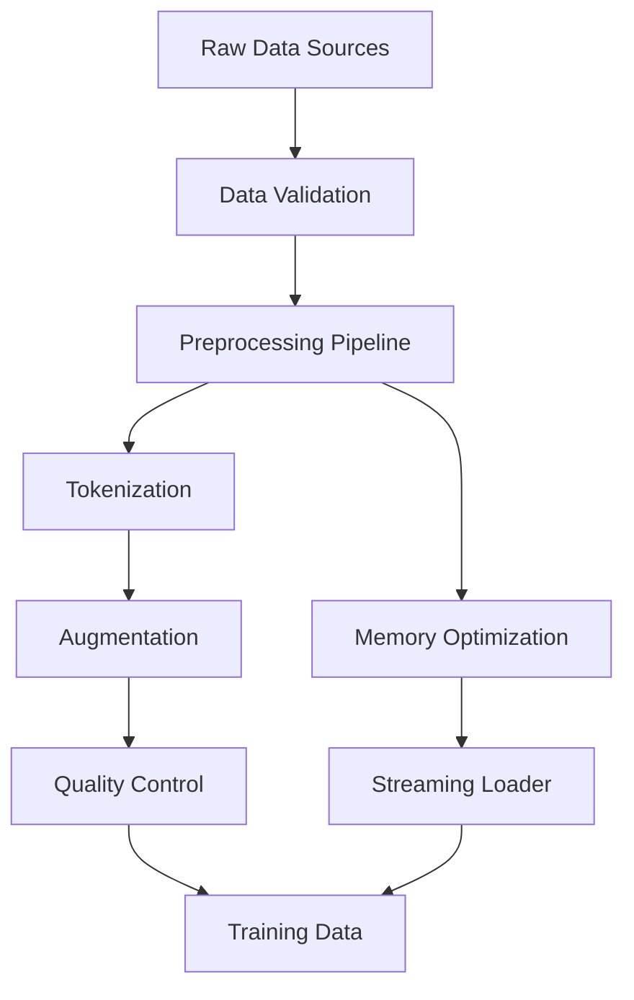

# Training Data Guide Complete

**Created:** June 03, 2025  
**Updated:** December 29, 2025  
**Author:** Kirk LaSalle; GitHub Copilot  
**Tags:** #ids #standardized_header #docs\reference\training_data_guide_complete.md #api #deployment #documentation #memory_management #multimodal #security #testing #tokenization #training #transformer #web_interface [training, data, preparation, guide, b1-model, multimodal, 2025]  
**Category:** Reference Documentation  
**Status:** Active
**IDS Integration:** This document is indexed and searchable via the ImpressionCore Documentation System (IDS).

---

title: "ImpressionCore Training Data Guide - Complete Reference"
tags: [training, data, preparation, guide, b1-model, multimodal, 2025]
created: 2025-06-03
modified: 2025-06-03
version: 2.0.0
authors: 

  - "Kirk LaSalle"
  - "GitHub Copilot"

status: active
category: reference
priority: high
---

# ImpressionCore Training Data Guide - Complete Reference

## Table of Contents

1. [Overview](#overview)
2. [Data Architecture](#data-architecture)
3. [Supported Data Types](#supported-data-types)
4. [Data Preparation Pipeline](#data-preparation-pipeline)
5. [Multimodal Data Integration](#multimodal-data-integration)
6. [Memory Optimization](#memory-optimization)
7. [Quality Control](#quality-control)
8. [Best Practices](#best-practices)
9. [Advanced Configuration](#advanced-configuration)
10. [Troubleshooting](#troubleshooting)
11. [API Reference](#api-reference)
12. [Examples](#examples)

## Overview

The ImpressionCore training data system is designed to efficiently handle multimodal data preparation for brain-inspired AI models. It optimizes for consumer hardware with limited VRAM while maintaining high-quality data processing.

### Key Features

- **Multimodal Support**: Text, image, audio, and cross-modal data
- **Memory Efficient**: Optimized for 4GB VRAM constraints
- **Streaming Processing**: Large dataset handling without memory overflow
- **Quality Assurance**: Automated data validation and cleaning
- **Scalable Architecture**: Modular design for easy extension

## Data Architecture

### Core Components

```python
# Data Processing Pipeline Architecture
src/data/
├── datasets/           # Dataset definitions and loaders
├── preprocessing/      # Data cleaning and transformation
├── tokenization/      # Text and multimodal tokenization
├── augmentation/      # Data augmentation strategies
└── validation/        # Quality control and validation
```

### Data Flow Diagram

For a comprehensive view of the complete data processing pipeline, see [Data Processing Pipeline Diagram](../assets/images/data_processing_pipeline.md).



## Supported Data Types

### Text Data

**Formats Supported:**

- Plain text (.txt)
- JSON structured data (.json)
- CSV with text columns (.csv)
- Markdown (.md)
- HTML (cleaned content)

**Text Processing Features:**

- Unicode normalization
- Language detection
- Encoding validation
- Special character handling

```python
# Example text data configuration
text_config = {
    "format": "json",
    "encoding": "utf-8",
    "max_length": 2048,
    "min_length": 10,
    "language_filter": ["en", "auto"],
    "preprocessing": {
        "normalize_unicode": True,
        "remove_html": True,
        "clean_whitespace": True
    }
}
```

### Image Data

**Formats Supported:**

- JPEG (.jpg, .jpeg)
- PNG (.png)
- WebP (.webp)
- TIFF (.tiff)
- BMP (.bmp)

**Image Processing Features:**

- Resolution normalization
- Color space conversion
- Compression optimization
- Metadata extraction

```python
# Example image data configuration
image_config = {
    "target_size": [224, 224],
    "color_mode": "RGB",
    "format": "JPEG",
    "quality": 95,
    "preprocessing": {
        "normalize": True,
        "resize_method": "lanczos",
        "maintain_aspect": True
    }
}
```

### Audio Data

**Formats Supported:**

- WAV (.wav)
- MP3 (.mp3)
- FLAC (.flac)
- OGG (.ogg)

**Audio Processing Features:**

- Sample rate normalization
- Noise reduction
- Silence trimming
- Feature extraction

```python
# Example audio data configuration
audio_config = {
    "sample_rate": 16000,
    "channels": 1,
    "format": "wav",
    "duration_range": [1.0, 30.0],
    "preprocessing": {
        "normalize_volume": True,
        "trim_silence": True,
        "noise_reduction": True
    }
}
```

## Data Preparation Pipeline

### Pipeline Overview

The data preparation pipeline consists of four main stages:

1. **Ingestion**: Raw data collection and validation
2. **Preprocessing**: Cleaning and standardization
3. **Tokenization**: Converting to model-ready format
4. **Packaging**: Creating training-ready datasets

### Stage 1: Data Ingestion

```python
from src.data.datasets import DataIngestionPipeline

# Initialize ingestion pipeline
ingestion = DataIngestionPipeline(
    config_path="configs/data_ingestion.json",
    output_dir="data/processed",
    validation_strict=True
)

# Add data sources
ingestion.add_source("text", "data/raw/text/*.txt")
ingestion.add_source("images", "data/raw/images/*.jpg")
ingestion.add_source("audio", "data/raw/audio/*.wav")

# Execute ingestion
results = ingestion.execute()
print(f"Processed {results.total_files} files")
```

### Stage 2: Preprocessing

```python
from src.data.preprocessing import MultimodalPreprocessor

# Configure preprocessing
preprocessor = MultimodalPreprocessor(
    memory_limit="3GB",  # Conservative for 4GB VRAM
    batch_size=32,
    parallel_workers=4
)

# Execute preprocessing
preprocessor.process_batch(
    input_dir="data/ingested",
    output_dir="data/preprocessed",
    config=preprocessing_config
)
```

### Stage 3: Tokenization

```python
from src.tokenization import MultimodalTokenizer

# Initialize tokenizer
tokenizer = MultimodalTokenizer(
    vocab_size=32000,
    special_tokens=["<|text|>", "<|image|>", "<|audio|>"],
    cross_modal_tokens=True
)

# Tokenize data
tokenized_data = tokenizer.encode_batch(
    data_path="data/preprocessed",
    output_path="data/tokenized"
)
```

### Stage 4: Dataset Packaging

```python
from src.data.datasets import TrainingDatasetBuilder

# Build training dataset
builder = TrainingDatasetBuilder(
    tokenized_path="data/tokenized",
    split_ratios={"train": 0.8, "val": 0.1, "test": 0.1},
    seed=42
)

# Create final dataset
dataset = builder.build(
    output_path="data/final/training_dataset.h5",
    metadata_path="data/final/metadata.json"
)
```

## Multimodal Data Integration

### Cross-Modal Alignment

ImpressionCore supports sophisticated cross-modal data alignment:

```python
# Example multimodal data entry
multimodal_sample = {
    "text": "A beautiful sunset over the ocean",
    "image": "sunset_ocean_001.jpg",
    "audio": "ocean_waves_ambient.wav",
    "metadata": {
        "timestamp": "2025-06-03T15:30:00Z",
        "source": "nature_collection",
        "quality_score": 0.95
    }
}
```

### Alignment Strategies

1. **Temporal Alignment**: For time-series data
2. **Semantic Alignment**: Content-based matching
3. **Structural Alignment**: Format and schema matching

```python
from src.data.alignment import CrossModalAligner

aligner = CrossModalAligner(
    strategy="semantic",
    embedding_model="sentence-transformers/all-MiniLM-L6-v2",
    threshold=0.8
)

aligned_data = aligner.align_batch(multimodal_samples)
```

## Memory Optimization

### Memory-Efficient Loading

```python
from src.data.loaders import MemoryEfficientLoader

# Configure memory-optimized loader
loader = MemoryEfficientLoader(
    dataset_path="data/final/training_dataset.h5",
    batch_size=16,  # Optimized for 4GB VRAM
    prefetch_buffer=2,
    memory_limit="2GB"  # Conservative allocation
)

# Stream data efficiently
for batch in loader:
    # Process batch without memory overflow
    process_training_batch(batch)
```

### Streaming Strategies

1. **Lazy Loading**: Load data only when needed
2. **Chunked Processing**: Process data in manageable chunks
3. **Memory Pooling**: Reuse memory buffers efficiently

```python
# Streaming configuration
streaming_config = {
    "chunk_size": 1000,
    "prefetch_count": 2,
    "memory_pool_size": "1GB",
    "compression": "lz4",  # Fast compression
    "cache_strategy": "lru"
}
```

## Quality Control

### Automated Validation

```python
from src.data.validation import DataQualityValidator

validator = DataQualityValidator(
    rules_config="configs/quality_rules.json",
    strict_mode=True
)

# Validate data quality
quality_report = validator.validate_dataset(
    dataset_path="data/preprocessed",
    sample_rate=0.1  # Validate 10% of data
)

print(f"Quality Score: {quality_report.overall_score}")
print(f"Issues Found: {len(quality_report.issues)}")
```

### Quality Metrics

- **Completeness**: Missing data detection
- **Consistency**: Format and schema validation
- **Accuracy**: Content quality assessment
- **Timeliness**: Data freshness validation

### Data Cleaning

```python
from src.data.cleaning import AutomaticCleaner

cleaner = AutomaticCleaner(
    rules=[
        "remove_duplicates",
        "fix_encoding_errors",
        "normalize_formats",
        "validate_content"
    ]
)

cleaned_data = cleaner.clean_batch(
    input_path="data/raw",
    output_path="data/cleaned"
)
```

## Best Practices

### Performance Optimization

1. **Batch Processing**: Process data in optimal batch sizes
2. **Parallel Processing**: Utilize multiple CPU cores
3. **Memory Management**: Monitor and optimize memory usage
4. **Disk I/O**: Use efficient file formats and compression

```python
# Optimal configuration for consumer hardware
optimal_config = {
    "batch_size": 32,
    "num_workers": 4,
    "memory_limit": "3GB",
    "disk_cache": True,
    "compression": "lz4",
    "prefetch_factor": 2
}
```

### Data Security

1. **Data Encryption**: Encrypt sensitive data at rest
2. **Access Control**: Implement proper permissions
3. **Audit Logging**: Track data access and modifications
4. **Privacy Protection**: Remove PII and sensitive information

```python
from src.security import DataEncryption

encryption = DataEncryption(
    algorithm="AES-256-GCM",
    key_management="local"  # For consumer deployment
)

encrypted_dataset = encryption.encrypt_dataset(
    input_path="data/sensitive",
    output_path="data/encrypted"
)
```

### Versioning and Lineage

```python
from src.data.versioning import DataVersionControl

# Track data versions
dvc = DataVersionControl(
    repository="data_repo",
    versioning_strategy="semantic"
)

# Create data version
version = dvc.create_version(
    dataset_path="data/final/training_dataset.h5",
    metadata={
        "created_by": "Kirk LaSalle",
        "processing_config": "v2.0.0",
        "source_data_hash": "sha256:abc123..."
    }
)
```

## Advanced Configuration

### Custom Data Sources

```python
from src.data.sources import CustomDataSource

class WebScrapingSource(CustomDataSource):
    def __init__(self, urls, config):
        self.urls = urls
        self.config = config
    
    def extract(self):
        # Custom extraction logic
        for url in self.urls:
            data = self.scrape_url(url)
            yield self.format_data(data)
```

### Plugin Architecture

```python
# Register custom plugins
from src.data.plugins import PluginManager

plugin_manager = PluginManager()
plugin_manager.register("custom_preprocessor", CustomPreprocessor)
plugin_manager.register("custom_validator", CustomValidator)
```

### Configuration Management

```json
{
    "data_pipeline": {
        "version": "2.0.0",
        "memory_optimization": {
            "enabled": true,
            "target_memory": "3GB",
            "streaming_threshold": "1GB"
        },
        "processing": {
            "parallel_workers": 4,
            "batch_size": 32,
            "prefetch_count": 2
        },
        "quality_control": {
            "validation_enabled": true,
            "strict_mode": false,
            "sample_rate": 0.1
        }
    }
}
```

## Troubleshooting

### Common Issues

#### Memory Errors

**Problem**: Out of memory during processing
**Solution**: 
```python
# Reduce batch size and enable streaming
config = {
    "batch_size": 16,  # Reduce from 32
    "streaming_enabled": True,
    "memory_limit": "2GB"  # Conservative limit
}
```

#### Slow Processing

**Problem**: Data processing is too slow
**Solution**:
```python
# Optimize for speed
config = {
    "num_workers": 8,  # Increase workers
    "compression": "lz4",  # Faster compression
    "cache_enabled": True,
    "prefetch_factor": 4
}
```

#### Data Quality Issues

**Problem**: Low quality data affecting training
**Solution**:
```python
# Enable strict quality control
quality_config = {
    "strict_validation": True,
    "quality_threshold": 0.8,
    "automatic_cleaning": True,
    "outlier_detection": True
}
```

### Debug Mode

```python
import logging
from src.core.utils.rich_logging import setup_rich_logging

# Enable detailed logging
setup_rich_logging(level=logging.DEBUG)

# Process with debug information
processor = DataProcessor(debug_mode=True)
processor.process_batch(data_path)
```

## API Reference

### Core Classes

#### DataIngestionPipeline

```python
class DataIngestionPipeline:
    """Handles raw data ingestion and initial validation."""
    
    def __init__(self, config_path: str, output_dir: str, validation_strict: bool = True):
        """Initialize ingestion pipeline."""
    
    def add_source(self, source_type: str, path_pattern: str) -> None:
        """Add a data source to the pipeline."""
    
    def execute(self) -> IngestionResults:
        """Execute the complete ingestion pipeline."""
```

#### MultimodalPreprocessor

```python
class MultimodalPreprocessor:
    """Handles preprocessing of multimodal data."""
    
    def __init__(self, memory_limit: str, batch_size: int, parallel_workers: int):
        """Initialize preprocessor with memory constraints."""
    
    def process_batch(self, input_dir: str, output_dir: str, config: dict) -> ProcessingResults:
        """Process a batch of multimodal data."""
```

#### TrainingDatasetBuilder

```python
class TrainingDatasetBuilder:
    """Builds final training datasets from processed data."""
    
    def __init__(self, tokenized_path: str, split_ratios: dict, seed: int = 42):
        """Initialize dataset builder."""
    
    def build(self, output_path: str, metadata_path: str) -> TrainingDataset:
        """Build and save the final training dataset."""
```

### Utility Functions

```python
# Data validation utilities
from src.data.utils import (
    validate_file_format,
    estimate_memory_usage,
    optimize_batch_size,
    check_data_quality
)

# Example usage
is_valid = validate_file_format("data.json", "json")
memory_usage = estimate_memory_usage("large_dataset.h5")
optimal_batch = optimize_batch_size(dataset, memory_limit="3GB")
quality_score = check_data_quality(dataset, rules_config)
```

## Examples

### Complete Pipeline Example

```python
#!/usr/bin/env python3
"""Complete training data preparation example."""

from src.data.datasets import DataIngestionPipeline
from src.data.preprocessing import MultimodalPreprocessor
from src.tokenization import MultimodalTokenizer
from src.data.datasets import TrainingDatasetBuilder
from src.core.utils.rich_status_animation import RichStatusAnimation

def prepare_training_data():
    """Complete data preparation pipeline."""
    
    with RichStatusAnimation("Preparing training data..."):
        # Step 1: Data Ingestion
        print("🔄 Starting data ingestion...")
        ingestion = DataIngestionPipeline(
            config_path="configs/data_ingestion.json",
            output_dir="data/ingested",
            validation_strict=True
        )
        
        # Add data sources
        ingestion.add_source("text", "data/raw/text/*.txt")
        ingestion.add_source("images", "data/raw/images/*.jpg")
        ingestion.add_source("audio", "data/raw/audio/*.wav")
        
        ingestion_results = ingestion.execute()
        print(f"✅ Ingested {ingestion_results.total_files} files")
        
        # Step 2: Preprocessing
        print("🔄 Starting preprocessing...")
        preprocessor = MultimodalPreprocessor(
            memory_limit="3GB",
            batch_size=32,
            parallel_workers=4
        )
        
        preprocessing_config = {
            "text": {"max_length": 2048, "encoding": "utf-8"},
            "image": {"target_size": [224, 224], "format": "JPEG"},
            "audio": {"sample_rate": 16000, "channels": 1}
        }
        
        preprocessing_results = preprocessor.process_batch(
            input_dir="data/ingested",
            output_dir="data/preprocessed",
            config=preprocessing_config
        )
        print(f"✅ Preprocessed {preprocessing_results.processed_count} samples")
        
        # Step 3: Tokenization
        print("🔄 Starting tokenization...")
        tokenizer = MultimodalTokenizer(
            vocab_size=32000,
            special_tokens=["<|text|>", "<|image|>", "<|audio|>"]
        )
        
        tokenized_data = tokenizer.encode_batch(
            data_path="data/preprocessed",
            output_path="data/tokenized"
        )
        print(f"✅ Tokenized {len(tokenized_data)} samples")
        
        # Step 4: Dataset Building
        print("🔄 Building final dataset...")
        builder = TrainingDatasetBuilder(
            tokenized_path="data/tokenized",
            split_ratios={"train": 0.8, "val": 0.1, "test": 0.1},
            seed=42
        )
        
        final_dataset = builder.build(
            output_path="data/final/training_dataset.h5",
            metadata_path="data/final/metadata.json"
        )
        
        print(f"✅ Built final dataset with {final_dataset.total_samples} samples")
        print(f"📊 Dataset splits: Train: {final_dataset.train_count}, "
              f"Val: {final_dataset.val_count}, Test: {final_dataset.test_count}")

if __name__ == "__main__":
    prepare_training_data()
```

### Quality Control Example

```python
#!/usr/bin/env python3
"""Data quality control example."""

from src.data.validation import DataQualityValidator
from src.data.cleaning import AutomaticCleaner

def quality_control_pipeline():
    """Run comprehensive quality control."""
    
    # Initialize validator
    validator = DataQualityValidator(
        rules_config="configs/quality_rules.json",
        strict_mode=True
    )
    
    # Validate dataset quality
    quality_report = validator.validate_dataset(
        dataset_path="data/preprocessed",
        sample_rate=0.1
    )
    
    print(f"Quality Score: {quality_report.overall_score:.2f}")
    
    if quality_report.overall_score < 0.8:
        print("⚠️ Data quality below threshold, running automatic cleaning...")
        
        # Initialize cleaner
        cleaner = AutomaticCleaner(
            rules=[
                "remove_duplicates",
                "fix_encoding_errors",
                "normalize_formats",
                "validate_content"
            ]
        )
        
        # Clean data
        cleaned_data = cleaner.clean_batch(
            input_path="data/preprocessed",
            output_path="data/cleaned"
        )
        
        print(f"✅ Cleaned {cleaned_data.processed_count} samples")
    else:
        print("✅ Data quality acceptable, proceeding with training preparation")

if __name__ == "__main__":
    quality_control_pipeline()
```

---

## Related Documentation

- [Model Architecture](model_architecture_complete.md) - Complete model architecture guide
- [API Reference](../api/complete_api_reference.md) - Full API documentation  
- [User Guide](../user/user_guide.md) - User guide and tutorials
- [Developer Guide](../developer/ARCHITECTURE.md) - Developer architecture guide

## Support

- **GitHub Issues**: [https://github.com/impressioncore/impressioncore/issues](https://github.com/impressioncore/impressioncore/issues)
- **Documentation**: [https://impressioncore.github.io/docs](https://impressioncore.github.io/docs)
- **Community**: [https://discord.gg/impressioncore](https://discord.gg/impressioncore)

---

**Last Updated**: 2025-06-03  
**Version**: 2.0.0  
**Authors**: Kirk LaSalle, GitHub Copilot  
**Status**: Active
