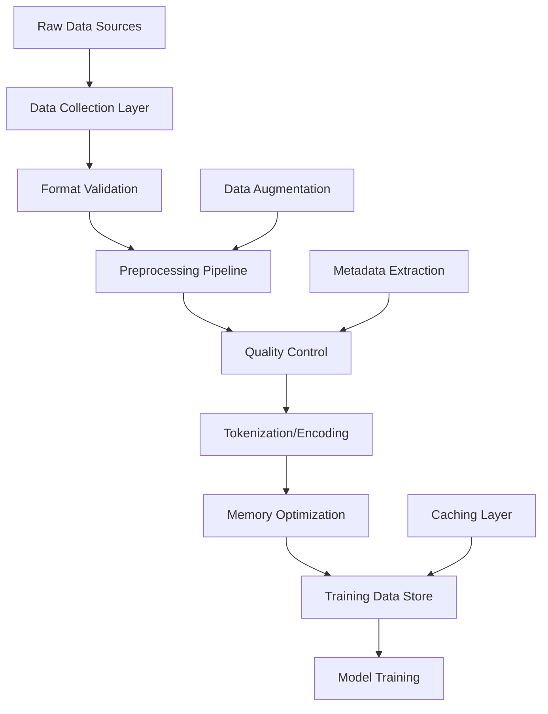

# Training Data Guide Comprehensive

**Created:** June 03, 2025  
**Updated:** December 29, 2025  
**Author:** Kirk LaSalle; GitHub Copilot  
**Tags:** #ids #standardized_header #docs\reference\training_data_guide_comprehensive.md #api #cuda #documentation #memory_management #multimodal #security #testing #tokenization #training [training, data, guide, multimodal, preprocessing, 2025]  
**Category:** Reference Documentation  
**Status:** Active
**IDS Integration:** This document is indexed and searchable via the ImpressionCore Documentation System (IDS).

---

title: "ImpressionCore Training Data Guide - Complete"
tags: [training, data, guide, multimodal, preprocessing, 2025]
created: 2025-06-03
modified: 2025-06-03
responsible: "GitHub Copilot"
status: "complete"
category: "reference"
version: "3.0.0"
---

# ImpressionCore Training Data Guide - Complete Reference

**Last Updated:** 2025-06-03 16:10:00  
**Version:** 3.0.0  
**Document Type:** Complete Training Data Guide  
**Target Audience:** Data Scientists, ML Engineers, Developers  

## Table of Contents

1. [Overview](#overview)
2. [Data Architecture](#data-architecture)
3. [Supported Data Types](#supported-data-types)
4. [Data Collection Guidelines](#data-collection-guidelines)
5. [Preprocessing Pipeline](#preprocessing-pipeline)
6. [Multimodal Data Integration](#multimodal-data-integration)
7. [Memory Optimization](#memory-optimization)
8. [Quality Control](#quality-control)
9. [Training Data Preparation](#training-data-preparation)
10. [Best Practices](#best-practices)
11. [Advanced Configuration](#advanced-configuration)
12. [Troubleshooting](#troubleshooting)
13. [API Reference](#api-reference)
14. [Examples](#examples)
15. [Related Documentation](#related-documentation)

---

## Overview

ImpressionCore's training data system is designed to handle multimodal data efficiently on consumer hardware while maintaining high quality and performance. The system supports text, image, audio, and video data with sophisticated preprocessing pipelines optimized for memory-constrained environments.

### Key Features

- **Multimodal Support**: Text, images, audio, video, and custom modalities
- **Memory Optimization**: Designed for 4GB VRAM environments (NVIDIA GTX 1050 Ti)
- **Streaming Processing**: Efficient data loading and preprocessing
- **Quality Control**: Automated data validation and cleaning
- **Scalable Architecture**: Handles datasets from small to enterprise-scale
- **Format Flexibility**: Supports multiple input and output formats

### Design Principles

1. **Memory Efficiency**: Minimize memory footprint at all stages
2. **Processing Speed**: Optimize for fast training iterations
3. **Data Quality**: Ensure high-quality training data
4. **Modularity**: Pluggable components for different data types
5. **Reproducibility**: Consistent preprocessing across runs

---

## Data Architecture

### Core Components

```text
src/data/
├── datasets/              # Dataset management and loading
├── preprocessing/         # Data transformation pipelines
├── tokenization/         # Text tokenization and encoding
├── augmentation/         # Data augmentation strategies
└── validation/           # Data quality validation
```

### Data Flow Architecture



### Memory Management

The data system implements sophisticated memory management:

```python
# Memory-efficient data loading
from src.data.datasets.memory_efficient_loader import MemoryEfficientDataLoader

loader = MemoryEfficientDataLoader(
    batch_size=16,          # Optimized for 4GB VRAM
    max_memory_usage=0.75,  # 75% of available memory
    prefetch_factor=2,      # Background loading
    num_workers=4           # Parallel processing
)
```

---

## Supported Data Types

### Text Data

#### Supported Formats

- **Plain Text**: `.txt`, `.md`, `.csv`
- **Structured**: JSON, XML, YAML
- **Documents**: PDF, DOCX, HTML
- **Code**: Python, JavaScript, etc.

#### Processing Features

- Unicode normalization
- Language detection
- Encoding standardization
- Content extraction

```python
# Text processing example
from src.data.preprocessing.text_processor import TextProcessor

processor = TextProcessor(
    max_length=512,
    normalize_unicode=True,
    remove_special_chars=False,
    preserve_formatting=True
)

processed_text = processor.process(raw_text)
```

### Image Data

#### Supported Formats

- **Raster**: PNG, JPEG, BMP, TIFF
- **Vector**: SVG (converted to raster)
- **Raw**: Camera RAW formats
- **Medical**: DICOM

#### Processing Features

- Automatic resizing and cropping
- Color space conversion
- Normalization and augmentation
- Memory-efficient loading

```python
# Image processing example
from src.data.preprocessing.image_processor import ImageProcessor

processor = ImageProcessor(
    target_size=(224, 224),
    color_mode='RGB',
    normalize=True,
    augmentation_config={
        'rotation': 15,
        'zoom': 0.1,
        'flip': True
    }
)

processed_image = processor.process(image_path)
```

### Audio Data

#### Supported Formats

- **Compressed**: MP3, AAC, OGG
- **Uncompressed**: WAV, FLAC
- **Streaming**: Real-time audio input

#### Processing Features

- Sample rate conversion
- Noise reduction
- Feature extraction (MFCC, spectrograms)
- Segmentation and windowing

```python
# Audio processing example
from src.data.preprocessing.audio_processor import AudioProcessor

processor = AudioProcessor(
    sample_rate=16000,
    duration=30,  # seconds
    features=['mfcc', 'spectrogram'],
    noise_reduction=True
)

processed_audio = processor.process(audio_file)
```

### Video Data

#### Supported Formats

- **Standard**: MP4, AVI, MOV
- **Streaming**: RTMP, HLS
- **High-quality**: ProRes, H.265

#### Processing Features

- Frame extraction
- Temporal sampling
- Motion analysis
- Memory-efficient streaming

```python
# Video processing example
from src.data.preprocessing.video_processor import VideoProcessor

processor = VideoProcessor(
    fps=1,  # Extract 1 frame per second
    resolution=(320, 240),
    max_frames=100,
    extract_audio=True
)

frames, audio = processor.process(video_file)
```

---

## Data Collection Guidelines

### Data Quality Standards

#### Minimum Requirements

- **Text**: Valid encoding, readable content, appropriate length
- **Images**: Minimum resolution 64x64, valid format, clear content
- **Audio**: Duration 0.1-300 seconds, clear quality, appropriate format
- **Video**: Minimum 1 second duration, stable framerate, clear content

#### Quality Metrics

```python
# Quality assessment example
from src.data.validation.quality_assessor import QualityAssessor

assessor = QualityAssessor()
quality_score = assessor.assess(data_sample)

# Quality thresholds
thresholds = {
    'text_readability': 0.7,
    'image_clarity': 0.6,
    'audio_snr': 20,  # dB
    'video_stability': 0.8
}
```

### Data Collection Best Practices

1. **Diversity**: Ensure diverse representation across all modalities
2. **Balance**: Maintain balanced datasets to prevent bias
3. **Licensing**: Verify data usage rights and licensing
4. **Privacy**: Implement privacy protection measures
5. **Documentation**: Maintain comprehensive metadata

### Ethical Guidelines

- Obtain proper consent for data collection
- Respect privacy and personal information
- Ensure cultural sensitivity and representation
- Implement bias detection and mitigation
- Maintain data provenance and lineage

---

## Preprocessing Pipeline

### Pipeline Architecture

The preprocessing pipeline is modular and configurable:

```python
from src.data.preprocessing.pipeline import PreprocessingPipeline

pipeline = PreprocessingPipeline([
    'format_validation',
    'quality_check',
    'normalization',
    'augmentation',
    'tokenization',
    'memory_optimization'
])

processed_data = pipeline.process(raw_data)
```

### Stage-by-Stage Processing

#### Format Validation

```python
# Validate data format and structure
validator = FormatValidator()
is_valid, errors = validator.validate(data)
```

#### Quality Control

```python
# Assess and filter data quality
quality_filter = QualityFilter(min_score=0.7)
filtered_data = quality_filter.filter(data)
```

#### Normalization

```python
# Normalize data to standard formats
normalizer = DataNormalizer()
normalized_data = normalizer.normalize(data)
```

#### Augmentation

```python
# Apply data augmentation techniques
augmentor = DataAugmentor(
    techniques=['rotation', 'noise', 'temporal_shift'],
    probability=0.3
)
augmented_data = augmentor.augment(data)
```

#### Tokenization

```python
# Convert data to tokens/embeddings
tokenizer = MultiModalTokenizer()
tokens = tokenizer.tokenize(data)
```

---

## Multimodal Data Integration

### Cross-Modal Alignment

ImpressionCore supports sophisticated multimodal data integration:

```python
# Multimodal data alignment
from src.data.multimodal.alignment import MultiModalAligner

aligner = MultiModalAligner()
aligned_data = aligner.align({
    'text': text_data,
    'image': image_data,
    'audio': audio_data
})
```

### Synchronization Strategies

#### Temporal Synchronization

- Align data based on timestamps
- Handle varying frame rates and sample rates
- Interpolate missing data points

#### Content-Based Synchronization

- Use content similarity for alignment
- Cross-modal embedding alignment
- Semantic consistency checking

#### Metadata-Based Synchronization

- Use file metadata for alignment
- Geographic and temporal metadata
- User-defined alignment rules

### Cross-Modal Data Validation

```python
# Validate multimodal data consistency
validator = MultiModalValidator()
consistency_score = validator.validate_consistency({
    'text': text_sample,
    'image': image_sample,
    'metadata': metadata_sample
})
```

---

## Memory Optimization

### Memory-Efficient Loading

#### Streaming Data Loader

```python
from src.data.datasets.streaming_loader import StreamingDataLoader

loader = StreamingDataLoader(
    batch_size=16,
    memory_limit='3GB',
    cache_size='500MB',
    streaming_buffer_size=1000
)

for batch in loader:
    # Process batch with minimal memory usage
    process_batch(batch)
```

#### Dynamic Batching

```python
# Adjust batch size based on available memory
from src.data.datasets.dynamic_batcher import DynamicBatcher

batcher = DynamicBatcher(
    target_memory_usage=0.8,
    min_batch_size=4,
    max_batch_size=32
)

optimal_batch_size = batcher.get_optimal_batch_size(data_sample)
```

### Caching Strategies

#### Multi-Level Caching

```python
# Implement efficient caching
from src.data.caching.cache_manager import CacheManager

cache = CacheManager(
    levels=['memory', 'ssd', 'hdd'],
    memory_cache_size='1GB',
    ssd_cache_size='10GB',
    eviction_policy='lru'
)

cached_data = cache.get_or_compute(data_key, compute_function)
```

#### Intelligent Prefetching

```python
# Prefetch data based on usage patterns
prefetcher = DataPrefetcher(
    prediction_model='lstm',
    prefetch_window=10,
    memory_budget=0.3
)

prefetcher.start_prefetching(data_sequence)
```

---

## Quality Control

### Automated Quality Assessment

#### Quality Metrics

```python
from src.data.validation.quality_metrics import QualityMetrics

metrics = QualityMetrics()

# Text quality metrics
text_quality = metrics.assess_text(text_data)
# Returns: readability, coherence, diversity, length_distribution

# Image quality metrics  
image_quality = metrics.assess_image(image_data)
# Returns: clarity, contrast, noise_level, composition

# Audio quality metrics
audio_quality = metrics.assess_audio(audio_data)
# Returns: snr, dynamic_range, frequency_distribution, clarity
```

#### Quality Filters

```python
# Apply quality filters
from src.data.validation.quality_filters import QualityFilters

filters = QualityFilters()

# Filter low-quality samples
high_quality_data = filters.filter_dataset(
    dataset=raw_dataset,
    min_quality_score=0.7,
    modality_weights={
        'text': 0.4,
        'image': 0.3,
        'audio': 0.3
    }
)
```

### Data Cleaning

#### Automated Cleaning

```python
# Automated data cleaning pipeline
from src.data.cleaning.auto_cleaner import AutoCleaner

cleaner = AutoCleaner(
    remove_duplicates=True,
    fix_encodings=True,
    normalize_formats=True,
    remove_corrupted=True
)

cleaned_data = cleaner.clean(raw_data)
```

#### Manual Review Interface

```python
# Manual data review system
from src.data.validation.review_interface import ReviewInterface

reviewer = ReviewInterface()
review_session = reviewer.create_session(
    data_batch=suspicious_samples,
    review_criteria=['quality', 'relevance', 'appropriateness']
)

reviewed_data = review_session.get_reviewed_data()
```

---

## Training Data Preparation

### Dataset Splitting

#### Smart Splitting

```python
from src.data.splitting.smart_splitter import SmartSplitter

splitter = SmartSplitter(
    split_ratios={'train': 0.8, 'val': 0.1, 'test': 0.1},
    stratify_by=['category', 'quality_score'],
    ensure_diversity=True
)

train, val, test = splitter.split(dataset)
```

#### Temporal Splitting

```python
# For time-series or temporal data
temporal_splitter = TemporalSplitter(
    split_method='sequential',
    validation_window_size=30,  # days
    test_window_size=60
)

splits = temporal_splitter.split(temporal_dataset)
```

### Data Augmentation

#### Modality-Specific Augmentation

```python
# Text augmentation
text_augmentor = TextAugmentor([
    'synonym_replacement',
    'random_insertion',
    'back_translation',
    'paraphrasing'
])

# Image augmentation
image_augmentor = ImageAugmentor([
    'rotation',
    'scaling',
    'color_jitter',
    'gaussian_noise'
])

# Audio augmentation
audio_augmentor = AudioAugmentor([
    'time_stretch',
    'pitch_shift',
    'add_noise',
    'reverb'
])
```

#### Cross-Modal Augmentation

```python
# Augmentation that maintains cross-modal consistency
cross_modal_augmentor = CrossModalAugmentor()
augmented_multimodal = cross_modal_augmentor.augment({
    'text': text_sample,
    'image': image_sample,
    'audio': audio_sample
})
```

---

## Best Practices

### Performance Best Practices

1. **Memory Management**
   - Use streaming data loaders for large datasets
   - Implement efficient caching strategies
   - Monitor memory usage during processing

2. **Processing Optimization**
   - Parallelize data processing where possible
   - Use vectorized operations
   - Optimize I/O operations

3. **Quality Assurance**
   - Implement comprehensive validation pipelines
   - Regular quality audits
   - Monitor data drift over time

### Security Best Practices

1. **Data Protection**
   - Encrypt sensitive data at rest and in transit
   - Implement access controls
   - Regular security audits

2. **Privacy Preservation**
   - Anonymize personal information
   - Implement differential privacy where appropriate
   - Obtain proper consent for data usage

### Scalability Best Practices

1. **Infrastructure Planning**
   - Design for horizontal scaling
   - Use distributed processing frameworks
   - Implement efficient data partitioning

2. **Monitoring and Maintenance**
   - Monitor system performance
   - Regular maintenance schedules
   - Automated alerting for issues

---

## Advanced Configuration

### Custom Data Loaders

```python
# Create custom data loader
from src.data.datasets.base_loader import BaseDataLoader

class CustomDataLoader(BaseDataLoader):
    def __init__(self, config):
        super().__init__(config)
        self.custom_config = config.get('custom', {})
    
    def load_sample(self, index):
        # Custom loading logic
        return self.process_sample(raw_sample)
    
    def get_metadata(self, index):
        # Return sample metadata
        return metadata

# Register custom loader
DataLoaderRegistry.register('custom', CustomDataLoader)
```

### Pipeline Customization

```python
# Create custom preprocessing pipeline
from src.data.preprocessing.base_processor import BaseProcessor

class CustomProcessor(BaseProcessor):
    def process(self, data):
        # Custom processing logic
        processed_data = self.apply_transformations(data)
        return processed_data

# Use in pipeline
pipeline = PreprocessingPipeline([
    'standard_validation',
    CustomProcessor(config),
    'standard_tokenization'
])
```

---

## Troubleshooting

### Common Issues

#### Memory Issues

```python
# Memory usage monitoring
from src.data.monitoring.memory_monitor import MemoryMonitor

monitor = MemoryMonitor()
monitor.start_monitoring()

# Process data with monitoring
for batch in data_loader:
    process_batch(batch)
    
    if monitor.memory_usage > 0.9:
        # Take corrective action
        gc.collect()
        torch.cuda.empty_cache()
```

#### Performance Issues

```python
# Performance profiling
from src.data.profiling.performance_profiler import PerformanceProfiler

profiler = PerformanceProfiler()
with profiler.profile():
    processed_data = pipeline.process(data)

performance_report = profiler.get_report()
```

#### Data Quality Issues

```python
# Quality debugging
from src.data.debugging.quality_debugger import QualityDebugger

debugger = QualityDebugger()
quality_issues = debugger.diagnose(
    dataset=problematic_dataset,
    expected_quality_score=0.8
)

print(f"Found {len(quality_issues)} quality issues:")
for issue in quality_issues:
    print(f"- {issue.type}: {issue.description}")
```

---

## API Reference

### Core Classes

#### DataProcessor

```python
class DataProcessor:
    """Main interface for data processing operations."""
    
    def __init__(self, config: Dict[str, Any]):
        """Initialize processor with configuration."""
        
    def process(self, data: Any) -> Any:
        """Process input data and return processed result."""
        
    def validate(self, data: Any) -> bool:
        """Validate data format and quality."""
        
    def get_metadata(self, data: Any) -> Dict[str, Any]:
        """Extract metadata from data."""
```

#### MultiModalDataLoader

```python
class MultiModalDataLoader:
    """Data loader for multimodal datasets."""
    
    def __init__(self, 
                 dataset_path: str,
                 modalities: List[str],
                 batch_size: int = 16,
                 shuffle: bool = True):
        """Initialize multimodal data loader."""
        
    def __iter__(self):
        """Iterate over data batches."""
        
    def __len__(self):
        """Return number of batches."""
        
    def get_sample(self, index: int) -> Dict[str, Any]:
        """Get specific sample by index."""
```

### Utility Functions

#### Data Format Conversion

```python
def convert_data_format(data: Any, 
                       source_format: str, 
                       target_format: str) -> Any:
    """Convert data between different formats."""

def validate_data_format(data: Any, 
                        expected_format: str) -> bool:
    """Validate data against expected format."""

def infer_data_format(data: Any) -> str:
    """Automatically infer data format."""
```

#### Quality Assessment

```python
def assess_data_quality(data: Any, 
                       modality: str) -> float:
    """Assess data quality score (0-1)."""

def filter_by_quality(dataset: List[Any], 
                     min_quality: float) -> List[Any]:
    """Filter dataset by minimum quality score."""

def generate_quality_report(dataset: List[Any]) -> Dict[str, Any]:
    """Generate comprehensive quality report."""
```

---

## Examples

### Basic Usage

#### Simple Text Processing

```python
from src.data.preprocessing.text_processor import TextProcessor

# Initialize processor
processor = TextProcessor(
    max_length=512,
    tokenizer='bert-base-uncased',
    normalize=True
)

# Process text
text = "This is a sample text for processing."
processed = processor.process(text)

print(f"Original: {text}")
print(f"Processed: {processed}")
```

#### Image Processing Pipeline

```python
from src.data.preprocessing.image_processor import ImageProcessor
from src.data.augmentation.image_augmentor import ImageAugmentor

# Setup processing pipeline
processor = ImageProcessor(target_size=(224, 224))
augmentor = ImageAugmentor(['rotation', 'flip'])

# Process image
image = load_image('sample.jpg')
processed_image = processor.process(image)
augmented_image = augmentor.augment(processed_image)

save_image(augmented_image, 'processed_sample.jpg')
```

### Advanced Usage

#### Multimodal Data Processing

```python
from src.data.multimodal.processor import MultiModalProcessor
from src.data.datasets.multimodal_loader import MultiModalDataLoader

# Setup multimodal processing
processor = MultiModalProcessor({
    'text': {'max_length': 512},
    'image': {'target_size': (224, 224)},
    'audio': {'sample_rate': 16000}
})

# Load and process multimodal dataset
loader = MultiModalDataLoader(
    dataset_path='path/to/multimodal/dataset',
    modalities=['text', 'image', 'audio'],
    batch_size=16
)

for batch in loader:
    processed_batch = processor.process(batch)
    # Use processed batch for training
    train_model(processed_batch)
```

#### Custom Pipeline Creation

```python
from src.data.preprocessing.pipeline import PreprocessingPipeline
from src.data.preprocessing.custom_processor import CustomProcessor

# Create custom processing pipeline
pipeline = PreprocessingPipeline([
    'format_validation',
    CustomProcessor({
        'custom_param1': 'value1',
        'custom_param2': 'value2'
    }),
    'quality_check',
    'tokenization'
])

# Process data through pipeline
processed_data = pipeline.process(raw_data)
```

---

## Related Documentation

- [Model Architecture Guide](model_architecture.md) - Complete model architecture documentation
- [API Reference](../api/complete_api_reference_v2.md) - Full API documentation  
- [User Guide](../user/user_guide.md) - User guide and tutorials
- [Developer Guide](../developer/ARCHITECTURE.md) - Developer architecture guide
- [Performance Optimization](../technical/performance_optimization.md) - Performance tuning guide

---

## Support and Contributing

### Getting Help

- **GitHub Issues**: [https://github.com/impressioncore/impressioncore/issues](https://github.com/impressioncore/impressioncore/issues)
- **Documentation**: [https://impressioncore.github.io/docs](https://impressioncore.github.io/docs)
- **Community**: [https://discord.gg/impressioncore](https://discord.gg/impressioncore)

### Contributing

We welcome contributions to improve the training data system:

1. Fork the repository
2. Create a feature branch
3. Implement improvements
4. Add tests and documentation
5. Submit a pull request

---

**Document Information:**

- **Version**: 3.0.0
- **Last Updated**: 2025-06-03 16:10:00
- **Authors**: GitHub Copilot
- **Review Status**: Complete
- **Next Review**: 2025-09-03

**Related Files:**

- `src/data/` - Core data processing implementation
- `docs/examples/` - Additional usage examples
- `tests/data/` - Data processing tests
- `configs/data/` - Data processing configurations

---

*This training data guide provides comprehensive coverage of ImpressionCore's data processing capabilities. Regular updates ensure alignment with the latest system features and best practices.*
