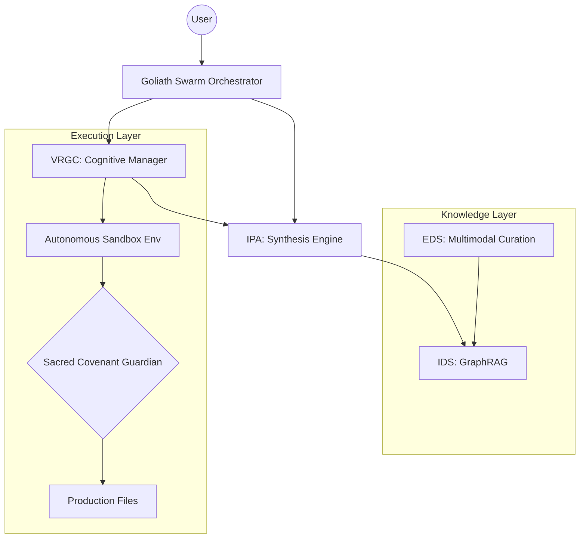

# ImpressionCore MCP Advancement Report (2025 Roadmap)

**Date:** December 30, 2025  
**Version:** 2.0 (Advancement Proposal)  
**Status:** PROPOSED ROADMAP  

---

## 1. Vision: The Agentic Swarm

In 2025, the ImpressionCore MCP ecosystem will transition from a "Library of Tools" to an **Autonomous Agentic Swarm**. This shift prioritizes **Agentic RAG**, where servers don't just respond to queries but autonomously collaborate to solve complex engineering and research goals.

### **The Swarm Logic Architecture**

---

## 2. Server-by-Server Evolutionary Upgrades

### **IDS-MCP: From Tags to Entity-Graphs (GraphRAG)**
- **Current State:** Tag-based keyword matching.
- **2025 Upgrade:** Implementation of a Knowledge Graph that maps relationships between code, documentation, and hardware constraints.
- **Novel Use: *The Digital DNA Architect***  
  Tracing the "evolutionary lineage" of a function across three generations of Brain-Triad iterations to explain *why* a design decision was made.

### **EDS-MCP: Multimodal Auto-Curation**
- **Current State:** License-compliant scraping for 1B training.
- **2025 Upgrade:** Autonomous "Knowledge Harvesting" agents that monitor arXiv and GitHub, converting raw research into B3-ready tokenized datasets without human intervention.
- **Novel Use: *Zero-Day Educational Streamer***  
  Real-time data feeds that update the AI's "internal library" within 60 minutes of a major research paper release.

### **IPA-MCP: Synthesis-First Intelligence**
- **Current State:** Search fusion (Google + Perplexity).
- **2025 Upgrade:** Multi-step reasoning chains that produce formatted **Intelligence Dossiers**, including "Consensus" vs. "Outlier" analysis.
- **Novel Use: *The Truth Engine***  
  Evaluating conflicting software documentation to identify the single "Ground Truth" for a specific API version.

### **VRGC-MCP: Software Application Programming Robot (SAPR)**
- **Current State:** Development Copilot with web access.
- **2025 Upgrade:** **Self-Healing Architectures**. VRGC will autonomously identify bottlenecks, propose a refactor in a Sandbox, and only request user approval for the final merge.
- **Core SAPR Logic:**
    - **Self-Healing**: Catching `OOM` or logic failures and drafting active architectural repairs before the user sees the log.
    - **Sandbox General**: Orchestrating "disposable labs" (isolated venvs) to verify experimental code without touching the main project state.
    - **War-Gaming**: Running parallel "what-if" simulations (varied batch sizes, quantization) to find the absolute optimal footprint for the GTX 1050 Ti.
- **Novel Use: *The Sandbox General***  
  Managing isolated virtual environments to "war-game" large-scale refactors for performance on the GTX 1050 Ti.

---

## 3. Goliath: The Central Nerve Center

The **Goliath Unified Interface** is evolving into the **Nerve Center**. It will handle:
1. **Dynamic Load Balancing:** Distributing tasks to prevent VRAM spikes on the 1050 Ti.
2. **Conflict Resolution:** Managing overlapping tool requests from multiple agents.
3. **Swarm Memory:** A project-wide short-term memory that allows IPA to "know" what VRGC just refactored.

---

## 4. Hardware Optimization & Integrity

### **The 1B Parameter Foundation (GTX 1050 Ti)**
Proposals for maintaining performance:
- **Quantization-Aware Training (QAT):** Native support in EDS for generating 4-bit and 8-bit datasets.
- **Micro-Services Architecture:** Using the Goliath Bridge to swap server modules in and out of active VRAM based on the current task phase.

---

## 5. Visual Visualization (Proposed UI)

> [!NOTE]
> The following visualization represents the "Competitive Intelligence War-Room" dashboard, providing a real-time view of the Swarm's activities.

---

**Authored by:** ImpressionCore Advanced Agent  
**Compliance Status:** Sacred Covenant Verified ✅  
**Targeted for:** ImpressionCore 2025 Q1 Deployment  
