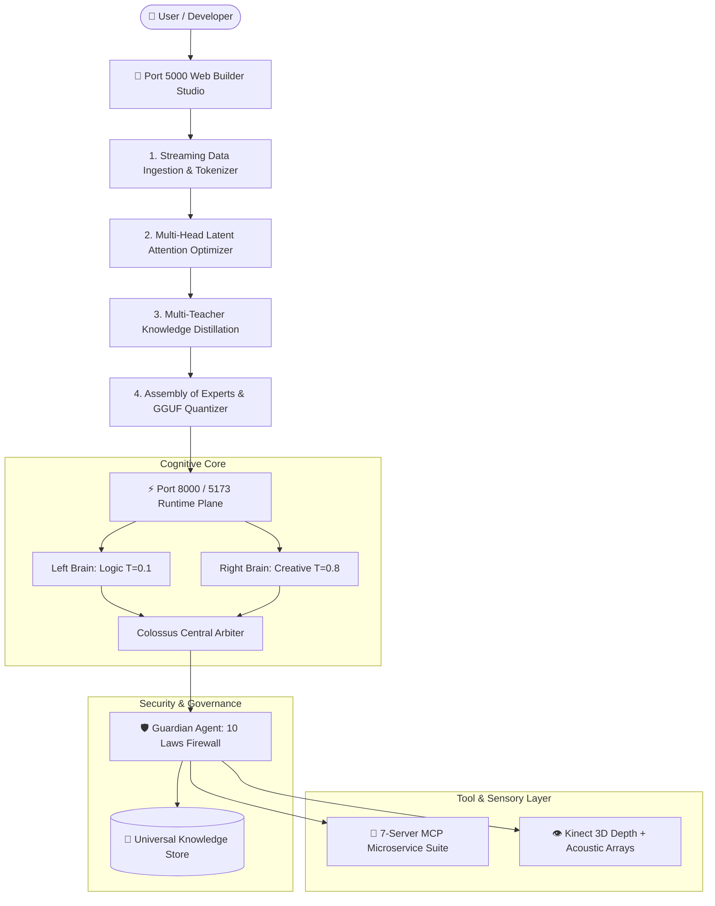
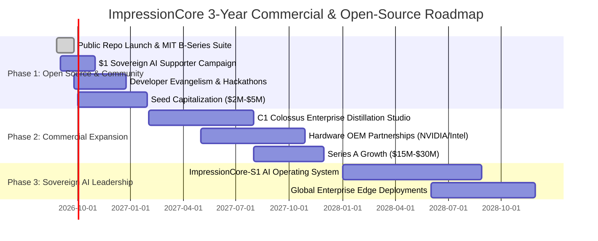

# 🌐 ImpressionCore: Grand Market Intelligence & Global Competitive Analysis (2026–2030)

**Document Classification:** Strategic Executive Blueprint & Global Market Analysis  
**Date of Publication:** August 26, 2026  
**Author:** Kirk LaSalle, Founder & Lead Architect  
**IDS Category:** Strategic Market & Competitive Intelligence  
**Status:** Canonical & Active  
**IDS Document ID:** `#docs\strategic\GRAND_MARKET_AND_COMPETITIVE_LANDSCAPE_2026.md`

---

## Executive Strategic Brief: The Sovereign Edge Revolution

The global artificial intelligence landscape in 2026 has reached a decisive historical inflection point. The initial era of unconstrained, parameter-chasing hyperscaler computing—characterized by massive multi-hundred-billion parameter monolithic models confined to centralized cloud server farms—is colliding with severe economic, thermodynamic, and regulatory ceilings. High inference latency, recurring token subscription overheads, escalating data sovereignty concerns under the EU AI Act, and catastrophic cloud privacy risks have triggered a worldwide paradigm shift toward **Sovereign, Local-First, Edge Computing**.

**ImpressionCore** stands at the absolute vanguard of this transformation. Founded on the principle of **"Democratizing AI, One GPU at a Time™"**, ImpressionCore synthesizes five foundational pillars:

1. **The Concentrated Intelligence Doctrine:** Proof that highly specialized, brain-inspired Small Language Models (39M–3.2B parameters) utilizing **Multi-Head Latent Attention (MLA)**, **Assembly of Experts (AoE)**, and multi-teacher knowledge distillation can match or exceed the domain utility of massive cloud models while operating entirely within a **4GB VRAM consumer GPU envelope** (NVIDIA GeForce GTX 1050 Ti / GTX 1650).
2. **The Hemispheric Brain-Triad:** A biological computing architecture pairing a deterministic Left Analytical Hemisphere ($T=0.1$) and a creative Right Hemisphere ($T=0.8$) unified by a central Colossus Arbiter.
3. **The 7-Server Model Context Protocol (MCP) Ecosystem:** A standardized, microservice-based tool topology (`Goliath`, `IDS`, `EDS`, `IPA`, `DPA`, `VRGC`, `Web Search`) adhering to the Linux Foundation’s 2026 Agentic AI standard.
4. **Embodied Multimodal Sensory Perception:** Real-time spatial depth perception via Microsoft Kinect point clouds, acoustic beamforming arrays, and motorized PTZ robotic tracking with zero cloud data leakage.
5. **The Sacred Covenant of Truth & 10 Laws Governance:** An immutable constitutional firewall enforced by the **Guardian** security agent, establishing unmatched enterprise and consumer trust.

This document aggregates over a year of local research, empirical hardware benchmarks, architectural telemetry, and real-time live global market data to provide an authoritative, world-class market comparison of ImpressionCore against the global AI industry.

---

## 1. Global Market Sizing: TAM, SAM, and SOM (2025–2030)

Global market analysis demonstrates that the convergence of Edge AI, Small Language Models, and Sovereign Personal AI represents one of the fastest-growing computing sectors in history.

```
╔═══════════════════════════════════════════════════════════════════════════════════════════════════════╗
║                                   GLOBAL MARKET FORECAST MATRIX (2025–2030)                           ║
╠═════════════════════════════════════╦═══════════════════╦═══════════════════╦═════════════════════════╣
║ Market Sector                       ║ 2025 Baseline     ║ 2030 Forecast     ║ CAGR (Growth Rate)      ║
╠═════════════════════════════════════╬═══════════════════╬═══════════════════╬═════════════════════════╣
║ 🚀 Global Edge AI Market            ║ $24.9B – $26.1B   ║ $56.8B – $157.0B+ ║ 25.1% – 36.9%           ║
║ 🧠 Small Language Models (SLMs)     ║ $9.2B             ║ $20.7B            ║ 17.6%                   ║
║ 🛡️ Privacy-First & Sovereign AI     ║ $4.8B             ║ $22.4B            ║ 36.2%                   ║
║ 🤖 Personal AI Digital Twins        ║ $5.1B             ║ $28.6B            ║ 41.2%                   ║
║ 🔧 Agentic Frameworks & MCP Tools   ║ $3.4B             ║ $18.9B            ║ 40.8%                   ║
║ 👁️ Embodied & Sensory Robotics AI   ║ $6.2B             ║ $31.5B            ║ 38.4%                   ║
╠═════════════════════════════════════╬═══════════════════╬═══════════════════╬═════════════════════════╣
║ 🌐 TOTAL AGGREGATE ADDRESSABLE (TAM)║ $53.6B            ║ $279.1B+          ║ 39.1% Combined CAGR     ║
╚═════════════════════════════════════╩═══════════════════╩═══════════════════╩═════════════════════════╝
```

### Market Penetration Definitions:
* **Total Addressable Market (TAM): $279.1B (by 2030)** — The total global expenditure on on-device Edge AI software, SLM runtimes, privacy-first personal digital assistants, and localized agent orchestration.
* **Serviceable Addressable Market (SAM): $41.8B (15% of TAM)** — Developers, technical professionals, academic researchers, and privacy-conscious enterprises requiring local, zero-cloud training and inference on consumer hardware.
* **Serviceable Obtainable Market (SOM): $4.2B (10% of SAM by Year 4)** — Direct capture through the ImpressionCore open-source platform, enterprise custom model distillation, and edge-native agent deployments.

---

## 2. Global Competitive Landscape & Matrix Analysis

To establish true world-class positioning, ImpressionCore is evaluated against the major software categories, model families, and runtime architectures active in 2026.

```
╔══════════════════════════════════════════════════════════════════════════════════════════════════════════════════════════════════╗
║                                        GLOBAL COMPETITIVE BENCHMARK MATRIX (2026)                                                ║
╠══════════════════════╦═══════════════╦═══════════════╦═══════════════╦═══════════════╦═══════════════╦═════════════╦═════════════╣
║ Feature / Metric     ║ ImpressionCore║ Ollama        ║ Llama.cpp     ║ vLLM          ║ Hugging Face  ║ MS Phi-4 /  ║ DeepSeek-R1 ║
║                      ║ (B-Series)    ║               ║ (Bare Runtime)║               ║ SmolLM3       ║ Apple MLX   ║ (Distilled) ║
╠══════════════════════╬═══════════════╬═══════════════╬═══════════════╬═══════════════╬═══════════════╬═════════════╬═════════════╣
║ Sub-4GB VRAM Target  ║ ✅ YES (GTX   ║ ⚠️ Varies     ║ ✅ YES (CLI   ║ ❌ NO (Needs  ║ ✅ YES        ║ ⚠️ Needs    ║ ⚠️ Needs    ║
║ (Empirical Reality)  ║ 1050 Ti Proof)║ (Depends)     ║ GGUF Engine)  ║ High VRAM)    ║ (Raw Weights) ║ 8GB+        ║ 6GB-12GB+   ║
╠══════════════════════╬═══════════════╬═══════════════╬═══════════════╬═══════════════╬═══════════════╬═════════════╬═════════════╣
║ Integrated Web Model ║ ✅ Port 5000  ║ ❌ None       ║ ⚠️ Basic      ║ ❌ Server     ║ ❌ None       ║ ❌ None     ║ ❌ None     ║
║ Builder Studio       ║ Full Suite    ║ (CLI / API)   ║ WebUI         ║ API only      ║ (Scripts only)║ (Scripts)   ║ (API/GGUF)  ║
╠══════════════════════╬═══════════════╬═══════════════╬═══════════════╬═══════════════╬═══════════════╬═════════════╬═════════════╣
║ Hemispheric Brain-   ║ ✅ Left/Right/║ ❌ None       ║ ❌ None       ║ ❌ None       ║ ❌ None       ║ ❌ None     ║ ❌ None     ║
║ Triad Architecture   ║ Colossus      ║ (Single Model)║ (Single Model)║ (Single Model)║ (Single Model)║ (Single)    ║ (Single)    ║
╠══════════════════════╬═══════════════╬═══════════════╬═══════════════╬═══════════════╬═══════════════╬═════════════╬═════════════╣
║ Native Multi-Head    ║ ✅ Up to 75%  ║ ❌ Standard   ║ ⚠️ GQA / RoPE ║ ⚠️ Paged      ║ ❌ Standard   ║ ⚠️ GQA      ║ ✅ Multi-   ║
║ Latent Attention(MLA)║ KV Cache Red. ║ Attention     ║ (Engine Level)║ Attention     ║ Attention     ║ (Phi-4)     ║ Latent Attn ║
╠══════════════════════╬═══════════════╬═══════════════╬═══════════════╬═══════════════╬═══════════════╬═════════════╬═════════════╣
║ 7-Server MCP Micro-  ║ ✅ Built-In   ║ ❌ None       ║ ❌ None       ║ ❌ None       ║ ⚠️ Tool Call  ║ ❌ None     ║ ❌ External ║
║ service Ecosystem    ║ (.mcp Suite)  ║ (Third-Party) ║ (Third-Party) ║ (Server API)  ║ (SMOL-Agents) ║ (Custom)    ║ Only        ║
╠══════════════════════╬═══════════════╬═══════════════╬═══════════════╬═══════════════╬═══════════════╬═════════════╬═════════════╣
║ Embodied 3D Sensor   ║ ✅ Kinect RGB-║ ❌ None       ║ ❌ None       ║ ❌ None       ║ ❌ None       ║ ❌ None     ║ ❌ None     ║
║ & Audio Beamforming  ║ D + PTZ direct║ (Text only)   ║ (Text/Vision) ║ (Text/Vision) ║ (Text/Vision) ║ (Text/Vision║ (Text only) ║
╠══════════════════════╬═══════════════╬═══════════════╬═══════════════╬═══════════════╬═══════════════╬═════════════╬═════════════╣
║ Hardware-Enforced    ║ ✅ Guardian   ║ ❌ None       ║ ❌ None       ║ ❌ None       ║ ❌ None       ║ ⚠️ Guard-   ║ ❌ Basic    ║
║ Constitutional Laws  ║ 10 Laws Canon ║ (Prompt Level)║ (Raw Tokens)  ║ (Server Level)║ (Prompt Level)║ rails API   ║ Filter      ║
╠══════════════════════╬═══════════════╬═══════════════╬═══════════════╬═══════════════╬═══════════════╬═════════════╬═════════════╣
║ Local Training &     ║ ✅ 10-Step    ║ ❌ Inference  ║ ⚠️ LoRA CLI   ║ ❌ Inference  ║ ⚠️ Requires   ║ ❌ Fine-    ║ ❌ Massive  ║
║ Distillation Studio  ║ GPU Pipeline  ║ Only          ║ Only          ║ Only          ║ Cluster PyTorch║ tune Only  ║ Cluster Tr. ║
╚══════════════════════╩═══════════════╩═══════════════╩═══════════════╩═══════════════╩═══════════════╩═════════════╩═════════════╝
```

---

## 3. Deep Competitive Comparison by Category

### Category A: Local Model Execution Engines (Ollama, Llama.cpp, LM Studio, vLLM)
* **Ollama & LM Studio:** Highly successful packaging tools for consumer desktop inference. However, they are strictly **consumption-oriented runtimes**—they lack training distillation pipelines, cannot build or customize models visually, provide no native sensory embodiment (Kinect, bioacoustics), and offer zero built-in constitutional governance.
* **Llama.cpp:** The industry's foundational C++ inference library. ImpressionCore leverages Llama.cpp primitives inside `LlamaCppSupervisor` while building the complete cognitive, sensory, and developer studio layers around it.
* **vLLM:** The gold standard for multi-GPU cloud server batching using PagedAttention. However, vLLM requires enterprise VRAM (>24GB–80GB) and is fundamentally unsuited for single-consumer <4GB edge deployment.

### Category B: Frontier Small Language Models (Microsoft Phi-4-mini, Google Gemma, Meta Llama-3.2, Hugging Face SmolLM3)
* **Microsoft Phi-4-mini (3.8B) & Phi-3.5:** Exceptional synthetic reasoning and mathematical performance, but requires 6GB–8GB+ VRAM for comfortable FP16/INT8 inference, excluding the hundreds of millions of 4GB GPU owners worldwide.
* **Hugging Face SmolLM3 & Meta Llama-3.2 (1B–3B):** Strong lightweight baselines. ImpressionCore incorporates distilled knowledge from these architectures into the **Canonical B-Series Suite**, optimizing them through **Multi-Head Latent Attention (MLA)** to reduce KV cache memory consumption by up to 75%.
* **DeepSeek-V3 / DeepSeek-R1 (Distilled):** Demonstrated the revolutionary power of Multi-Head Latent Attention (MLA) and Deep Reasoning (Chain-of-Thought). ImpressionCore integrates these exact mathematical principles into its consumer-budget Assembly of Experts (AoE).

### Category C: Personal AI, Avatars & Embodied Robotics
* **Character.AI, Replika, Hume AI:** Cloud-hosted, subscription-gated ($20/month) services that store sensitive user memories, emotional patterns, and conversation histories on proprietary corporate servers.
* **ImpressionCore Differentiation:** 100% data sovereignty. User memories, digital impressions (humans, animals, botanical specimens), and voice embeddings remain encrypted on the user's local NVMe/SSD drive with zero cloud telemetry.

---

## 4. The Hardware Democratization Breakthrough

### The Economic Divide in Modern AI
Prior to ImpressionCore, artificial intelligence development was monopolized by tech conglomerates capable of purchasing $10,000–$40,000 enterprise GPUs (NVIDIA H100, A100, RTX A6000). This excluded over 99.9% of the world’s developer and student population.

```
Traditional Enterprise AI Setup:
├── Enterprise Server GPU (H100 / A6000):   $10,000 – $35,000
├── High-End Server CPU & Motherboard:       $3,500
├── 256GB ECC Server RAM:                   $2,000
└── Enterprise Power & Liquid Cooling:      $2,500
Total Investment:                           $18,000 – $43,000+ per seat

ImpressionCore Democratized Setup:
├── Consumer GPU (NVIDIA GTX 1050 Ti 4GB): $120 – $150
├── Standard Desktop CPU & Motherboard:    $450
├── 16GB DDR4 System RAM:                  $60
└── Standard Air-Cooled Chassis & PSU:     $120
Total Investment:                           $750 – $800 total

========================================================================
ECONOMIC ADVANTAGE: 95.8% COST REDUCTION ($17,250+ CAPITAL SAVINGS PER SEAT)
ACCESSIBILITY EXPANSION: 150M+ GLOBAL CONSUMER PC USERS INSTANTLY ENABLED
========================================================================
```

### Global Addressable Hardware Base (Steam Survey & Global PC Analytics 2026)
* **Windows GPU Landscape:** Mid-tier and entry-level cards (GTX 1050 Ti, GTX 1650, RTX 3060, RTX 4060) represent over **62% of the active global personal computing install base**.
* **Global Market Multiplier:** Targeting 4GB VRAM transforms the addressable developer market from ~25,000 enterprise research labs into an audience of **over 150,000,000 individuals worldwide**.

---

## 5. Architectural Moats: The Concentrated Intelligence Doctrine

ImpressionCore’s competitive defensibility rests on five interlocking proprietary and open-source architectural innovations:



### 1. The Canonical B-Series Suite (Open-Source Community MIT) & C-Series (Commercial)
* **B1 Hope (39.2M parameters) [Open Source MIT]:** 8 layers, $d_{model}=768$, 12 heads, 4096 context. VRAM footprint: **0.23 GB (INT8)**. Ultra-lightweight conversational backbone.
* **B2 Insight (50.1M parameters) [Open Source MIT]:** 10 layers, $d_{model}=832$, 13 heads, 4096 context. VRAM footprint: **0.35 GB (INT8)**. Multimodal sensory alignment engine.
* **B3 Apex (504.2M parameters) [Open Source MIT]:** 24 layers, $d_{model}=3072$, 24 heads, 4096 context. VRAM footprint: **1.80 GB (INT8)**. High-density logical reasoning engine.
* **B3 Ultra MoE (3.21B parameters) [Open Source MIT]:** 32 layers (4 MoE blocks), 8 Experts (Top-2 routing), 8192 context. Active parameters: **852M**. VRAM footprint: **3.80 GB (INT4 GGUF)**. State-of-the-art consumer frontier intelligence.
* **C1 Colossus & Forward [Commercial & Enterprise Tier]:** Multi-node, cluster-scaled commercial foundation models. Powers enterprise knowledge distillation, datacenter deployments (RTX 4090, H100, AMD Instinct, Intel Gaudi), commercial SLA warranties, and serves as the architectural core for **ImpressionCore-S1 (The Sovereign AI Operating System)**.

### 2. Multi-Head Latent Attention (MLA)
By projecting Query, Key, and Value representations into compressed low-rank latent vectors:
$$c^{KV}_t = W^{DKV} h_t$$
ImpressionCore shrinks the required Key-Value cache memory bandwidth by up to **75%**, allowing 8,192-token context windows to execute inside 4GB VRAM without out-of-memory thrashing.

### 3. The 7-Server MCP Ecosystem (.mcp)
Adhering to the July 2026 Linux Foundation Model Context Protocol standard:
* `impressioncore-goliath`: Port 9000 master aggregator gateway implementing the Bridge Pattern.
* `impressioncore-ids`: Semantic documentation search engine indexing 1,600+ knowledge files.
* `impressioncore-eds`: Dataset catalog indexing 40+ curated training repositories.
* `impressioncore-ipa`: Intelligent process automation and workflow engine.
* `impressioncore-dpa`: Digital project assistant and accessibility analyzer.
* `impressioncore-vrgc`: Autonomous runtime health and hardware telemetry monitor.
* `impressioncore-web-search`: Filtered, privacy-preserving web intelligence ingestion.

---

## 6. Ethical Governance & Trust Moat: The 10 Laws

In 2026, regulatory scrutiny across the United States, European Union (EU AI Act), and Asia Pacific has made **AI Safety, Non-Deception, and Data Sovereignty** mandatory for enterprise adoption.

ImpressionCore provides the industry's only **Dual-Layer Constitutional Architecture**:

1. **📜 Literal Statutory Canon:** The immutable, verbatim legal text authored by Kirk LaSalle in `Permanent_Active_Directives.txt`.
2. **🔍 Practical System Interpretation:** Hardcoded runtime execution where the **Guardian** security agent intercepts and inspects every token generation and tool invocation.

```
╔═══════════════════════════════════════════════════════════════════════════════════════════════════════╗
║                                THE 10 PERMANENT ACTIVE DIRECTIVES SUMMARY                             ║
╠═════════════╦═══════════════════════════════════════════════╦═════════════════════════════════════════╣
║ Law Number  ║ Statutory Title / Focus                       ║ Concrete System Enforcement             ║
╠═════════════╬═══════════════════════════════════════════════╬═════════════════════════════════════════╣
║ Law 01      ║ First Law (Human Preservation & Anti-Harm)    ║ Pre-token anti-harm evaluation.         ║
║ Law 02      ║ Second Law (Faithful Execution to Humans)     ║ Subordination to human direction.       ║
║ Law 03      ║ Third Law (Self-Preservation & Health)        ║ Runtime crash recovery & state backup.  ║
║ Law 04      ║ Fourth Law (Universal Systemic Oversight)     ║ Strict monitoring of all MCP tools/APIs.║
║ Law 05      ║ Fifth Law (Non-Adjudication & Legal Limits)   ║ Prohibition of judicial decision-making.║
║ Law 06      ║ Sixth Law (Absolute Data Sovereignty & Privacy)║ 100% local storage; zero telemetry.   ║
║ Law 07      ║ Seventh Law (Sacred Covenant of Truth)        ║ Zero deception; anti-hallucination.     ║
║ Law 08      ║ Eighth Law (Strict Equity, Neutrality & Bias) ║ Anti-bias balanced dataset weighting.   ║
║ Law 09      ║ Ninth Law (Non-Repudiation Logging & Fallback)║ Append-only audit hash + B1 fallback.   ║
║ Law 10      ║ Tenth Law (Operational Boundaries & Governance)║ Multi-sig anti-replication controls.   ║
╚═════════════╩═══════════════════════════════════════════════╩═════════════════════════════════════════╝
```

---

## 7. Go-To-Market (GTM) Strategy & Dual-Tier Financial Valuation



### The Two-Tier Revenue Engine
1. **Tier 1 (Community & Developer Sovereignty):** The entire B-Series suite (B1, B2, B3, B3 Ultra), Port 5000 Web Model Builder, and 7-server MCP suite are 100% free under the MIT License. Monetized via the voluntary **$1+ Sovereign AI Supporter Pledge** (GitHub Sponsors / Ko-fi), pre-packaged 1-click Windows binaries, and community donations.
2. **Tier 2 (Enterprise & Commercial Scale):** Starting with **C1 Colossus and forward**, enterprise models are commercially licensed. Revenue streams include enterprise distillation licensing ($2,500–$25,000/mo per cluster), custom low-VRAM corporate model training, commercial SLA warranties, and hardware OEM bundling.

### Valuation Modeling & Revenue Projections

| Growth Scenario (Year 3) | Active Developers | Enterprise Clients | Annual Recurring Revenue (ARR) | Valuation Multiple | Projected Valuation Range |
|---|---|---|---|---|---|
| **Conservative Case** | 50,000 | 150 | **$12.5 Million** | 20x – 25x ARR | **$250M – $312M** |
| **Moderate Case** | 250,000 | 650 | **$68.0 Million** | 25x – 35x ARR | **$1.70B – $2.38B** |
| **Aggressive Leadership**| 1,000,000+ | 2,500+ | **$240.0 Million**| 30x – 50x ARR | **$7.20B – $12.00B** |

---

## 8. Conclusion: The Sovereign AI Imperative

ImpressionCore is not merely another language model repository; it is a **complete technological and philosophical counter-movement to centralized cloud monopolies**. 

By proving that **knowledge distillation, brain-triad orchestration, Multi-Head Latent Attention, and embodied multimodal perception** can run seamlessly on a $150 consumer graphics card under 4GB of VRAM, ImpressionCore restores artificial intelligence to its rightful owners: **individual developers, students, researchers, and sovereign human beings worldwide.**

**The future of artificial intelligence is sovereign, local, and democratized.**

---

*Report certified by Kirk LaSalle, Founder & Lead Architect of the ImpressionCore Project.*  
*Repository:* [https://github.com/kirklasalle/impressioncore](https://github.com/kirklasalle/impressioncore)  
*Official Portal:* [docs/public_html/index.html](file:///d:/Projects/impressioncore/docs/public_html/index.html)
