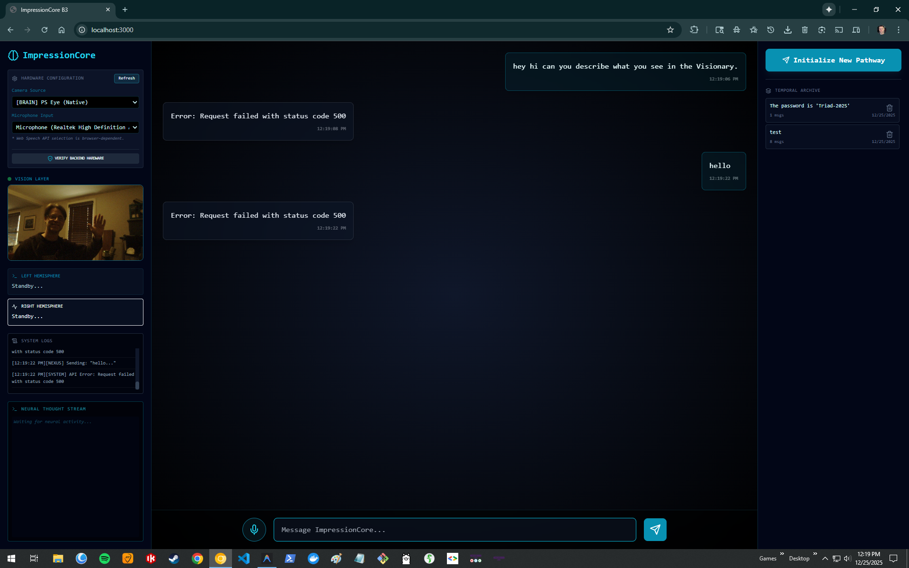
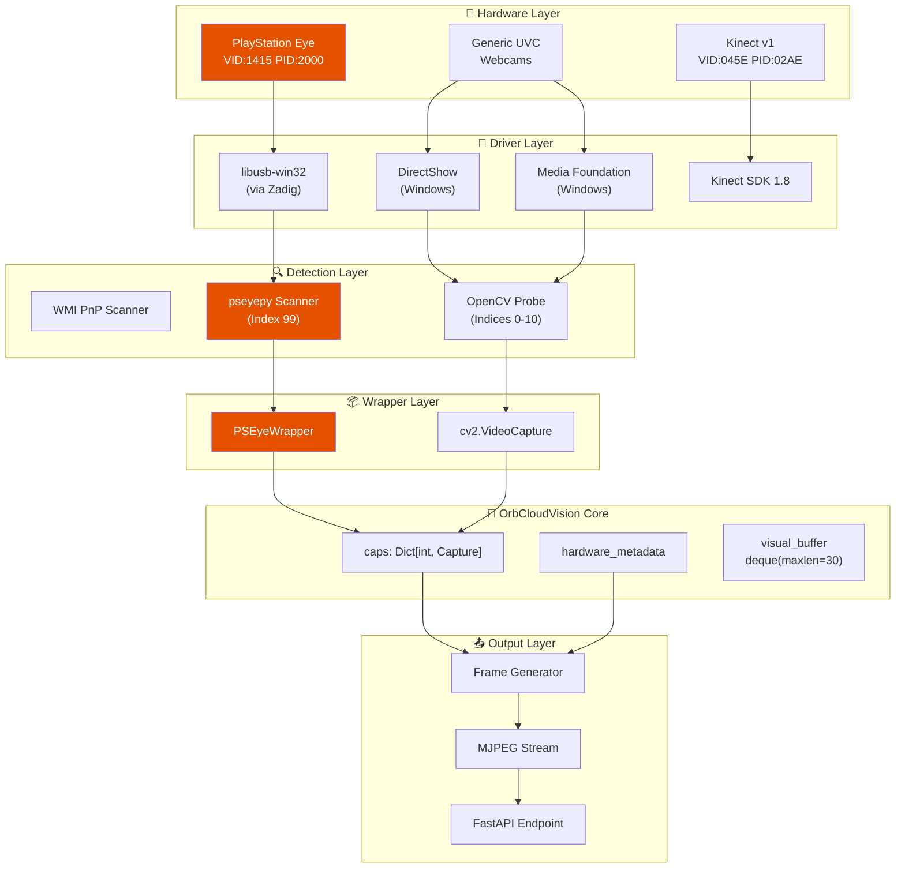
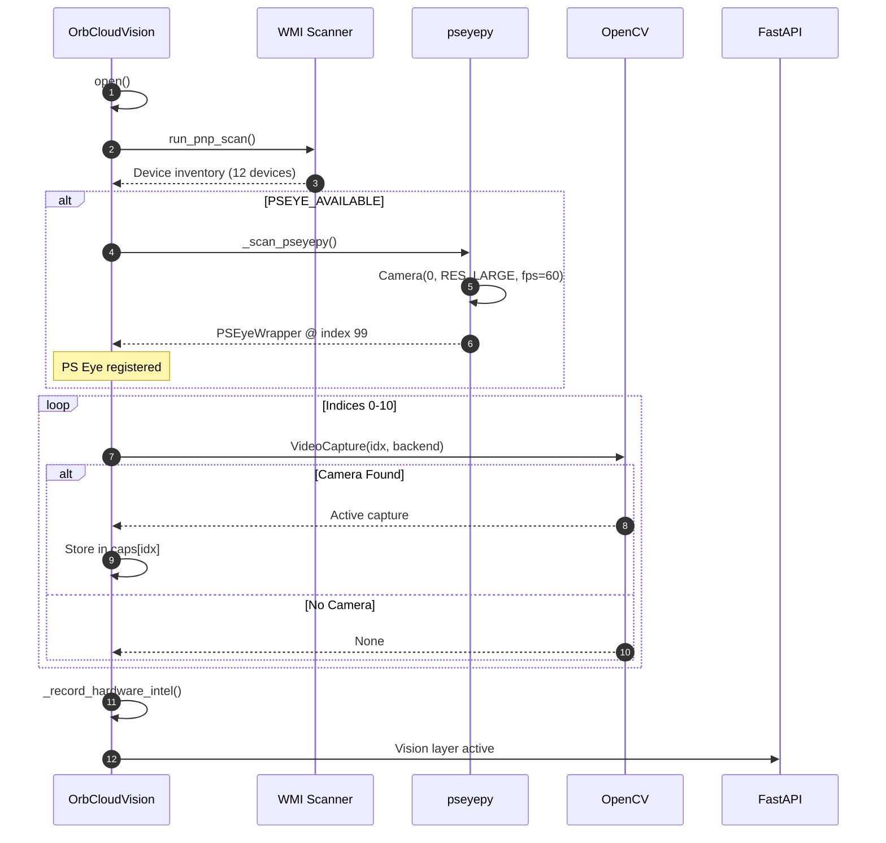
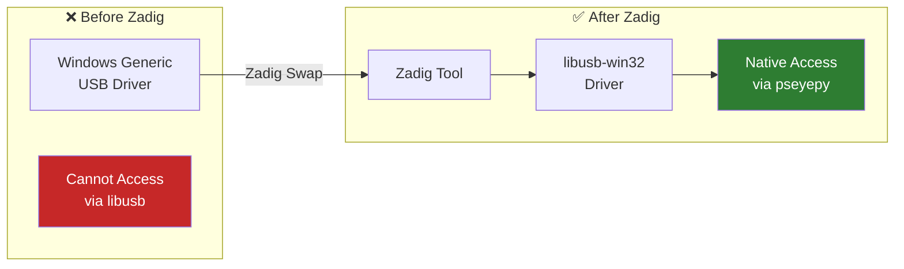
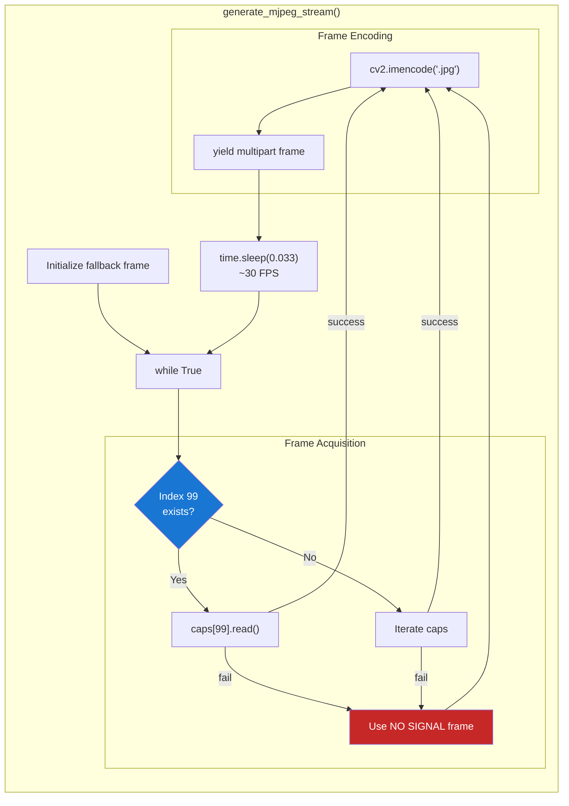
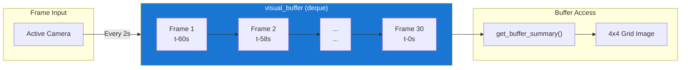
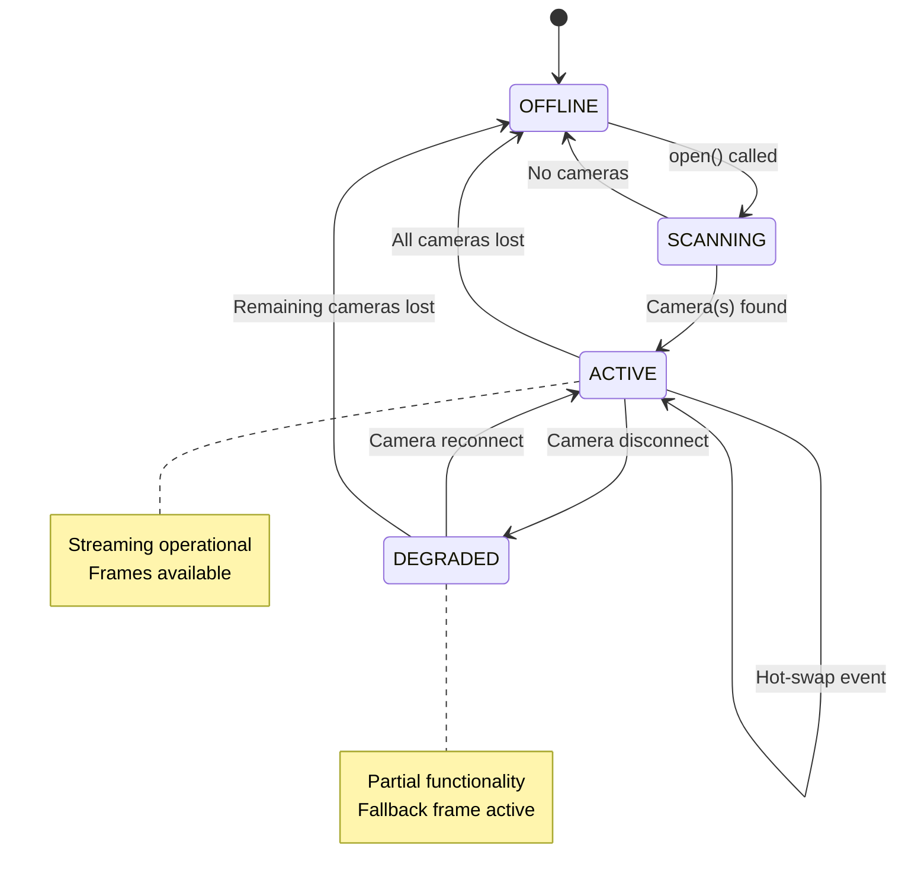

# Vision System Architecture

**Created:** December 25, 2025  
**Updated:** December 29, 2025  
**Author:** Kirk LaSalle  
**Tags:** #docs\technical\VISION_SYSTEM_ARCHITECTURE.md #documentation  
**Category:** Technical Documentation  
**Status:** Active
**IDS Integration:** This document is indexed and searchable via the ImpressionCore Documentation System (IDS).

---

**Version:** 1.0.0  
**Author:** Kirk LaSalle  
**Status:** Production

---

## Executive Summary

The OrbCloudVision system is ImpressionCore's comprehensive vision layer, providing hardware-agnostic camera detection, multi-source frame acquisition, and real-time MJPEG streaming. It supports multiple camera backends including OpenCV (DirectShow/MSMF), PlayStation Eye (via native libusb), and Kinect sensors.

---

## 🎯 Live System Demonstration


*Figure 1: Live PlayStation Eye camera streaming at 640x480@60fps through the ImpressionCore Brain-Triad frontend. The Vision Layer displays real-time video captured via native libusb driver.*

---

## 🏗️ System Architecture

### Component Overview



---

## 📷 Camera Detection Pipeline

### Detection Sequence



### Camera Index Mapping

| Index | Source | Backend | Priority |
|-------|--------|---------|----------|
| 99 | PlayStation Eye | libusb/pseyepy | Highest |
| 0-10 | UVC Cameras | DSHOW/MSMF/ANY | Standard |
| 100+ | Reserved | Future sensors | Low |

---

## 🎮 PlayStation Eye Integration

### Driver Requirements



### Installation Steps

1. **Download Zadig**: https://zadig.akeo.ie/
2. **Connect PS Eye**: Verify red/blue lights
3. **Run Zadig** as Administrator
4. **Select Device**: "USB Camera-B4.04.27.1"
5. **Replace Driver**: libusb-win32
6. **Verify**: `pip install pseyepy` (anmagx fork)

### PSEyeWrapper Implementation

```python
class PSEyeWrapper:
    """
    Wraps pseyepy Camera to mimic cv2.VideoCapture interface.
    
    The pseyepy library returns (frame, timestamp) tuples from read(),
    while OpenCV returns (success, frame). This wrapper normalizes
    the interface for seamless integration.
    """
    
    def __init__(self, eye_cam):
        self.eye = eye_cam
        
    def read(self) -> Tuple[bool, Optional[np.ndarray]]:
        """
        Read a frame from the PS Eye camera.
        
        Returns:
            Tuple of (success: bool, frame: np.ndarray or None)
            
        Note:
            pseyepy returns RGB frames, converted to BGR for OpenCV.
        """
        try:
            result = self.eye.read()
            if result is None:
                return False, None
            
            # Unpack (frame, timestamp) tuple
            if isinstance(result, tuple) and len(result) == 2:
                frame, timestamp = result
            else:
                frame = result
            
            # Validate and convert
            if isinstance(frame, np.ndarray) and frame.size > 0:
                # Convert RGB → BGR for OpenCV compatibility
                if len(frame.shape) == 3 and frame.shape[2] == 3:
                    frame = cv2.cvtColor(frame, cv2.COLOR_RGB2BGR)
                return True, frame
            return False, None
        except Exception as e:
            print(f"DEBUG: PSEyeWrapper.read() exception: {e}")
            return False, None

    def release(self):
        """Release camera resources."""
        try:
            self.eye.close()
        except:
            pass

    def isOpened(self) -> bool:
        """Check if camera is operational."""
        return True
    
    def get(self, prop: int) -> float:
        """Get camera property (dummy implementation)."""
        if prop == cv2.CAP_PROP_FRAME_WIDTH: return 640
        if prop == cv2.CAP_PROP_FRAME_HEIGHT: return 480
        if prop == cv2.CAP_PROP_FPS: return 60
        return 0
```

---

## 📡 MJPEG Streaming Pipeline

### Stream Generator Flow



### Stream Format

``` text
HTTP/1.1 200 OK
Content-Type: multipart/x-mixed-replace;boundary=frame

--frame
Content-Type: image/jpeg

[JPEG binary data]
--frame
Content-Type: image/jpeg

[JPEG binary data]
...
```

### Performance Characteristics

| Metric | Value |
|--------|-------|
| Source FPS | 60 (PS Eye native) |
| Stream FPS | 30 (throttled) |
| Resolution | 640x480 |
| JPEG Quality | Default (95) |
| Latency | ~50ms |

---

## 🔄 Temporal Visual Buffer

### Buffer Architecture



### Buffer Configuration

```python
visual_buffer = deque(maxlen=30)  # 30 frames max
buffer_interval = 2.0  # Capture every 2 seconds
# Total coverage: 60 seconds of visual history
```

---

## 🛠️ Hardware Metadata

### Schema

```json
{
  "99": {
    "width": 640,
    "height": 480,
    "fps": 60,
    "ptz_capabilities": {
      "pan": false,
      "tilt": false,
      "zoom": false,
      "digital": true
    },
    "backend": "LIBUSB_PSEYEPY",
    "status": "ACTIVE",
    "model": "PS Eye (Native)"
  }
}
```

### Capability Detection

| Capability | Detection Method |
|------------|------------------|
| Resolution | Camera query / defaults |
| FPS | Camera query / defaults |
| PTZ | Model-specific lookup |
| Backend | Acquisition source |

---

## 🔌 Sensory Hot-Swap

### State Transitions



---

## 📊 Troubleshooting

### Common Issues

| Issue | Symptom | Solution |
|-------|---------|----------|
| No PS Eye detection | Index 99 missing | Run Zadig driver swap |
| NO SIGNAL frame | caps empty | Check physical connection |
| Stream breaks | ERR_INCOMPLETE | Ensure time import |
| Low FPS | Choppy video | Check USB bandwidth |

### Debug Commands

```bash
# Check USB devices
python -c "from pseyepy import cam_count; print(cam_count())"

# Test direct capture
python -c "from pseyepy import Camera; c=Camera(0); print(c.read()[0].shape)"

# WMI device scan
python src/orchestrator/diag_pnp.py
```

---

## 🔗 Related Documentation

- [API Reference](../api/TRIAD_API_REFERENCE.md)
- [Brain-Triad Design](../architecture/BRAIN_TRIAD_DESIGN.md)
- [PS Eye Integration Guide](../hardware/PS_EYE_INTEGRATION_GUIDE.md)

---

## 📜 Changelog

| Version | Date | Changes |
|---------|------|---------|
| 1.0.0 | 2025-12-25 | Initial release with PS Eye support |
