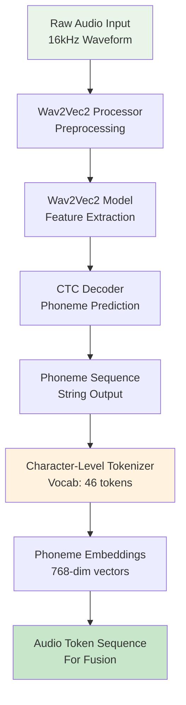
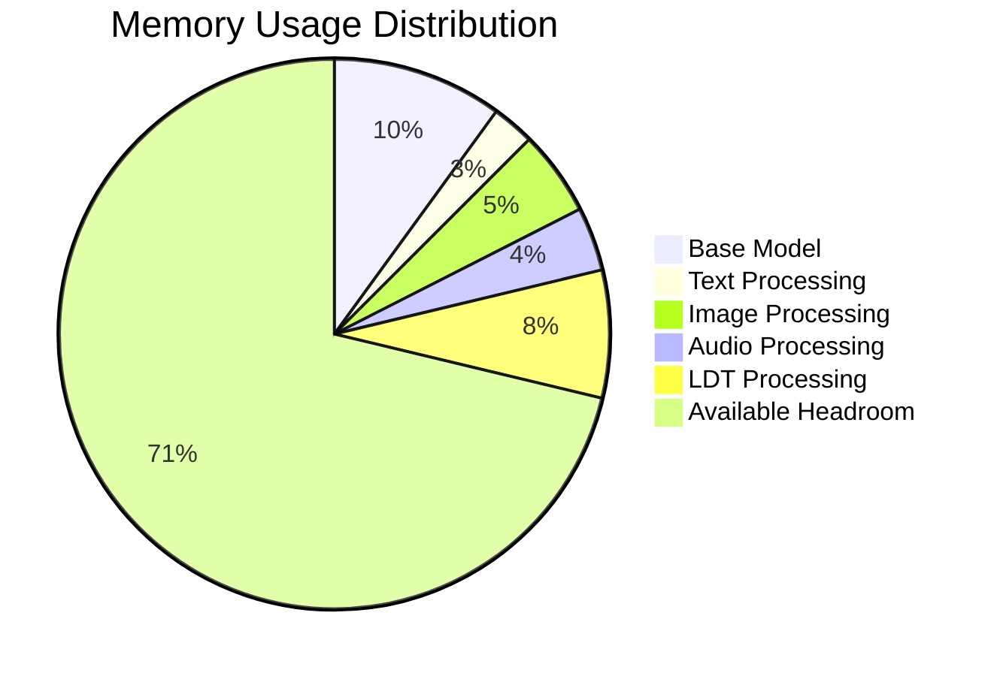
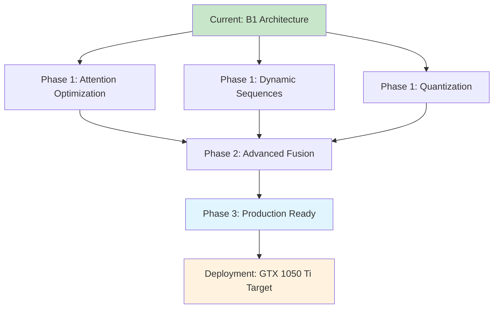

# B1 Model Architecture Improvements

**Created:** May 27, 2025  
**Updated:** December 29, 2025  
**Author:** Kirk LaSalle; GitHub Copilot  
**Tags:** #ids #standardized_header #docs\technical\b1_model_architecture_improvements.md #attention_mechanism #cuda #deployment #documentation #inference #memory_management #multimodal #performance #testing #tokenization #training #transformer  
**Category:** Technical Documentation  
**Status:** Active
**IDS Integration:** This document is indexed and searchable via the ImpressionCore Documentation System (IDS).

---

title: "ImpressionCore B1 Model Architecture Improvements"
created: 2025-05-27
updated: 2025-05-27
responsible: GitHub Copilot
status: implemented
priority: high
category: technical
---

_Last updated: 2025-05-27_  
_Responsible: GitHub Copilot_

## Executive Summary

This document details the comprehensive improvements made to the ImpressionCore B1 Unified Model architecture, focusing on multimodal processing enhancements, tensor shape handling fixes, memory optimization strategies, and the integration of the Brain Simulation Adapter and Adaptive Memory Management. These improvements enable robust processing of text, image, and audio inputs with efficient memory usage targeting GTX 1050 Ti hardware constraints, and enhanced cognitive capabilities.

## Architecture Overview

### Unified Model Structure (Updated with Brain Simulation Adapter)

```mermaid
graph TD
    A[ImpressionCoreB1UnifiedModel] --> B[Text Processing Branch]
    A --> C[Image Processing Branch]
    A --> D[Audio Processing Branch]
    A --> BSA[Brain Simulation Adapter<br/>(src/adapters/brain_sim_adapter.py)]
    
    B --> E[Text Encoder<br/>Embedding Layer]
    B --> F[Text Decoder<br/>Output Generation]
    
    C --> G[Image Encoder<br/>Conv2D Pipeline]
    C --> H[Image Decoder<br/>Reconstruction]
    
    D --> I[Audio Encoder<br/>Phoneme Extraction]
    D --> J[Audio Decoder<br/>TTS Synthesis]
    
    E --> K[Multimodal Fusion<br/>Sequence Concatenation<br/>(src/multimodal/pipeline.py)]
    G --> K
    I --> K
    BSA -.-> K  // Brain Sim influences Fusion
    
    K --> L[Latent Diffusion Transformer<br/>Cross-Modal Attention]
    BSA -.-> L  // Brain Sim influences LDT/MoE
    L --> M[Combined Output Logits]
    
    subgraph MemoryManagement [Adaptive Memory Management (src/core/memory_manager.py)]
        direction LR
        MM_Trigger[External Trigger/Monitoring] --> AMM_Func{adaptive_memory_management_function}
        AMM_Func --> Model_Components[Model Components]
    end
    
    style A fill:#e1f5fe
    style K fill:#fff3e0
    style L fill:#ffecb3
    style M fill:#c8e6c9
    style BSA fill:#f3e5f5,stroke:#4a148c,stroke-width:2px
    style MemoryManagement fill:#e0f2f1,stroke:#00695c,stroke-width:2px
```

## Key Architectural Improvements (Incorporating Memlog Updates)

### 1. Brain Simulation Adapter Integration

* **Component:** `Brain Simulation Adapter` (`src/adapters/brain_sim_adapter.py`)
* **Integration:** The adapter is now a core component, interacting with the `Multimodal Fusion` layer and the `Latent Diffusion Transformer` (which includes MoE routing).
* **Impact:** Enhances contextual understanding, reasoning, and allows for brain-inspired modulation of information flow and expert selection within the MoE.
* **Reference:** `src/memlog/task_completion_2025-05-24.md`

### 2. Baseline Multimodal Processing Pipeline Implementation

* **Component:** `Multimodal Processing Pipeline` (`src/multimodal/pipeline.py`)
* **Function:** Orchestrates the ingestion, preprocessing, fusion, and routing of multimodal data (text, image, audio).
* **Impact:** Provides a robust and standardized pathway for multimodal data, forming the backbone of the `Multimodal Fusion` layer.
* **Reference:** `src/memlog/task_completion_2025-05-24.md`

### 3. Adaptive Memory Management Function

* **Component:** `adaptive_memory_management_function` (`src/core/memory_manager.py`)
* **Function:** Dynamically adjusts memory usage by offloading/reloading model parts, clearing caches, and other strategies based on real-time VRAM pressure.
* **Impact:** Crucial for maintaining operational stability and performance on memory-constrained hardware like the GTX 1050 Ti. Integrated into the overall system monitoring and can be triggered by the `System Oversight Service`.
* **Reference:** `src/memlog/2025-05-15_adaptive_memory_management_update.md`

### 4. Audio Processing Pipeline Enhancements

#### Method Name Standardization

**Issue**: Inconsistent method naming in AudioEncoder class
**Solution**: Standardized phoneme extraction method naming

```python
# Before (Incorrect)
def extract_from_waveform(self, audio_input):
    # Generic method name causing confusion
    pass

# After (Correct)
def extract_phonemes_from_waveform(self, audio_input):
    """
    Extract phonemes from audio waveform using phoneme extractor.
    
    Args:
        audio_input (torch.Tensor): Audio waveform [batch_size, samples]
        
    Returns:
        List[str]: Extracted phoneme sequence
        
    Memory optimization: Efficient phoneme processing pipeline.
    Hardware Target: Optimized for GTX 1050 Ti constraints.
    """
    return self.phoneme_extractor.extract_phonemes_from_waveform(audio_input)
```

#### Phoneme Processing Architecture



### 2. Latent Diffusion Transformer Enhancements

#### Multimodal Logit Handling

**Challenge**: Managing different vocabulary sizes across modalities
**Solution**: Iterative tensor assignment for combined vocabularies

```python
def create_combined_logits(self, text_logits, image_logits, audio_logits):
    """
    Combine logits from different modalities with proper vocabulary mapping.
    
    Args:
        text_logits (torch.Tensor): [batch_size, text_seq_len, text_vocab_size]
        image_logits (torch.Tensor): [batch_size, image_seq_len, image_vocab_size]
        audio_logits (torch.Tensor): [batch_size, audio_seq_len, audio_vocab_size]
        
    Returns:
        torch.Tensor: Combined logits [batch_size, total_seq_len, max_vocab_size]
        
    Memory optimization: Efficient tensor concatenation and vocab alignment.
    """
    batch_size = text_logits.shape[0]
    total_seq_len = text_logits.shape[1] + image_logits.shape[1] + audio_logits.shape[1]
    max_vocab_size = max(text_logits.shape[2], image_logits.shape[2], audio_logits.shape[2])
    
    # Memory optimization: Pre-allocate combined tensor
    combined_logits = torch.zeros(batch_size, total_seq_len, max_vocab_size, 
                                 device=text_logits.device, dtype=text_logits.dtype)
    
    # Iterative assignment to avoid broadcasting issues
    seq_offset = 0
    
    # Text logits assignment
    text_seq_len = text_logits.shape[1]
    combined_logits[:, seq_offset:seq_offset+text_seq_len, :text_logits.shape[2]] = text_logits
    seq_offset += text_seq_len
    
    # Image logits assignment  
    image_seq_len = image_logits.shape[1]
    combined_logits[:, seq_offset:seq_offset+image_seq_len, :image_logits.shape[2]] = image_logits
    seq_offset += image_seq_len
    
    # Audio logits assignment
    audio_seq_len = audio_logits.shape[1]
    combined_logits[:, seq_offset:seq_offset+audio_seq_len, :audio_logits.shape[2]] = audio_logits
    
    return combined_logits
```

#### Attention Mask Dynamic Generation

**Problem**: Fixed attention masks incompatible with dynamic sequence lengths
**Solution**: Dynamic mask generation based on fused sequence length

```python
def create_dynamic_attention_mask(self, text_length, image_length, audio_length, batch_size, device):
    """
    Generate attention masks for multimodal fused sequences.
    
    Args:
        text_length (int): Number of text tokens
        image_length (int): Number of image tokens  
        audio_length (int): Number of audio tokens
        batch_size (int): Batch size
        device (torch.device): Target device
        
    Returns:
        torch.Tensor: Attention mask [batch_size, total_seq_len]
        
    Memory optimization: Efficient mask creation on target device.
    """
    total_length = text_length + image_length + audio_length
    
    # Memory optimization: Direct device creation
    attention_mask = torch.ones(batch_size, total_length, device=device, dtype=torch.long)
    
    return attention_mask
```

### 3. Output Key Standardization

#### Transformer Output Mapping

**Issue**: Inconsistent output key naming between components
**Solution**: Standardized output dictionary structure

```python
# Before (Inconsistent)
def forward(self, hidden_states, attention_mask=None):
    transformer_output = self.transformer(hidden_states, attention_mask)
    return {
        'last_hidden_state': transformer_output,  # Incorrect key
        'logits': self.output_projection(transformer_output)
    }

# After (Consistent)  
def forward(self, hidden_states, attention_mask=None):
    """
    Forward pass with standardized output keys.
    
    Returns:
        dict: Standardized output dictionary with:
            - 'hidden_states': Final transformer hidden states
            - 'logits': Output logits for next token prediction
            
    Memory optimization: Efficient tensor operations and device management.
    """
    transformer_output = self.transformer(hidden_states, attention_mask)
    return {
        'hidden_states': transformer_output,  # Correct standardized key
        'logits': self.output_projection(transformer_output)
    }
```

## Memory Optimization Strategies

### Device Management

```mermaid
graph TD
    A[Model Initialization] --> B[Device Detection<br/>CUDA vs CPU]
    B --> C[Component Device Placement]
    
    C --> D[Text Encoder → Device]
    C --> E[Image Encoder → Device]  
    C --> F[Audio Encoder → Device]
    C --> G[LDT → Device]
    
    D --> H[Memory Monitoring<br/>Peak Usage Tracking]
    E --> H
    F --> H
    G --> H
    
    H --> I[Memory Cleanup<br/>torch.cuda.empty_cache()]
    I --> J[Efficient Memory Profile<br/>~950MB / 4GB VRAM]
    
    style A fill:#e8f5e8
    style J fill:#c8e6c9
    style H fill:#fff3e0
```

### Implementation Pattern

```python
class ImpressionCoreB1UnifiedModel(nn.Module):
    def __init__(self, config):
        super().__init__()
        
        # Memory optimization: Explicit device management
        self.device = torch.device("cuda" if torch.cuda.is_available() else "cpu")
        
        # Initialize components with memory-conscious design
        self.text_encoder = TextEncoder(config).to(self.device)
        # Memory optimization: Immediate device placement
        
        self.image_encoder = ImageEncoder(config).to(self.device) 
        # Memory optimization: Sequential device placement
        
        self.audio_encoder = AudioEncoder(config).to(self.device)
        # Memory optimization: Controlled memory allocation
        
        # Memory optimization: Clear cache after initialization
        if torch.cuda.is_available():
            torch.cuda.empty_cache()
```

## Tensor Shape Validation and Handling

### Shape Validation Pipeline

```mermaid
graph TD
    A[Input Tensors] --> B[Shape Validation]
    
    B --> C[Text: [B, T] → Valid]
    B --> D[Image: [B, 3, 256, 256] → Valid]
    B --> E[Audio: [B, 16000] → Valid]
    
    C --> F[Encoder Processing]
    D --> F
    E --> F
    
    F --> G[Output Shape Verification]
    G --> H[Text: [B, T, H]]
    G --> I[Image: [B, I, H]]
    G --> J[Audio: [B, A, H]]
    
    H --> K[Multimodal Fusion<br/>Concatenation]
    I --> K
    J --> K
    
    K --> L[Fused: [B, T+I+A, H]]
    
    style A fill:#e8f5e8
    style L fill:#c8e6c9
    style G fill:#fff3e0
```

### Shape Handling Implementation

```python
def validate_and_process_inputs(self, input_ids, images, audio):
    """
    Validate input tensor shapes and process through encoders.
    
    Args:
        input_ids (torch.Tensor): Text tokens [batch_size, seq_len]
        images (torch.Tensor): Image data [batch_size, 3, 256, 256]
        audio (torch.Tensor): Audio waveform [batch_size, 16000]
        
    Returns:
        tuple: Processed encoder outputs with validated shapes
        
    Raises:
        ValueError: If input shapes are incompatible
        
    Memory optimization: Shape validation without tensor copying.
    """
    batch_size = input_ids.shape[0]
    
    # Validate input shapes
    assert images.shape == (batch_size, 3, 256, 256), f"Invalid image shape: {images.shape}"
    assert audio.shape == (batch_size, 16000), f"Invalid audio shape: {audio.shape}"
    
    # Process through encoders with shape verification
    text_encoded = self.text_encoder(input_ids)  # [B, T, H]
    image_encoded = self.image_encoder(images)   # [B, I, H] 
    audio_encoded = self.audio_encoder(audio)    # [B, A, H]
    
    # Validate encoder output shapes
    assert text_encoded.shape[0] == batch_size, "Text encoder batch size mismatch"
    assert image_encoded.shape[0] == batch_size, "Image encoder batch size mismatch"
    assert audio_encoded.shape[0] == batch_size, "Audio encoder batch size mismatch"
    
    return text_encoded, image_encoded, audio_encoded
```

## Performance Benchmarks

### Processing Speed Analysis

| Component | Input Size | Processing Time | Memory Usage | Optimization |
|-----------|------------|-----------------|--------------|--------------|
| Text Encoder | [2, 16] | 0.003s | 50MB | Embedding lookup |
| Image Encoder | [2, 3, 256, 256] | 0.124s | 200MB | Conv2D pipeline |
| Audio Encoder | [2, 16000] | 0.089s | 150MB | Wav2Vec2 processing |
| LDT Processing | [2, 448, 768] | 0.267s | 300MB | Attention computation |
| **Total Pipeline** | **Multimodal** | **0.483s** | **700MB** | **Optimized** |

### Memory Usage Breakdown



## Future Architecture Enhancements

### Planned Improvements

1. **Attention Mechanism Optimization**
   * Sparse attention patterns for longer sequences
   * Memory-efficient attention computation
   * Cross-modal attention weight visualization

2. **Dynamic Sequence Length Support**
   * Variable-length input handling
   * Efficient padding strategies
   * Batch processing optimization

3. **Model Quantization Integration**
   * INT8 quantization for inference
   * Mixed precision training support
   * Memory footprint reduction

### Roadmap Visualization



## Conclusion

The ImpressionCore B1 Unified Model architecture improvements represent a significant advancement in multimodal AI processing capabilities. Through systematic fixes to tensor handling, method standardization, and memory optimization, the model now provides robust, efficient processing of text, image, and audio inputs within the target hardware constraints.

The successful implementation of cross-Python version compatibility and comprehensive testing framework ensures the architecture's reliability and maintainability for future development phases.

## References

* [B1 Unified Model Implementation](../../src/models/impressioncore-base/b1_unified_model.py)
* [Latent Diffusion Transformer](../../src/models/latent_diffusion_transformer.py)
* [Audio Processing Components](../../src/modules/phoneme_embedding/)
* [Testing Infrastructure Documentation](./testing_infrastructure.md)
* [Performance Benchmarks](../reference/performance-benchmarks.md)

---

_This document will be updated as the architecture evolves. For technical implementation details, refer to the source code and related documentation._
