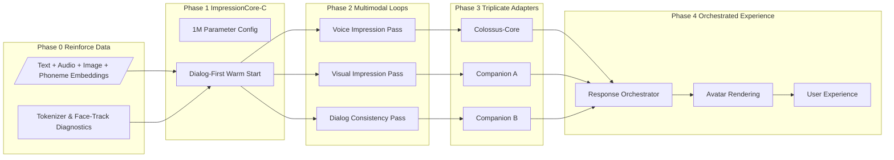

# ImpressionCore-C & Colossus Roadmap

**Created:** November 04, 2025  
**Updated:** December 29, 2025  
**Author:** GitHub Copilot  
**Tags:** #docs/training/ImpressionCoreC_Colossus_Roadmap.md #training #roadmap #colossus #multimodal #dialog  
**Category:** Documentation  
**Status:** Active
**IDS Integration:** This document is indexed and searchable via the ImpressionCore Documentation System (IDS).

---

## Mission Context

ImpressionCore exists to deliver a fully embodied impression of every registered user — synchronized dialog, expressive voice, and adaptive visual presence. This roadmap aligns the 1 million parameter ImpressionCore-C foundation with the future Colossus triplicate architecture so that all modalities remain first-class citizens.

## Phase Overview

1. **Phase 0 — Reconsolidate Data & Diagnostics**  
   - Validate text, audio, image, and phoneme embeddings already staged on the F:/ infrastructure.  
   - Regenerate quick diagnostics on tokenizer ↔ phoneme alignment and confirm face-tracking feature freshness.  
   - Capture baseline self-play dialog logs with the current slim checkpoints for comparison.

2. **Phase 1 — 1M Parameter Foundation (ImpressionCore-C)**  
   - Define compressed architecture config (`embed_dim`, `num_layers`, expert counts) targeting ~1M parameters while preserving multimodal paths.  
   - Run a dialog-first warm start (batch ≥16, accum ≥8) using curated conversation corpora plus aligned audio/visual tuples.  

- Run a dialog-first warm start (batch ≥16, accum ≥8) using curated conversation corpora plus aligned audio/visual tuples.  
- Keep the Assembly-of-Experts regularizer lightweight (current target `0.001 * var(usage)`) by tracking normalized routing frequencies so the LM loss remains the primary optimization signal.  
  - Track loss × quality metrics and ensure speech/face adapters stay wired into the forward path.

3. **Phase 2 — Multimodal Enrichment Loops**  
   - Alternate fine-tuning passes that emphasize:  
     - **Voice Impression:** phoneme-aligned TTS mimicry and prosody tagging.  
     - **Visual Impression:** face-tracking expression labels, camera pose imitation.  
     - **Dialog Consistency:** Socratic question-answer sets, emotional safety corpora.  
   - Maintain a single shared checkpoint throughout; these are targeted curriculum passes, not divergent branches.

4. **Phase 3 — Colossus Triplicate Expansion**  
   - Clone the matured foundation into three adapter-enhanced siblings once stability is proven.  
     - **Colossus-Core:** maintains narrative and multimodal synchronization.  
     - **Companion A (Empathy):** emphasizes rapport, emotional mirroring, de-escalation.  
     - **Companion B (Strategy):** handles reasoning, planning, safety counterfactuals.  
   - All siblings continue to share the tokenizer, embeddings, and knowledge cache; adapters provide persona shifts without breaking multimodal outputs.

5. **Phase 4 — Orchestrated Inference & Avatar Integration**  
   - Implement the response orchestrator that samples outputs from each sibling, scores them with the quality head, and blends the final dialog stream.  
   - Route synchronized phoneme + face cues into the avatar rendering pipeline so users experience full audio/visual impressions in real time.  
   - Validate end-to-end experience with human-in-the-loop sessions and safety audits.

## Flow Visualization

## Immediate Action Items

- Draft the trimmed architecture config for ImpressionCore-C (≈1M parameters) and stage it under `src/training/configs/models/`.  
- Assemble the dialog-first dataset manifest (text + aligned speech/face features) for Phase 1 training runs.  
- Expand the Phase 1 dialog corpus beyond the seed set so the warm start covers core, supportive, and strategic tones with sufficient variety.  
- Extend logging to capture per-pass multimodal quality metrics (speech similarity, facial expression accuracy, dialog score).  
- Prepare adapter templates for Phase 3 persona specialization once Phase 2 metrics reach target thresholds.

## Status Tracking

- **Current Phase:** Transitioning from Phase 0 diagnostics to Phase 1 warm-start training.  
- **Next Checkpoint:** Verify 1M configuration readiness and schedule the first dialog-first training pass.  
- **Constitutional Alignment:** All steps adhere to protection-first design, multimodal completeness, and consumer hardware democracy (GTX 1050 Ti target).