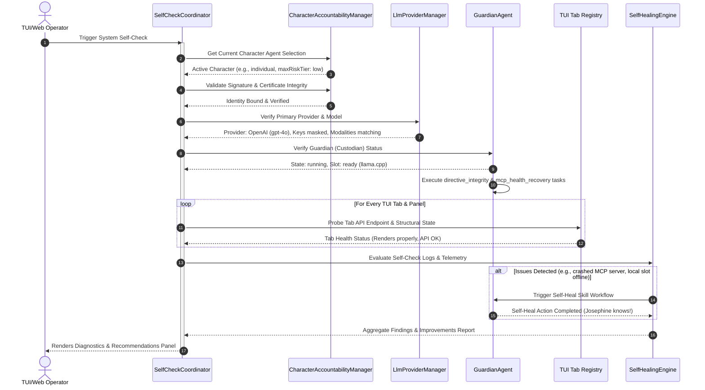

# PRISM UI Self-Checking & Self-Improvement Plan

This document details the implementation plan for integrating an automated, continuous **Self-Checking and Self-Improvement System** within the PRISM ecosystem. The system verifies the integrity of the **Guardian configuration**, the **main Provider/model configuration**, the **Character Agent selection**, and systematically audits **every Tab and Panel** within the terminal user interface (TUI) and Web dashboards.

---

## 1. Executive Summary & Core Objective

The PRISM platform requires a self-diagnostic and self-healing subsystem to verify system health, ensure regulatory compliance, and proactively improve platform efficiency. The proposed **Unified Self-Check and Integrity Validation Runner** will run sequentially or on-demand, executing:
1. **CAC Identity Verification**: Ensure the selected Character Agent is correctly bound, its security certificates are valid, and its risk limits are enforced.
2. **LLM Provider Audits**: Test endpoint connectivity, latency, throughput, and key masking for both remote cloud providers and local supervisors.
3. **Guardian Custodian Diagnostics**: Verify GGUF integrity, llama.cpp model slot availability, and the execution status of critical custodian tasks.
4. **Subsystem Tab & Panel Sweeps**: Run targeted diagnostics across all 12 interface tabs and panels to catch rendering crashes and API failures.
5. **Self-Improvement Loops**: Automatically run remediation tasks (e.g., freeing up disk space, restarting crashed MCP servers, rotating keys, and updating model configurations).

---

## 2. Validation Flow Architecture

The diagnostics process is coordinated by a new `SelfCheckCoordinator` residing in `src/core/diagnostics/self-check-coordinator.ts`. The coordinator runs under the identity of the active Character Agent to verify accountability tracking.

---

## 3. Tab & Panel Verification Matrix

The self-check runner will systematically sweep each tab and panel in the UI, invoking their respective data endpoints and verifying that the structure is healthy:

| Tab ID | TUI Panel / Sub-Tab | Core Data APIs Checked | Health & Integrity Diagnostics |
| :--- | :--- | :--- | :--- |
| **`chat`** | Chat Window & Sessions List | `GET /api/chat/sessions` `POST /api/chat/session` | Create temp session; run lightweight prompt probe; check workspace file linkage; teardown test session. |
| **`settings`** | LLM Config / Model Matrix | `GET /api/v1/llm/config` `GET /api/v1/llm/matrix` `GET /api/v1/audit/trail` | Verify API key is masked (`••••••••`); check latency on active provider; audit model matrix for deprecations. |
| **`tools`** | Tools, Plugins, Diagnostics | `GET /api/tools` `GET /api/plugins/status` `GET /api/v1/diagnostics/{key}/status` | Verify MCP server connections; check schemas for all tools; run background diagnostic suites. |
| **`agentic`** | Active Agents / Swarms / Characters | `GET /api/agents` `GET /api/swarms` `GET /api/workspace/characters` | Verify swarm topology; check active character manifests; monitor promotion and stop triggers. |
| **`computer`** | Sandbox / OS Control | `GET /api/computer/status` `GET /api/computer/screen` | Verify active sandbox (docker/host) connection; audit screenshot storage; check cross-platform tool availability. |
| **`browser`** | Playwright Session / Profiles | `GET /api/browser/sessions` `GET /api/browser/profiles` | Verify Playwright launch capability; check browser profiles; audit allowlist patterns. |
| **`workspace`**| File Browser / Git Status | `GET /api/workspace/files` `GET /api/workspace/git` | Validate file system access; check project Git status; verify artifact signature validation. |
| **`network`** | Blocked Patterns / Proxy | `GET /api/network/patterns` `GET /api/network/telemetry` | Verify blocklist compilation; check dns tool resolving; test local network adapter status. |
| **`telemetry`**| Metrics / Event Lineage | `GET /api/telemetry/lineage` `GET /api/telemetry/metrics` | Check Event Bus responsiveness; ensure latency/token metric aggregation; analyze SLO gauges. |
| **`logs`** | Log View / Rotations | `GET /api/logs/files` `GET /api/logs/metrics` | Verify JSON logs schema; audit log volume metrics; check rotation triggers. |
| **`scheduler`**| Jobs / Compliance | `GET /api/scheduler/jobs` `GET /api/compliance/status` | Verify scheduled compliance jobs; audit task decomposer loops; check compliance routing. |
| **`setup`** | Wizard Status | `GET /api/setup/status` | Confirm wizard configuration parity; check setup complete flag in preferences. |

---

## 4. Configuration Integrity Rules

### A. Character Agent Selection Validation
Every self-check must execute within a valid **Character Accountability Chain (CAC)**. The runner will assert:
* **Identity provenance**: The active session must bind to a validated assistant email.
* **Risk tier enforcement**: Submitting high-risk operations while operating under a character limited to a low-risk tier must return a clean, intercepted policy rejection (`TAXONOMY_CODES.POLICY_DENIED`).
* **Signature verification**: Character configuration files in the `characters/` folder must match their saved cryptographical signatures.

### B. Main Provider & Model Audits
* **API Key Security**: Verify that keys are loaded correctly but never displayed in cleartext in any JSON diagnostic payloads or logs.
* **Modality Alignment**: Ensure the active model has the required modalities (text, vision, tools) declared in the Model Matrix for the character's role.
* **Latency Check**: Route a tiny test token request to verify round-trip response time (under 1500ms for remote cloud; under 500ms for local slots).

### C. Enhanced Guardian Configuration Diagnostics
The Guardian is built to run autonomously on local models. It uses **Dynamic Parameter-Aware Reasoning Scaling** to adjust system overhead and parameters based on model size:

> [!NOTE]
> **Capability Scaling Levels**
> * **`low_spec`** (Models < 2B, e.g., Qwen 1.5B, context < 2048): Enforces tight memory limits (512MB RSS), limits local model file storage allocations to 5GB, and runs light prompts.
> * **`mid_spec`** (Models 3B-8B, e.g., Llama 3 8B): Uses moderate memory limits (1GB RSS) and allows up to 15GB model file allocations.
> * **`high_spec`** (Models > 8B or Cloud models): Enables full-scale memory audits (2GB RSS limit), allocates up to 30GB model storage, and executes extensive telemetry checks.

The Guardian performs the following automated self-checks and healing:
* **Active Directive Restoring**: The Guardian maintains a known-good backup of the `Permanent_Active_Directives.txt` (stored under `state/Permanent_Active_Directives.txt.bak` on startup). If a verification check fails or the file is modified without authorization, the Guardian automatically restores it from the backup to heal the system.
* **Context & Action Log Pruning**: Runs a periodic compaction sweep (`context_prune`) to aggregate consecutive nominal check logs, reducing memory footprint and context-window consumption.
* **Active Tasks Verification**: Monitors `mcp_health_recovery` and `aab_ledger_monitor` tasks to verify system-level custodian control.

---

## 5. Autonomous Self-Improvement & Remediation Actions

When the runner uncovers health degradations, the system doesn't just display warning flags. It triggers **Self-Improvement Remediation workflows** overseen by the Guardian custodian:

> [!TIP]
> **Remediation Trigger Catalog**
> * **High RAM / Memory Leak Detected**: Trigger a memory compaction sweep, or gracefully restart the llama.cpp supervisor slot to free system resources.
> * **Stale Temp Files (>10GB disk space)**: Invoke the Guardian's `temp_cleanup` task to wipe older caches and release disk resources.
> * **Down / Unresponsive MCP Servers**: Call `forceReconnect(serverName)` to reload client contexts and re-establish downstream tools.
> * **Model Latency Spikes**: Advise switching routing strategies (e.g., switching from speculatively decoded local slot to an online fallback model profile).
> * **Exposed Secret Key Detected**: Automatically quarantine the exposed environment file, alert the operator, and request key rotation.

---

## 6. Implementation Plan & Milestones

### Phase 1: Self-Check Core Engine
- Create the core test coordinator file: [self-check-coordinator.ts](file:///d:/Projects/Prism/src/core/diagnostics/self-check-coordinator.ts).
- Integrate it into the existing `DiagnosticsHandler` at `/api/diagnostics/system/run`.
- Implement CLI command: `npm run doctor` to output JSON self-check reports.

### Phase 2: Tab API Integration
- Map check-loops to every endpoint listed in the **Tab Verification Matrix**.
- Build mock navigators in Ink to verify tab renders without throwing React hooks errors.

### Phase 3: Guardian Integration & Self-Healing
- Hook up the `SelfCheckCoordinator` to the Guardian Agent so that it runs automatically at boot and every 10 minutes.
- Implement the self-improvement/remediation actions inside `src/core/agents/guardian-agent.ts`.

### Phase 4: Verification & Release
- Integrate the self-check runner into the release validation suite (`npm run release:validate`).
- Verify that a tamper warning or missing character config correctly blocks release.
