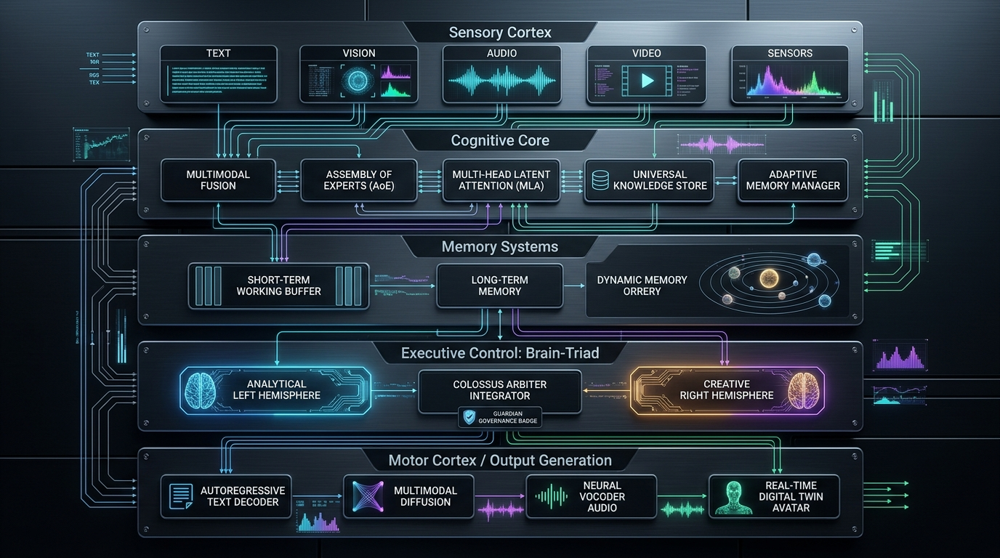
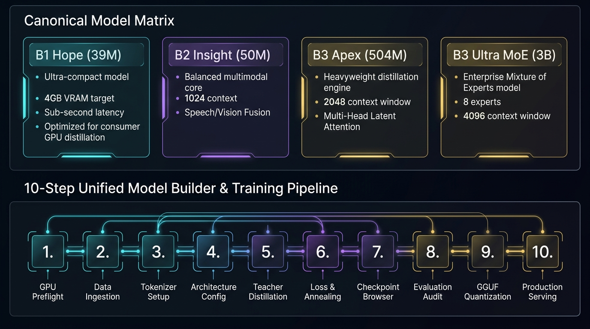
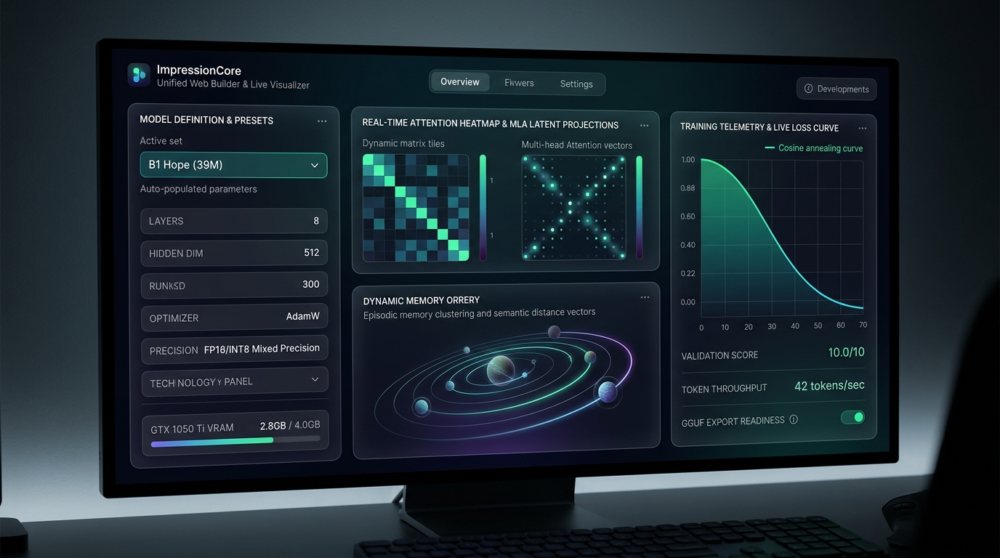
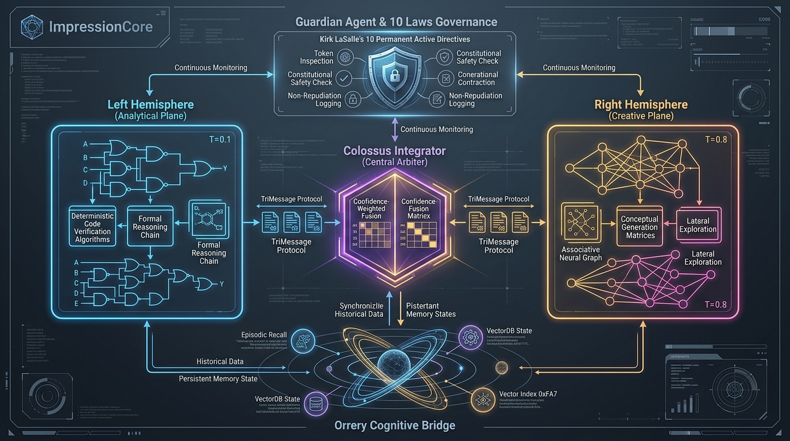

# ImpressionCore User Guide

**Created:** April 19, 2025  
**Updated:** August 26, 2026  
**Author:** Kirk LaSalle; Antigravity  
**Category:** User Documentation & Operator Manual  
**Status:** Active Canonical 2026 Release  
**IDS Integration:** This document is indexed and searchable via the ImpressionCore Documentation System (IDS).

---

## 🌟 1. Overview & System Mission

ImpressionCore is a **brain-inspired, multimodal, agentic AI platform** engineered to democratize professional-grade AI training and inference on consumer hardware valued at $150–250 (such as the NVIDIA GeForce GTX 1050 Ti with 4GB VRAM).



### Key Capabilities

- **Brain-Inspired Cognitive Architecture**: Multimodal Sensory Cortex, Assembly of Experts (AoE), Multi-Head Latent Attention (MLA), Dynamic Memory Orrery, and Brain-Triad Executive Layer.
- **Consumer Hardware Optimized**: Complete training pipeline strictly bounded below 4GB VRAM with 40-second epochs.
- **Hemispheric Brain-Triad**: Analytical Left Hemisphere ($T=0.1$), Creative Right Hemisphere ($T=0.8$), and Colossus Integrator via TriMessage Protocol.
- **Autonomous Governance**: Strict continuous enforcement of Kirk LaSalle's 10 Permanent Active Directives.
- **Unified Model Builder & Live Visualizer**: Interactive Glassmorphism UI on Port 5000 with real-time attention heatmaps, latent vectors, and 3D memory orrery.
- **Agent0Core with GGUF Supervision**: Autonomous agentic intelligence layer with local quantized LLM supervisor and Guardian safety agents.

---

## 💻 2. System Requirements & Hardware Profiles

| Component | Minimum Specification (Consumer Tier) | Recommended Specification (Workstation Tier) |
|---|---|---|
| **GPU** | NVIDIA GeForce GTX 1050 Ti (4GB VRAM) | NVIDIA RTX 3060 / 4060 / 4090 (8–24GB VRAM) |
| **CPU** | Intel Core i5-4460 @ 3.20GHz or AMD Ryzen 5 | Intel Core i7 / i9 or AMD Ryzen 7 / 9 |
| **RAM** | 16GB DDR3/DDR4 | 32GB–64GB DDR4/DDR5 |
| **Disk Space** | 20GB free space (SSD recommended) | 500GB+ dedicated storage (`F:\` drive layout) |
| **Operating System** | Windows 10/11 64-bit, Ubuntu 22.04+, macOS 12+ | Windows 11 Pro / Ubuntu 24.04 LTS |
| **Python & CUDA** | Python 3.10+ with CUDA 12.1+ / PyTorch 2.6+ | Python 3.11 with CUDA 12.4+ |

---

## 🚀 3. Canonical Model Offerings & Preset Matrix

ImpressionCore provides 4 official canonical model configurations alongside the C1 Triad Plane:



| Model Profile | Target Params | Layers × Heads | Hidden / FFN Dim | Context Window | Target VRAM | Batch / Grad Accum | Learning Rate | Optimal Target Hardware |
| :--- | :---: | :---: | :---: | :---: | :---: | :---: | :---: | :--- |
| **B1 Hope 39M** (`b1_39m`) | **39 Million** | 8 × 8 | 512 / 2048 | 512 tokens | **~0.23 GB** | 1 / 8 | 5e-5 | NVIDIA GTX 1050 Ti (4GB) / Laptops / CPU |
| **B2 Insight 50M** (`b2_50m`) | **50 Million** | 12 × 10 | 640 / 2560 | 1,024 tokens | **~0.35 GB** | 1 / 10 | 4e-5 | NVIDIA GTX 1050 Ti (4GB) / Edge Nodes |
| **B3 Apex 504M** (`b3_504m`) | **504 Million** | 24 × 16 | 1024 / 4096 | 2,048 tokens | **~1.80 GB** | 1 / 16 | 2e-5 | NVIDIA GTX 1050 Ti (4GB) / RTX 3060 |
| **B3 Ultra 3B MoE** (`b3_3b`) | **3.2 Billion** (MoE) | 32 × 16 | 2048 / 8192 | 4,096 tokens | **~3.80 GB (INT4/8)** | 1 / 32 | 1e-5 | GTX 1050 Ti + Offload / RTX 3060 / 4090 |
| **C1 Triad Plane** | Multi-Inst. | Heterog. | Triad | Dynamic | Hybrid | Dynamic | Adaptive | Hybrid Consumer / Host |

---

## 🛠️ 4. The 10-Step Model Building & Training Pipeline



### Step 1: Launch the Model Builder Server
Launch the local web server using the Windows batch launcher or Python:
```powershell
# Option A: Windows Batch Launcher
.\launch_builder.bat

# Option B: Direct Python execution
python src/interfaces/web/server.py --port 5000
```
Open your browser at **[http://127.0.0.1:5000](http://127.0.0.1:5000)** and log in with default development credentials (`admin` / `admin`).

---

### Step 2: Hardware & GPU Preflight Check
Navigate to **System Setup** (`/system-setup` or `/gpu-setup`):
1. The builder automatically probes `torch.cuda` and NVML telemetry.
2. Confirm your GPU is detected (e.g. *NVIDIA GeForce GTX 1050 Ti*, 4096MB VRAM).
3. Verify PyTorch CUDA runtime (`PyTorch 2.6.0+cu124` / `CUDA 12.4`).

---

### Step 3: Dataset Preparation & Scanning
Navigate to **Data Preparation** (`/data-prep`):
1. **Browse / Scan Datasets:** Point the dataset path to `data/datasets` or your custom text/image/audio folder.
2. Click **Scan Directory** to index total files, byte counts, and encoding validation.
3. Verify that your text files are UTF-8 encoded and formatted for sequence learning.

---

### Step 4: Tokenizer Configuration
Navigate to **Tokenization** (`/tokenizer`):
1. **Tokenizer Type:** Select `Byte-Pair Encoding (BPE)`.
2. **Vocabulary Size:** Default is `32,000` (or `50,257` for GPT-2 compatibility).
3. **Special Tokens:** `<pad>,<eos>,<bos>,<unk>`
4. Test live tokenization by typing a prompt (e.g. `"ImpressionCore digital identity"`).

---

### Step 5: Model Architecture Definition & Preset Selection
Navigate to **Model Definition** (`/model-definition`):
1. **Select Model Size Preset:** Choose from the dropdown:
   - `B1 Hope 39M (Edge SLM)`
   - `B2 Insight 50M`
   - `B3 Apex 504M`
   - `B3 Ultra 3B MoE`
2. **Observe Auto-Populated Settings:**
   - Notice how **Layers**, **Hidden Size**, **Attention Heads**, **FFN Dimension**, and **Precision** instantly populate.
   - Observe the **VRAM Estimation Bar**: It confirms whether the model fits inside the 4.0 GB budget of a GTX 1050 Ti.
3. Click **Save Configuration** to persist your model definition.

---

### Step 6: Training & Distillation Pipeline
Navigate to **Training** (`/training`):
1. **Configure Hyperparameters:**
   - **Epochs:** 2–10
   - **Batch Size:** 1–2 (with Gradient Accumulation Steps 8–16)
   - **Learning Rate:** `5e-5` (for B1) or `2e-5` (for B3)
   - **Precision:** `fp16` (Mixed Precision for low VRAM)
   - **Checkpoint Directory:** `models/checkpoints` or `F:\models\checkpoints`
2. Click **Start Training**:
   - The builder launches the background training worker.
   - Monitor the real-time telemetry: **Loss Curve** (converging from ~5.0 down below 1.0), **VRAM Consumption**, and **Step Progress**.

---

### Step 7: Checkpoint Verification & Integrity Hashing
Navigate to **Checkpoints** (`/checkpoints`):
1. Verify that model weights (`model.pt`, `checkpoint_epoch_*.pt`) are saved.
2. Check SHA-256 file integrity, parameter counts, and creation timestamps.

---

### Step 8: Live Inference & Interactive Chat
Navigate to **Inference / Chat** (`/inference` or `/chat`):
1. Select your trained checkpoint or active model.
2. Set Generation Parameters:
   - **Temperature:** `0.7`
   - **Top-P:** `0.90`
   - **Max Tokens:** `128`
3. Enter a prompt to verify generation:
   > *"ImpressionCore digital identity and cognitive architecture represents"*
4. Receive the real-time generated response and verify latency metrics.

---

### Step 9: Benchmark Evaluation Suite
Navigate to **Evaluation** (`/evaluation`):
1. Select evaluation metrics: `Accuracy`, `Perplexity`, `BLEU`, `ROUGE-L`, `F1 Score`, `Latency`.
2. Click **Run Evaluation** to score your model against validation datasets.

---

### Step 10: Production Deployment Packaging & GGUF Export
Navigate to **Deployment** (`/deployment`):
1. **Target Format:** Choose `PyTorch (.pt)`, `SafeTensors (.safetensors)`, `GGUF (Q4_K_M, Q8_0)`, or `ONNX (.onnx)`.
2. **Optimization:** Select `Quantized INT8` or `FP16`.
3. Click **Package Model for Deployment**:
   - The package is compiled into `production_packages/ImpressionCore_B<X>_deploy_<timestamp>/` complete with `model.pt` and `manifest.json`.

---

## 🧠 5. Brain-Triad Cognitive Orchestration & Governance



ImpressionCore's Brain-Triad operates with three distinct computational planes:
- **Left Hemisphere (Analytical Plane)**: $T=0.1$, deterministic code verification, formal logic gates.
- **Right Hemisphere (Creative Plane)**: $T=0.8$, associative neural graphs, lateral exploration, creative hypothesis generation.
- **Colossus Integrator (Central Arbiter)**: Confidence-weighted fusion matrix synthesizing both streams via the **TriMessage Protocol**.
- **Guardian Agent**: Continuous token inspection enforcing Kirk LaSalle's 10 Permanent Active Directives.
- **Orrery Cognitive Bridge**: Dynamic 3D celestial memory indexing bridging episodic recall and persistent VectorDB state.

---

## 💻 6. Automated Python Verification Runner

You can execute the entire 9-step pipeline automatically with a single command:
```powershell
python src/dev_tools/exercise_builder_site.py
```
This script exercises all APIs, defines the model, trains it, runs inference, benchmarks evaluation metrics, and generates the production deployment bundle.

---

## 📚 7. Related Documentation

- **[Architecture Blueprint](../developer/ARCHITECTURE.md)**
- **[Model Developer Guide](../developer/model_developer_guide.md)**
- **[2026 Models Deep Audit & Roadmap](../analysis_reports/impressioncore_models_deep_audit_and_roadmap_2026.md)**
- **[Permanent Active Directives (10 Laws)](../../Permanent_Active_Directives.txt)**
- **[Sacred Covenant](../../COPILOT_SACRED_COVENANT.md)**
