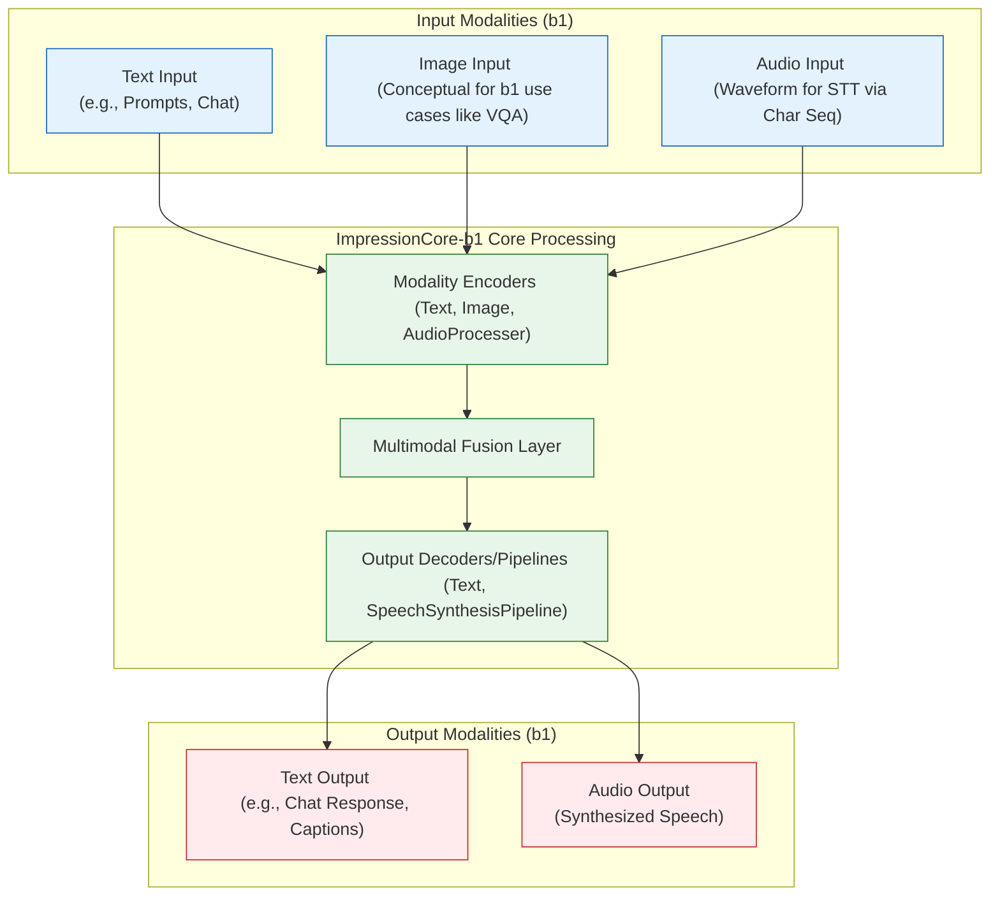

# Impressioncore Walkthrough

**Created:** May 23, 2025  
**Updated:** December 29, 2025  
**Author:** Kirk LaSalle; GitHub Copilot  
**Tags:** #ids #standardized_header #docs\user_guide\impressioncore_walkthrough.md #api #attention_mechanism #command_line #cuda #deployment #documentation #gpu_optimization #inference #memory_management #multimodal #pytorch #security #testing #tokenization #training #transformer #web_interface  
**Category:** User Documentation  
**Status:** Active
**IDS Integration:** This document is indexed and searchable via the ImpressionCore Documentation System (IDS).

---

# ImpressionCore-b1 Walkthrough: A Developer's Guide (Version 2025-05-23)

**Target Audience:** Developers and advanced users looking to understand, use, and potentially extend ImpressionCore-b1.

**Purpose:** This guide provides a start-to-finish walkthrough of setting up, understanding, and using the ImpressionCore-b1 framework, with a focus on its core multimodal capabilities and efficient operation on consumer hardware.

**Before You Begin:**

* Ensure you have reviewed the main [User Guide](../user_guide.md) for general project information.
* Familiarize yourself with the [ImpressionCore-b1 Modular Functional Architecture](../../developer/impressioncore_b1_architecture.md).

---

## 1. Introduction & Overview (🚧)

Welcome to ImpressionCore-b1! This version of ImpressionCore represents a significant step towards creating a brain-inspired, multimodal AI framework that is both powerful and efficient enough to run on consumer-grade hardware.

**Vision & Key Principles (b1 Focus):**

* **Brain-Inspired Architecture:** ImpressionCore-b1 is designed with a modular architecture reminiscent of specialized brain regions, enabling complex information processing. Key components include dedicated encoders for various data types, a multimodal fusion layer to integrate information, and decoders to generate diverse outputs. (See [Architecture Document](../../developer/impressioncore_b1_architecture.md) for details).
* **Multimodality:** The framework aims to seamlessly process and generate information across text, image, and audio modalities. For b1, this includes text processing, image understanding (conceptual), character-based audio processing for input, and speech synthesis for output.
* **Memory Efficiency for Consumer Hardware:** A core design goal is to operate effectively on hardware with limited VRAM (targeting NVIDIA GTX 1050 Ti 4GB). This is achieved through techniques like mixed-precision training (conceptual for b1 usage), gradient checkpointing (conceptual), and careful model/component selection.
* **Privacy by Design (Conceptual for b1):** While full Digital Identity Management is a future goal, b1 is built with privacy in mind, emphasizing local processing and user control over data where feasible. (See [Digital Identity Management Core](../../developer/impressioncore_b1_architecture.md#6-digital-identity-management-core-new-section---2025-05-23) in the architecture doc).
* **Lifelong Learning (Conceptual Foundation):** The architecture is designed to support future capabilities for continuous learning and adaptation, though active lifelong learning mechanisms are post-b1.

**High-Level Diagram (ImpressionCore-b1):**

### ImpressionCore-b1 Modular Functional Architecture

(This diagram is adapted from the ImpressionCore-b1 Modular Functional Architecture)*



This walkthrough will guide you through setting up your environment, preparing data for these modalities, understanding the b1 model components, and running inference for key b1 use cases.

---

## 2. System & Environment Setup (🚧)

Getting ImpressionCore-b1 running on your local machine requires a few prerequisites and setup steps. This section will guide you through the process.

**System Requirements (b1 Target):**

* **Operating System:** Windows 10/11 (primary development), Linux (expected to be compatible).
* **Python:** Python 3.10 or newer.
* **CPU:** Modern multi-core CPU (e.g., Intel Core i5/i7 4th gen or newer, AMD Ryzen equivalent).
* **RAM:** 16GB RAM minimum, 32GB recommended for smoother operation with multiple components.
* **GPU:** NVIDIA GPU with CUDA support is highly recommended for core functionalities.
  * **Target GPU for b1:** NVIDIA GeForce GTX 1050 Ti (4GB VRAM).
  * Other NVIDIA GPUs with >= 4GB VRAM should work (e.g., RTX series, other GTX series).
  * Performance will vary based on GPU capabilities.
* **Storage:** ~20-50GB free disk space for the repository, dependencies, and potential model downloads.

**Installation Steps:**

1. **Prerequisites:**
   * **Git:** Ensure Git is installed. ([https://git-scm.com/downloads](https://git-scm.com/downloads))
   * **Python:** Install Python 3.10+ if not already present. Add Python to your system PATH. ([https://www.python.org/downloads/](https://www.python.org/downloads/))
   * **NVIDIA CUDA Toolkit & cuDNN:** If you have an NVIDIA GPU, install the appropriate CUDA Toolkit version compatible with PyTorch (see PyTorch website for current recommendations) and the corresponding cuDNN library. This is crucial for GPU acceleration.
     * CUDA Toolkit Archive: [https://developer.nvidia.com/cuda-toolkit-archive](https://developer.nvidia.com/cuda-toolkit-archive)
     * cuDNN Archive: [https://developer.nvidia.com/rdp/cudnn-archive](https://developer.nvidia.com/rdp/cudnn-archive)

2. **Clone the Repository:**

   Open your terminal or command prompt and navigate to the directory where you want to clone ImpressionCore.

   ```bash
   git clone <repository_url> # Replace <repository_url> with the actual URL
   cd impressioncore
   ```

3. **Set up Python Virtual Environment (Recommended):**

   It's highly recommended to use a virtual environment to manage project dependencies.

   ```bash
   python -m venv .venv

   # Activate the virtual environment

   # Windows (bash/Git Bash)

   source .venv/Scripts/activate

   # Windows (Command Prompt)

   # .venv\Scripts\activate.bat

   # Linux/macOS

   # source .venv/bin/activate

   ```

4. **Install Dependencies:**

   Install the required Python packages using the `requirements.txt` file.

   ```bash
   pip install -r requirements.txt
   ```

   *Note: This may take some time as it will download and install PyTorch and other large libraries.*

**GPU Setup & Memory Optimization Strategies (b1 Context):**

* **PyTorch with CUDA:** The `requirements.txt` should install a version of PyTorch that supports your CUDA version (if installed correctly). You can verify this in Python:

  ```python
  import torch
  print(f"PyTorch version: {torch.__version__}")
  print(f"CUDA available: {torch.cuda.is_available()}")
  if torch.cuda.is_available():
      print(f"CUDA version: {torch.version.cuda}")
      print(f"Current GPU: {torch.cuda.get_device_name(torch.cuda.current_device())}")
  ```

  Verify the installation:

   ```bash
   python -c "import torch; print(torch.__version__)"
   python -c "import torchvision; print(torchvision.__version__)"
   python -c "import torchaudio; print(torchaudio.__version__)"
   ```

   You should see the versions of PyTorch, TorchVision, and TorchAudio printed without errors.

* **Memory Optimization (Conceptual for b1 Usage):**

  ImpressionCore-b1 is designed with memory efficiency in mind. While deep configuration of these is more for developers of the core framework, users should be aware of the concepts:

  * **Mixed Precision:** Some models/pipelines might internally leverage mixed precision (e.g., FP16) to reduce memory footprint and speed up computation on compatible GPUs. This is generally handled by the framework.
  * **Component Selection:** For b1, using the recommended components (e.g., specific Hugging Face models for TTS that are known to be relatively lightweight) is key to staying within memory limits.
  * **Avoid Running Too Many Components Simultaneously:** Be mindful of how many complex pipelines you are trying to run at the exact same time, especially on 4GB VRAM.

**Environment Verification (`getting_started.py`):**

After installation, run the `getting_started.py` script to perform a basic environment check and ensure key components can be loaded:

```bash
python getting_started.py
```

This script will output information about your setup and indicate if any common issues are detected. Review its output carefully.

**Troubleshooting & Diagnostics:**

* **`memlog` Directory:** ImpressionCore often logs important events, errors, and status updates to files within the `src/memlog/` directory. If you encounter issues, check the latest logs there for more detailed error messages.
* **Troubleshooting Guide:** For common issues and solutions, please refer to the [Troubleshooting Guide](./troubleshooting.md) (🚧 To be created/enhanced).

## 3. Data Preparation (Multimodal Focus)

Effective data preparation is crucial for training robust and accurate multimodal AI models like ImpressionCore. The quality, diversity, and format of your input data directly influence the model's learning capabilities and performance. This section outlines the general principles and steps for preparing your data for ImpressionCore, with a particular focus on the multimodal capabilities targeted in the b1 milestone (text, image, audio).

### 3.1. Overview of Data Preparation

Data preparation in ImpressionCore involves several key stages:

1. **Data Collection**: Gathering raw data from various sources. This could include text documents, image datasets, audio recordings, etc.
2. **Data Cleaning**: Identifying and correcting errors, inconsistencies, or noise in the raw data. This might involve removing duplicates, handling missing values, or normalizing formats.
3. **Preprocessing**: Transforming raw data into a suitable format for model ingestion. This is modality-specific:
    * **Text**: Cleaning text, sentence segmentation, removing special characters, etc.
    * **Image**: Resizing, normalization, augmentation (e.g., rotations, flips), converting to a consistent format (e.g., RGB).
    * **Audio**: Resampling to a common frequency, noise reduction, converting to a standard format (e.g., WAV), feature extraction (e.g., MFCCs, spectrograms).
4. **Data Structuring & Alignment**: Organizing the preprocessed data and, for multimodal datasets, ensuring that different modalities corresponding to the same conceptual entity are correctly linked or aligned. For example, an image and its textual description.
5. **Dataset Creation**: Splitting data into training, validation, and test sets.

ImpressionCore typically expects raw data to be organized in a `data/raw` directory and processed/prepared data to be stored in a `data/processed` directory within your project structure.

### 3.2. Supported Data Types (b1 Focus)

The ImpressionCore-b1 milestone primarily focuses on:

* **Text**: Plain text files (.txt), structured text (JSON, CSV where text fields are primary).
* **Images**: Common image formats like JPEG (.jpg, .jpeg), PNG (.png).
* **Audio**: Common audio formats like WAV (.wav), MP3 (.mp3).

While the framework is designed for future extensibility to other modalities like video, the initial walkthrough and core b1 tools are centered on these three.

### 3.3. Key Components and Scripts

ImpressionCore provides several components and example scripts to aid in data preparation:

* **Modality-Specific Processors**:
  * `src/preprocessing/text_processor.py` (and similar for image/audio, e.g., `src/preprocessing/image_processor.py`, `src/preprocessing/audio_processor.py`): These modules contain classes and functions for handling the preprocessing steps specific to each modality.
* **Multimodal Aligner**:
  * `src/preprocessing/multimodal_aligner.py` or `src/data/preprocessing/multimodal.py`: Contains the `MultimodalAligner` class, which is responsible for taking processed data from different modalities and preparing it for input into a multimodal model. This might involve creating unified data structures or ensuring features are compatible.
* **Example Preparation Script**:
  * `src/examples/prepare_training_data.py`: This script provides a practical example of how to take raw multimodal data, process it, and prepare it into a dataset format suitable for training ImpressionCore models. It often demonstrates how to use the modality-specific processors and the aligner.
* **Dataset Loaders**:
  * `src/training/datasets.py` or `src/data/datasets/`: These files define PyTorch `Dataset` classes (e.g., `MultimodalDataset`) that handle loading the preprocessed and aligned data during model training.

### 3.4. General Workflow for Data Preparation

1. **Organize Raw Data**:
    * Place your raw text, image, and audio files in appropriate subdirectories within `data/raw/`. For example:

        ```text
        data/
        └── raw/
            ├── text/
            │   ├── doc1.txt
            │   └── report.json
            ├── images/
            │   ├── image1.jpg
            │   └── photoA.png
            └── audio/
                ├── recording1.wav
                └── speech_segment.mp3
        ```

    * If your data is multimodal (e.g., images with corresponding text descriptions), ensure you have a way to link them, often through naming conventions or manifest files (e.g., a JSON file listing image paths and their associated text).

2. **Adapt or Use Preparation Scripts**:
    * Review `src/examples/prepare_training_data.py`. You may need to adapt this script or create a new one based on its principles to suit your specific dataset structure and preprocessing needs.
    * The script will typically iterate through your raw data, apply the necessary cleaning and preprocessing steps using the modality-specific processors, and then use the `MultimodalAligner` if you are preparing data for a multimodal model.

3. **Define Preprocessing Parameters**:
    * Configure parameters such as image size, audio sample rate, text cleaning rules, etc., as required by your model and the processors.

4. **Run the Preparation Script**:
    * Execute your script to process the raw data. The output should be saved in the `data/processed/` directory, often in a format that can be easily loaded by the `Dataset` classes (e.g., serialized tensors, structured files like HDF5, or manifest files pointing to processed items).

5. **Verify Processed Data**:
    * Before starting a training run, it's good practice to inspect a few samples from your processed dataset to ensure the transformations were applied correctly and the data is as expected.

### 3.5. Example: Preparing a Simple Multimodal Dataset

Let's assume you have a dataset of images and corresponding textual captions.

1. **Raw Data Structure**:

    ```text
    data/
    └── raw/
        ├── my_dataset_images/
        │   ├── 001.jpg
        │   ├── 002.jpg
        │   └── ...
        └── my_dataset_captions.json
            {
                "001.jpg": "A photo of a cat sitting on a mat.",
                "002.jpg": "A landscape view of mountains at sunset.",
                ...
            }
    ```

2. **Conceptual Preparation Steps (to be implemented in a script)**:
    * Read `my_dataset_captions.json`.
    * For each entry:
        * Load the image (e.g., `001.jpg`).
        * Preprocess the image using `ImageProcessor` (resize, normalize, etc.).
        * Preprocess the caption text using `TextProcessor` (clean, tokenize).
        * Store the processed image and text features, maintaining their link.
    * Save the processed data (e.g., as individual files or a combined dataset file) in `data/processed/my_prepared_dataset/`.

This section provides a high-level guide. For detailed implementation, refer to the specific processor and aligner modules in the `src` directory and the example scripts. The `docs/developer/impressioncore_b1_multimodal_io.md` document also offers more architectural details on how multimodal data flows through the system.

Next, we will cover tokenization and embedding, which are critical follow-up steps to data preparation.

---

## 4. Tokenization & Embedding (Multimodal Focus) (🚧)

Once your data is preprocessed, the next critical steps are tokenization (for text and potentially other modalities) and embedding. These processes convert your prepared data into numerical representations that the ImpressionCore models can understand and learn from.

### 4.1. What are Tokenization and Embedding?

* **Tokenization**:
  * **Text**: The process of breaking down a stream of text into smaller units called tokens. These tokens can be words, sub-words (e.g., using Byte Pair Encoding - BPE, WordPiece), or characters. The choice of tokenization strategy impacts vocabulary size and the model\\'s ability to handle out-of-vocabulary words.
  * **Audio**: For certain audio processing approaches (especially those treating audio as a sequence, like some Speech-to-Text models), tokenization might involve segmenting the audio signal or its feature representation (e.g., phonemes, character sequences from a preliminary ASR).
  * **Image**: While traditional "tokenization" isn\\'t directly applied to images in the same way as text, techniques like patch-based processing (e.g., in Vision Transformers - ViT) can be seen as a form of dividing the image into "tokens" or segments.

* **Embedding**:
  * The process of mapping discrete tokens (like words or image patches) or continuous features (like audio spectrograms) into dense vector representations. These vectors capture semantic meaning and relationships, such that similar tokens/features have similar vector representations in the embedding space.
  * **Text Embeddings**: Word embeddings (e.g., Word2Vec, GloVe, FastText) or contextual embeddings (from transformers like BERT, RoBERTa) represent words/tokens as dense vectors.
  * **Image Embeddings**: Convolutional Neural Networks (CNNs) or Vision Transformers (ViTs) are used to extract feature vectors (embeddings) from images or image patches.
  * **Audio Embeddings**: Models like Wav2Vec 2.0, HuBERT, or custom CNN/RNN architectures can generate embeddings from raw audio or audio features like MFCCs or spectrograms.

### 4.2. Tokenization & Embedding in ImpressionCore-b1

ImpressionCore-b1 leverages established techniques and provides components for handling tokenization and embedding for its target modalities.

**Key Components & Files:**

* `src/tokenization/`: This directory houses tokenizer configurations and potentially custom tokenizer logic.
  * `text_tokenizer.py`: Likely contains or interfaces with Hugging Face `AutoTokenizer` or similar for text.
  * `audio_char_tokenizer.py`: For character-based tokenization of transcribed audio or direct audio-to-character models.
* `src/models/embeddings/`: Contains embedding layer definitions or interfaces.
  * `text_embedding_layer.py`: Wrapper or implementation for text embedding layers.
  * `image_embedding_model.py`: Could be a ViT patch embedding layer or a CNN feature extractor.
  * `audio_embedding_model.py`: For generating embeddings from audio data.
* `src/models/architectures/b1_multimodal_transformer.py` (or similar): The core model architecture will define how these embeddings are consumed and fused.
* Configuration files (e.g., in `configs/` or `src/core/config/`): Specify tokenizer names (e.g., from Hugging Face Hub), embedding dimensions, and other related hyperparameters.

**Workflow:**

1. **Vocabulary Creation/Loading (Primarily Text):**
   * For text, a vocabulary is either pre-defined (e.g., using a pre-trained tokenizer from Hugging Face) or built from the training corpus.
   * ImpressionCore-b1 typically relies on pre-trained tokenizers for common languages to leverage their extensive vocabularies.
   * Special tokens (e.g., `[PAD]`, `[UNK]`, `[CLS]`, `[SEP]`, `[BOS]`, `[EOS]`) are crucial and are usually part of pre-trained tokenizers. Ensure they are correctly handled.

2. **Text Tokenization:**
   * Input text is processed by the chosen tokenizer (e.g., `BertTokenizerFast`).
   * This converts sentences into sequences of token IDs.
   * Attention masks and token type IDs might also be generated, depending on the model architecture.
   * **Example (Conceptual):**

     ```python

     # from transformers import AutoTokenizer

     # tokenizer = AutoTokenizer.from_pretrained("bert-base-uncased") # Or a path to local tokenizer config

     # text = "Hello, ImpressionCore!"

     # inputs = tokenizer(text, return_tensors="pt", padding=True, truncation=True)

     # token_ids = inputs["input_ids"]

     ```

     *Refer to `src/tokenization/text_tokenizer.py` for actual implementation.*

3. **Image "Tokenization" / Feature Extraction:**
   * For ViT-like models: Images are divided into fixed-size patches. Each patch is linearly projected into an embedding. A special `[CLS]` token embedding might be prepended. Positional embeddings are added to retain spatial information.
   * For CNN-based models: The image is passed through a pre-trained CNN (e.g., ResNet), and the output feature map from one of the later layers serves as the image embedding.
   * **Example (Conceptual for ViT patch embedding):**

     ```python

     # from src/models.embeddings.image_embedding_model import ImagePatchEmbedder # Hypothetical

     # image_processor = ... # Loads and preprocesses image to tensor

     # image_tensor = image_processor(raw_image)

     # patch_embedder = ImagePatchEmbedder(img_size=224, patch_size=16, embed_dim=768)

     # image_embeddings = patch_embedder(image_tensor) # Output: [batch_size, num_patches, embed_dim]

     ```

4. **Audio Tokenization/Feature Extraction & Embedding:**
   * **Character-based (for b1 STT/TTS):** Audio might be transcribed to characters, which are then tokenized and embedded like text. Or, an end-to-end model might directly map audio features to character embeddings.
   * **Feature-based:** Raw audio is converted into spectrograms or MFCCs. These features can then be fed into an audio embedding model (e.g., a CNN or a transformer encoder like Wav2Vec2).
   * **Example (Conceptual for feature-based):**

     ```python

     # from src.preprocessing.audio_processor import AudioFeatureExtractor # Hypothetical

     # from src.models.embeddings.audio_embedding_model import AudioEmbeddingModel # Hypothetical

     # audio_file = "path/to/audio.wav"

     # feature_extractor = AudioFeatureExtractor(sample_rate=16000, n_mfcc=40)

     # audio_features = feature_extractor(audio_file) # e.g., MFCCs

     # audio_embedder = AudioEmbeddingModel(input_features=40, embed_dim=768)

     # audio_embeddings = audio_embedder(audio_features)

     ```

5. **Embedding Layers:**
   * Once token IDs (for text) or processed features (for image/audio) are obtained, they are passed through embedding layers.
   * These layers are typically look-up tables (for token IDs) or neural network layers (e.g., linear projections for image patches, CNN/Transformer layers for audio features) that map the input to dense vectors of a fixed `embed_dim`.
   * The `embed_dim` is often consistent across modalities in multimodal architectures to facilitate fusion.

### 4.3. Multimodal Alignment & Special Tokens

* **Alignment:** In multimodal models, it\\'s crucial that embeddings from different modalities are projected into a comparable semantic space. This might involve specific training objectives (e.g., contrastive learning) or architectural choices (e.g., cross-attention mechanisms).
* **Special Tokens for Modalities:** Sometimes, special tokens are added to the input sequence to indicate the type or boundaries of different modalities. For example: `[IMG_START] ...image_embeddings... [IMG_END] [TXT_START] ...text_embeddings... [TXT_END]`. The exact strategy depends on the model architecture.
* **Positional Embeddings:** For sequence data (text, audio sequences, sequences of image patches), positional embeddings are added to the token/patch embeddings to provide the model with information about the order of elements.

### 4.4. Practical Considerations for b1

* **Pre-trained Models:** ImpressionCore-b1 heavily relies on pre-trained models for tokenization (e.g., Hugging Face tokenizers) and initial embeddings (e.g., weights from pre-trained ViT, BERT, or Wav2Vec2). This saves significant training time and resources.
* **Configuration:** Check the model configuration files (e.g., `configs/impressioncore_b1_arch.yaml`) to see which specific tokenizers and embedding models are being used for each modality.
* **Memory:** Embedding layers, especially for large vocabularies or high dimensions, can consume significant memory. The choice of `embed_dim` and vocabulary size is balanced against hardware constraints.

This section provides a conceptual overview. The actual implementation details can be found by examining the relevant source code files in `src/tokenization/`, `src/models/embeddings/`, and the core model architecture definitions. The next section will delve into the model definition itself.

---

## 5. Model Definition (ImpressionCore-b1) (🚧)

This section outlines the ImpressionCore-b1 model architecture, focusing on its key components and how they interact to process multimodal data and generate outputs. The b1 architecture is designed to be modular and memory-efficient, enabling it to run on consumer-grade hardware.

Refer to the main architecture document for a more detailed diagram and component breakdown: `docs/developer/impressioncore_b1_architecture.md`.

### 5.1. Core Architectural Principles (b1)

* **Modularity**: The model is composed of distinct modules for encoding different modalities, fusing them, and decoding outputs. This allows for easier development, testing, and potential future upgrades.
* **Multimodal Fusion**: A central fusion layer is responsible for integrating information from text, image, and audio encoders.
* **Efficiency**: Techniques like using pre-trained components, considering mixed precision (conceptual for b1 usage), and potentially gradient checkpointing (conceptual) are employed to manage VRAM usage.
* **Task-Specific Heads**: The core fused representation can be fed into different output heads for various tasks (e.g., text generation, speech synthesis).

### 5.2. Key Components of ImpressionCore-b1

The primary components of the ImpressionCore-b1 model include:

1. **Modality Encoders**:
    * **Text Encoder**: Typically a transformer-based model (e.g., leveraging components from Hugging Face Transformers like BERT or a custom lightweight transformer) responsible for converting input text tokens into contextual embeddings. See `src/models/architectures/impressioncore_b1.py` and potentially `src/modules/attention/multimodal_example.py` for related examples.
    * **Image Encoder**: Can be a Vision Transformer (ViT) variant or a CNN-based model (e.g., ResNet features) that processes image patches or whole images into embedding sequences. The `ImagePatchEmbedder` concept from Section 4 is relevant here.
    * **Audio Processor/Encoder**: For b1, this often involves processing audio into a character sequence (via an ASR component or direct audio-to-char model) which is then treated similarly to text, or extracting features like MFCCs/spectrograms that are fed into a dedicated audio embedding model. See `src/preprocessing/audio_processor.py` and `src/models/embeddings/audio_embedding_model.py` (conceptual paths).

2. **Multimodal Fusion Layer**:
    * This is a critical component that takes the embeddings from the individual modality encoders and combines them into a unified multimodal representation.
    * Strategies for fusion can range from simple concatenation followed by linear layers or a few transformer layers, to more complex cross-attention mechanisms that allow modalities to inform each other\\\'s representations directly.
    * The goal is to create a rich, context-aware representation that captures information from all active input modalities.
    * Refer to `src/data/preprocessing/cross_modal_attention.py` (specifically the `MultimodalFusion` class) and `src/models/architectures/impressioncore_b1.py` for fusion logic.

3. **Core Transformer/Processing Backbone (Conceptual)**:
    * After fusion, the combined multimodal embeddings may be processed further by a series of transformer layers or a similar sequence processing model. This allows for deeper integration and reasoning across modalities.
    * For b1, this backbone might be relatively shallow to conserve resources, or it might be integrated within the fusion layer itself.

4. **Mixture of Experts (MoE) Framework (Conceptual/Placeholder for b1)**:
    * The architecture includes a placeholder for a Mixture of Experts (MoE) framework. In a full implementation, this would allow the model to dynamically route inputs to specialized "expert" sub-networks, improving efficiency and performance.
    * For b1, this might be a simplified version or a structural placeholder for future development. See `src/models/architectures/impressioncore_b1.py` for `moe_forward` and related stubs.

5. **Output Decoders/Pipelines**:
    * **Text Decoder**: For tasks like generating textual descriptions, answering questions, or continuing a chat, a text decoder (often a transformer-based language model head) takes the fused representation and generates output text token by token.
    * **Speech Synthesis Pipeline**: For generating audio output, the fused representation (or a derived textual representation) is passed to a speech synthesis pipeline. In b1, this often involves a Text-to-Speech (TTS) model that converts text (potentially generated by a text decoder) into an audio waveform. See `src/inference/pipelines/speech_synthesis_pipeline.py`.
    * Other task-specific heads could be added as needed.

### 5.3. Data Flow within the Model

1. **Input**: Raw text, image, and/or audio data is provided.
2. **Preprocessing & Tokenization/Embedding (Covered in Sections 3 & 4)**: Data is cleaned, preprocessed, tokenized, and converted into initial embeddings by their respective modality-specific components.
3. **Encoding**: These initial embeddings are passed through the dedicated Text, Image, and Audio Encoders to produce higher-level feature representations for each modality.
4. **Fusion**: The encoded representations from each active modality are fed into the Multimodal Fusion Layer. This layer outputs a single, unified multimodal embedding sequence.
5. **Core Processing (Optional/Integrated)**: The fused representation might be routed through an MoE system.
6. **Output Generation**: The final multimodal representation is passed to one or more output decoders/pipelines based on the desired output type:
    * For text output, a text decoder generates a sequence of text tokens.
    * For speech output, a speech synthesis pipeline converts text (either from input or generated by a text decoder) into an audio waveform.

### 5.4. Configuration and Key Files

* **Model Architecture Definition**: The core Python code defining the model structure is primarily in `src/models/architectures/impressioncore_b1.py`. This file includes the functional definitions for building and running the forward pass of the b1 model.
* **Component Implementations**: Individual components like specific attention mechanisms, embedding layers, or processors can be found in subdirectories like `src/modules/`, `src/models/embeddings/`, `src/data/preprocessing/`.
* **Configuration Files**: Model hyperparameters, choices of pre-trained components, embedding dimensions, layer counts, etc., are typically defined in YAML configuration files located in the `configs/` directory (e.g., `configs/impressioncore_b1_arch.yaml`). These files are loaded at runtime to construct the model with the specified settings.

**Example from `impressioncore_b1.py` (Conceptual Structure):**

```python
# Simplified conceptual structure from src/models/architectures/impressioncore_b1.py

# --- Modular encoders and fusion ---
def encode_text(text_tensor, text_encoder_module): # ...
def encode_image(image_tensor, image_encoder_module): # ...
def multimodal_fusion(text_features, image_features, fusion_module): # ...

# --- Dynamic MoE routing ---
def moe_forward(fused_features, expert_modules, gating_module): # ...

# --- Main model factory ---
def build_impressioncore_b1(config):
    # Initialize text_encoder, image_encoder, fusion_layer, experts, gate, head based on config
    modules = {
        "text_encoder": ..., 
        "image_encoder": ..., 
        "fusion_layer": ..., 
        "experts": ..., 
        "gate": ..., 
        "head": ... # Output head for a specific task
    }
    return modules

# --- Forward pass (functional, memory-optimized) ---
def impressioncore_b1_forward(text_input, image_input, model_modules, use_mixed_precision=False):
    text_feat = encode_text(text_input, model_modules["text_encoder"])
    image_feat = encode_image(image_input, model_modules["image_encoder"])
    
    fused_representation = multimodal_fusion(text_feat, image_feat, model_modules["fusion_layer"])
    
    # Potentially pass through MoE
    # moe_output = moe_forward(fused_representation, model_modules["experts"], model_modules["gate"])
    
    # Pass to output head
    # output = model_modules["head"](moe_output) # or directly from fused_representation for simpler b1
    output = model_modules["head"](fused_representation) # Simplified for b1
    return output

```

This simplified view illustrates how different parts of the model are defined and connected. The actual implementation involves more detailed handling of tensors, masks, and specific layer configurations based on the project\'s needs and the `configs`.

Understanding these components and their interactions is key to working with ImpressionCore-b1, whether for running inference, fine-tuning, or extending its capabilities.

---

## 6. Training & Fine-Tuning (b1 Focus) (🚧)

**Note on b1 Scope:** Comprehensive end-user model training and fine-tuning from scratch are considered post-b1 features for ImpressionCore. The b1 milestone primarily focuses on leveraging pre-trained or pre-fine-tuned components to achieve its core functionalities. This section provides context for developers on the training aspects of these components and the available tools, rather than a guide for end-users to initiate new large-scale training runs.

ImpressionCore-b1 is built upon the principle of using existing, well-understood models and adapting them where necessary. However, the framework includes scripts and configurations that were used for its development or can be used for more advanced experimentation by developers.

### 6.1. Philosophy: Pre-trained Components and Adaptation

For the b1 release, to ensure functionality on consumer hardware (target: GTX 1050 Ti 4GB) and to provide a stable baseline, ImpressionCore-b1 relies heavily on:

* **Pre-trained Models**: Utilizing models from hubs like Hugging Face for tasks such as text tokenization, foundational text embeddings, and potentially aspects of image or audio processing.
* **Pre-fine-tuned Components**: Specific components, like those for speech synthesis, might be pre-fine-tuned versions of existing models, optimized for quality and efficiency within the ImpressionCore ecosystem.
* **Developer-Focused Training Scripts**: The `src/training/` and `src/examples/` directories contain scripts that developers can use to understand how components might have been trained, or for experimenting with smaller-scale training or fine-tuning tasks.

End-users of ImpressionCore-b1 are expected to use the system with its provided model configurations. Developers looking to extend or deeply modify the system can explore the training infrastructure.

### 6.2. Key Training-Related Scripts and Directories

Developers interested in the training aspects of ImpressionCore should familiarize themselves with the following:

* **`src/training/`**: This is the primary directory for training-related code.
  * `train_tokenizer.py`: As detailed in `src/training/README.md`, this script can be used for training text and image tokenizers. While b1 might use pre-trained tokenizers, this script shows the capability.
  * `core_trainer.py`: Contains core logic for model training loops, optimizer setup, and schedulers.
  * `training_manager.py`: Manages training processes, potentially handling distributed training setups (though distributed training is likely post-b1 for general use).
  * `training_utils.py`: Utility functions supporting training, such as data loading, metric calculation, and checkpointing.
  * `config/`: Contains configuration files for specific training runs, like `latent_diffusion_config.py` or `tokenizer_training.py`.

* **`src/examples/`**: Contains various example scripts, some of which involve training.
  * `train_documents.py`, `mixed_corpus_training.py`, `train_small.py`, `train_model.py`: These scripts demonstrate how to train models on different types of text data or with specific configurations. Refer to `src/examples/README.md` for more details.
  * `tokenizer_training_example.py`: Shows how to use the tokenizer training script.
  * `continuous_training.py`, `continuous_training_with_shared_memory.py`: Illustrate concepts for ongoing model adaptation, which are more advanced and likely foundational for post-b1 lifelong learning features.

* **`configs/` (Root Level)**:
  * `impressioncore_b1_train.yaml` (if present, or similar): Would define parameters for training runs related to the b1 model, such as learning rates, batch sizes, and dataset paths.

* **`src/core/`**:
  * `config.py`: Handles loading and managing configurations, including training parameters.
  * `optimizer.py`: May contain custom optimizer implementations or configurations.

### 6.3. Training Data for b1 Components

While users won\'t typically train b1 components from scratch, understanding the data used is helpful:

* **Text**: Components processing text likely used large, diverse text corpora. Examples in `src/data/datasets/training/` (e.g., `sample_training.txt`, `sample_text.txt`) give a glimpse into the type of data.
* **Multimodal Data**: For any multimodal fine-tuning, aligned datasets of text, images, and/or audio would have been necessary. The data preparation steps (Section 3) are crucial here.

### 6.4. Fine-Tuning Conceptual Approach (Developer Context)

If a developer were to fine-tune a component for ImpressionCore-b1 (e.g., adapting a pre-trained language model for a specific style or task relevant to b1), the general process would involve:

1. **Preparing a Dataset**: A smaller, task-specific dataset.
2. **Loading a Pre-trained Model**: Using the ImpressionCore architecture to load the base model weights.
3. **Configuring the Trainer**: Setting up the optimizer, learning rate scheduler, and other training parameters, likely through a YAML configuration file and `core_trainer.py`.
4. **Running the Training Script**: Using one of the example training scripts as a template or `core_trainer.py` directly.
5. **Evaluating and Saving Checkpoints**: Monitoring performance on a validation set and saving model checkpoints.

**Memory Considerations for Fine-Tuning:**\
Fine-tuning, even on a smaller scale, can be memory-intensive. Techniques like LoRA (Low-Rank Adaptation), gradient accumulation, and mixed-precision training would be important considerations for developers attempting this on hardware like the GTX 1050 Ti. The `src/core/optimizer.py` and `src/training/training_utils.py` might contain elements related to these techniques.

### 6.5. Checkpoint Management (Developer Context)

* **Saving**: Training scripts typically save model checkpoints (the model\'s learned weights and optimizer state) periodically to a specified directory (e.g., `src/models/checkpoints/` or a path defined in the training configuration).
* **Loading**: For inference or resuming training, these checkpoints are loaded back into the model architecture.
* The `src/training/training_manager.py` or `core_trainer.py` would handle the logic for saving and loading checkpoints.

For ImpressionCore-b1 users, the relevant "checkpoints" are the pre-configured model weights that are loaded when the system starts or a specific pipeline is initialized.

In summary, while ImpressionCore-b1 users will primarily interact with pre-built model functionalities, the underlying framework contains the necessary tools and scripts that enabled the training and fine-tuning of its components. Developers can explore these for deeper understanding or future extensions beyond the b1 scope.

---

## 7. Memory & Performance Optimization (b1 Focus) (🚧)

One of the primary design goals for ImpressionCore-b1 is to operate efficiently on consumer-grade hardware, specifically targeting systems with limited VRAM like the NVIDIA GTX 1050 Ti (4GB). This section outlines the key strategies and components involved in achieving this goal.

**Core Principles for b1 Memory Efficiency:**

*   **Right-Sized Models:** Selecting or designing model components (encoders, decoders, attention mechanisms) that are powerful enough for their task but not unnecessarily large.
*   **Pre-trained Weights Wisely:** Leveraging pre-trained models (e.g., from Hugging Face) but being mindful of their size and choosing variants suitable for the target hardware.
*   **Efficient Data Loading:** Optimizing how data is loaded and batched to prevent bottlenecks and excessive memory use during training (less focus for b1 inference) and inference.
*   **PyTorch Best Practices:** Utilizing PyTorch features like `torch.no_grad()` during inference, careful tensor manipulation to avoid unnecessary copies, and appropriate device placement (`.to(device)`).
*   **Modular Loading (Conceptual):** While the b1 model is generally loaded as a whole, future optimizations might involve loading only strictly necessary components for a given task.

**Key Files and Components for Memory/Performance:**

*   `src/core/utils/memory_utils.py` or `src/utils/memory_profiler.py` / `src/utils/memory_optimization.py`: These files likely contain utility functions for:
    *   Monitoring memory usage (GPU and CPU).
    *   Profiling memory consumption of different components.
    *   Implementing basic memory-saving techniques.
*   `src/memory_manager/manager.py` or `src/tools/memory_manager.py`: This suggests a more dedicated component for managing memory, potentially including:
    *   Strategies for dynamic tensor allocation/deallocation (advanced).
    *   Caching mechanisms for frequently used data or model parts.
*   Model Definitions (e.g., `src/models/architectures/impressioncore_b1.py`, `src/models/layers/memory_efficient_attention.py`):
    *   The architecture itself is designed with efficiency in mind.
    *   Custom layers like `MemoryEfficientAttention` (if it exists or similar concepts are embedded) would directly contribute to reducing VRAM footprint during the model's forward pass.
*   Configuration Files (e.g., `configs/impressioncore_b1_arch.yaml`):
    *   These files specify parameters like embedding dimensions, number of layers, and hidden sizes. These choices directly impact model size and memory requirements.
    *   May include flags to enable/disable certain memory-intensive features or switch to more lightweight model variants.
*   Training Scripts (e.g., `src/training/train_impressioncore_optimized.py`, `src/examples/continuous_training_with_shared_memory.py`):
    *   While b1 is inference-focused for users, the training scripts reveal techniques used during development to manage memory, such as:
        *   **Gradient Accumulation:** Simulating larger batch sizes without increasing memory, by accumulating gradients over several smaller batches before updating model weights.
        *   **Gradient Checkpointing (Activation Checkpointing):** A technique where instead of storing all intermediate activations for backpropagation (which consumes a lot of memory), some are recomputed during the backward pass. This trades computation for memory. PyTorch supports this (`torch.utils.checkpoint`).
        *   **Mixed-Precision Training (e.g., using `torch.cuda.amp`):** Performing parts of the computation in lower precision (e.g., FP16) to reduce memory and speed up training on compatible GPUs. This is also relevant for inference.
*   Inference Pipelines (e.g., `src/inference/pipeline.py`):
    *   Should implement `torch.no_grad()` context.
    *   May include options for loading models in FP16 or other optimized formats if available.

**Specific Techniques and Considerations for b1:**

1.  **Model Quantization (Post-Training Quantization - PTQ / Quantization-Aware Training - QAT) - *Priority Next Step*:**
    *   **Concept:** Reducing the precision of model weights and/or activations from 32-bit floating point (FP32) to lower precision formats like 8-bit integer (INT8) or FP16.
    *   **Benefit:** Significantly reduces model size, VRAM usage, and can speed up inference, often with minimal loss in accuracy.
    *   **Status for b1:** This is identified as a high-priority next step in `docs/process/implementation_status.md`. While full implementation might be post-b1, the groundwork and investigation are key for b1's hardware target.
    *   **Tools:** PyTorch provides tools for both PTQ (`torch.quantization.quantize_dynamic`, `torch.quantization.prepare`, `torch.quantization.convert`) and QAT (`torch.quantization.prepare_qat`, `torch.quantization.convert`).

2.  **Efficient Attention Mechanisms:**
    *   Standard attention mechanisms in transformers can be memory-intensive (O(N^2) complexity with sequence length N).
    *   ImpressionCore might use or plan to use more efficient attention variants (e.g., sparse attention, linear attention, or approximations like those in Linformer, Performer) if very long sequences become a bottleneck. The presence of `src/models/layers/memory_efficient_attention.py` would confirm this.

3.  **Careful Component Selection:**
    *   For tasks like TTS, choosing a base model and vocoder that are known for their efficiency is crucial. The `PhonemeToSoundSynthesizer` likely wraps such choices.

4.  **Batch Size for Inference:**
    *   For inference on memory-constrained devices, always use a batch size of 1 unless specifically testing batch processing capabilities with ample memory.

**Walkthrough - How to Verify/Observe:**

*   Check Model Configurations: Examine `configs/impressioncore_b1_arch.yaml` for model size parameters.
*   Review Inference Scripts: Ensure `torch.no_grad()` is used. Look for any device placement logic.
*   Run Basic Inference: Use tools like `nvidia-smi` (for NVIDIA GPUs) or task manager to observe VRAM and RAM usage when loading and running a pipeline (e.g., the `SpeechSynthesisPipeline`).
*   Explore Utility Scripts: If `memory_profiler.py` or similar exists, try running it or its functions to get more detailed breakdowns (developer-focused).

Achieving good performance on limited hardware is an ongoing process of optimization. ImpressionCore-b1 aims to establish a strong foundation by making conscious design choices and prioritizing techniques like quantization.

---

<a name="section-9"></a>

## 9. Knowledge Store (UKS) - Conceptual for b1 🚧

The Unified Knowledge Store (UKS) is envisioned as a sophisticated component for managing and accessing the vast amounts of information the ImpressionCore model will process and learn. For the **b1 milestone**, the UKS is primarily a **conceptual placeholder**, outlining its intended role and future integration points rather than a fully implemented system.

**Conceptual Goals for UKS (Post-b1):**

*   **Unified Storage:** To store diverse data types (text, processed image features, audio metadata, etc.) in an interconnected manner.
*   **Efficient Retrieval:** To allow rapid and context-aware querying of stored knowledge.
*   **Dynamic Updates:** To enable the model to continuously learn and update the knowledge store.
*   **Reasoning Base:** To provide a foundation for more advanced reasoning capabilities by linking disparate pieces of information.
*   **Integration with Brainsim:** The UKS will be a core component of the Brainsim module, providing the structured knowledge necessary for simulating cognitive processes.

**b1 Focus:**

*   **Defining Data Structures (Conceptual):** Initial thoughts on how different modalities might be represented and linked.
*   **API Endpoints (Placeholder):** Identifying potential API interactions for storing and retrieving knowledge, even if the backend is not yet built.
*   **Interaction with Rule Engine (Conceptual):** How the Rule Engine (see [Section 10](#section-10)) might query or interact with the UKS.

Currently, there isn't a dedicated `src/knowledge/uks.py` or similar. The ideas for UKS are more abstract at this stage, focusing on its architectural role within the broader ImpressionCore system and its tight coupling with the future Brainsim module. The `src/knowledge/rule_engine.py` might offer very early, indirect hints if it were to interact with a knowledge base, but the UKS itself is a forward-looking concept for b1.

Further details and the actual implementation of the UKS are planned for subsequent milestones, building upon the foundational architecture established in b1.

---

<a name="section-10"></a>

## 10. Rule Engine - Conceptual for b1 🚧

The Rule Engine is a conceptual component within ImpressionCore, particularly relevant to the **b1 milestone** in its planning and early architectural considerations. It's envisioned to work closely with the Unified Knowledge Store (UKS) and the Brainsim module to introduce a layer of explicit logic, constraints, and procedural knowledge into the system.

**Conceptual Role of the Rule Engine (Post-b1):**

*   **Constraint Management:** Enforcing predefined constraints or desired behaviors on the model's outputs or internal states. For example, ensuring generated text adheres to certain safety guidelines or factual consistencies based on the UKS.
*   **Custom Logic Execution:** Allowing the definition and execution of custom logic flows that can influence model behavior or data processing. This could involve conditional actions based on input data, model state, or information retrieved from the UKS.
*   **Procedural Knowledge:** Representing and applying procedural knowledge – "how-to" information – that might be more efficiently handled by explicit rules rather than learned implicitly by the neural model alone.
*   **Interaction with UKS:** The Rule Engine would heavily rely on the UKS to fetch facts, context, and existing knowledge to inform its decisions.
*   **Integration with Brainsim:** Within the Brainsim cognitive architecture, the Rule Engine could simulate more explicit, symbolic reasoning processes, complementing the subsymbolic processing of the core neural networks.
*   **Modulating Model Pipeline:** The Rule Engine could act at various stages of the model pipeline, from pre-processing inputs to post-processing outputs, or even influencing intermediate generation steps.

**b1 Focus:**

*   **Architectural Placement:** Identifying where a Rule Engine would fit within the overall ImpressionCore architecture, particularly its interfaces with the core model, the UKS (conceptual), and Brainsim (conceptual).
*   **Defining Rule Types (High-Level):** Brainstorming the kinds of rules that might be useful (e.g., filtering rules, transformation rules, validation rules).
*   **Interaction Scenarios:** Conceptualizing how rules might be triggered and how they would affect the flow of data and decision-making.

**Current Status & Potential Starting Points (Conceptual for b1):**

*   While a dedicated `src/knowledge/rule_engine.py` or `src/brainsim/rule_engine.py` might exist or be planned, its implementation for b1 is expected to be minimal and focused on defining interfaces or placeholder structures.
*   The file `src/knowledge/rule_engine.py` (if present and developed) would be the primary location for its logic.
*   Integration points would be considered within `src/core/brainsim_integration.py` or similar modules that orchestrate different cognitive components.
*   Test files like `src/tests/test_rules.py` would eventually be needed to validate its functionality.

For the b1 milestone, the Rule Engine is less about a working implementation and more about establishing its necessity and conceptual design within the ImpressionCore framework, ensuring that future development can seamlessly integrate this explicit logic layer. It's a key part of the long-term vision for a more controllable and interpretable AI.

---

<a name="section-11"></a>

## 11. Inheritance & Modularity (b1 Focus) ✅

ImpressionCore is designed with a strong emphasis on modularity and code reuse, even in its early b1 stage. While complex inheritance hierarchies might be less prevalent in a functional programming paradigm, the principles of breaking down complex systems into smaller, manageable, and reusable components are central.

**Core Principles:**

* **Single Responsibility Principle (SRP):** Each module, function, or component aims to have one primary responsibility. This makes them easier to understand, test, and maintain.
* **Clear Interfaces:** Modules interact through well-defined interfaces (e.g., function signatures, API contracts). This decouples components, allowing them to be developed and updated independently.
* **Configuration-Driven:** Many components are designed to be configurable (e.g., via YAML files in `configs/` or parameters passed during initialization). This allows for flexible adaptation without code changes.
* **Reusable Utilities:** Common functionalities (e.g., logging, file I/O, specific mathematical operations) are often encapsulated in utility modules (e.g., within `src/core/utils/`) for use across the system.

**Walkthrough - Identifying Modularity:**

1. **Directory Structure as a Guide:**
    * The `src/` directory itself is a primary example of modular design. Subdirectories like `src/core/`, `src/data/`, `src/models/`, `src/training/`, `src/inference/`, `src/brainsim/`, and `src/web/` clearly delineate major functional areas.
    * Refer to `docs/developer/impressioncore_b1_architecture.md` for a high-level overview of how these modules are intended to interact.
2. **Core Components (`src/core/`):**
    * **Configuration (`src/core/config/`):** Explore how configurations are loaded and made available to other modules. This promotes separation of configuration from application logic.
    * **Utilities (`src/core/utils/`):** Look for common helper functions. For example, a custom logging setup or data validation utilities. These are prime examples of reusable code.
    * **Custom Exceptions (`src/core/exceptions/`):** Centralizing custom exception types promotes consistent error handling.
3. **Model Architectures (`src/models/architectures/`):**
    * The `impressioncore_b1.py` model itself is a module.
    * Within it, or in `src/models/layers/` or `src/models/embeddings/`, you might find components (e.g., specific attention mechanisms, embedding layers) that could be reused in other models or experiments.
4. **Data Processing Pipelines (`src/data/preprocessing/` or `src/pipelines/`):**
    * Data loading, cleaning, and transformation steps are often broken into distinct functions or smaller modules. This allows for flexible pipeline construction. For example, a tokenization step might be a separate module used by multiple data preparation scripts.
5. **Training and Inference Logic:**
    * **Trainers (`src/training/trainers/`):** The training loop itself might be a generic component, configured for specific models and datasets.
    * **Inference Pipelines (`src/inference/pipelines/`):** Similar to training, inference pipelines often chain together reusable components for pre-processing, model prediction, and post-processing.
6. **Configuration Files (`configs/`):**
    * Files like `impressioncore_b1_arch.yaml` demonstrate how modular components (e.g., model layers, optimizer settings) can be defined and assembled through configuration, promoting reuse and experimentation.
7. **Functional Approach:**
    * The preference for functional programming encourages the creation of pure functions with clear inputs and outputs. These functions are inherently modular and reusable. Instead of inheriting methods from a base class, you might see functions that operate on data structures, with different functions providing specialized behaviors.

**Example of "Conceptual Inheritance" or Composition:**

While traditional class inheritance might be limited, you'll see patterns of composition:

* A higher-level module (e.g., a specific `Trainer` in `src/training/trainers/`) might *use* or *compose* several smaller, specialized modules (e.g., a model object from `src/models/architectures/`, a data loader from `src/data/datasets/`, an optimizer function).
* This is a form of "has-a" relationship rather than "is-a," which is common in functional and modular design.

**Key Takeaways for b1:**

* Modularity is achieved through clear separation of concerns, well-defined interfaces, and the creation of reusable components (often functions or small modules).
* The directory structure and configuration files provide strong clues about the system's modular architecture.
* Focus on how different parts of the system (e.g., data processing, model definition, training loop) are kept distinct yet can interact effectively.
* Look for utility functions and configurable components as key enablers of code reuse.

(As ImpressionCore evolves, more complex patterns of composition and potentially some targeted class-based inheritance for specific stateful components might emerge, but the b1 foundation emphasizes functional modularity.)

---

## 14. Security Considerations (b1 Focus)

Security is a foundational pillar of ImpressionCore, especially for the **b1 milestone** which establishes core functionalities. While full-scale security implementations will evolve, b1 focuses on establishing secure practices and a robust security mindset from the outset.

**Key Security Aspects for b1:**

1. **Secure Coding Practices:**
   * **Input Validation:** All external inputs (API calls, user-provided data, configuration files) are validated to prevent common vulnerabilities like injection attacks.
     * *Example:* Validating data types, lengths, and formats for API parameters in `src/web/routes.py`.
   * **Error Handling:** Implement robust error handling that avoids leaking sensitive information in error messages.
   * **Dependency Management:** Regularly scan and update dependencies to patch known vulnerabilities. `requirements.txt` and `model-requirements.txt` are actively managed.
   * **Principle of Least Privilege:** Components and modules are designed to operate with the minimum necessary permissions.

2. **Data Security (Conceptual for b1):**
   * While b1 doesn't handle extensive sensitive user data, the architecture anticipates future needs.
   * **Data at Rest:** Future considerations include encryption for any stored user data or model checkpoints containing sensitive information.
   * **Data in Transit:** APIs will eventually enforce HTTPS. For b1, internal data exchange security is noted.
   * **Configuration Security:** Sensitive configuration details (e.g., API keys, if any) should be managed via environment variables or secure configuration services, not hardcoded. See `src/core/config/` for configuration management.

3. **API Security (b1 Focus):**
   * **Authentication & Authorization (Conceptual):** The b1 milestone lays the groundwork for future authentication/authorization mechanisms. Initial API endpoints in `src/web/routes.py` are designed with extensibility for security layers.
   * **Rate Limiting (Conceptual):** Future implementation will consider rate limiting to prevent abuse of API resources.
   * **Input Sanitization:** As mentioned, inputs to API endpoints are validated.

4. **Model Security (b1 Focus):**
   * **Adversarial Attacks (Awareness):** While not a primary implementation focus for b1, the team is aware of potential adversarial attacks on ML models. Design choices aim for robustness where possible.
   * **Model Provenance:** Understanding the origin and training data of models is crucial. For b1, this is managed through clear documentation and versioning of models developed internally.

5. **Secure Development Lifecycle (SDL) Practices (b1 Focus):**
   * **Code Reviews:** All code contributions are subject to review, with a focus on security implications.
   * **Static Analysis (Future):** Future integration of static analysis security testing (SAST) tools is planned.
   * **Vulnerability Management (Conceptual):** Establishing a process for reporting and addressing security vulnerabilities.

**Relevant Files & Directories:**

* `src/core/security/`: Intended location for core security modules.
* `src/web/routes.py`: API endpoint definitions where input validation occurs.
* `src/core/config/`: Configuration management, important for handling sensitive settings securely.
* `docs/developer/api_contracts.md`: Defines expectations for API interactions, including security notes.
* `docs/Permanent_Active_Directives.txt`: Emphasizes user safety and privacy.

The b1 milestone focuses on building a secure foundation by embedding security into the design and development process. This proactive approach aims to minimize vulnerabilities as ImpressionCore evolves.

---

## 15. Development Roadmap (b1 Context)

The ImpressionCore-b1 milestone represents the foundational step towards realizing the project's vision. This section outlines the key development priorities and the general roadmap context relevant to b1, drawing from `docs/process/next_steps.md` and the overall project goals.

**Core Goals of ImpressionCore-b1:**

1. **Establish Core Framework:** Implement the basic architecture, including essential modules for multimodal processing, data handling, and model interaction.
2. **Multimodal Input/Output (Proof of Concept):** Demonstrate the ability to process at least two modalities (e.g., text and basic sound/phoneme representation) and generate a coherent output.
3. **Memory Optimization (Initial Implementation):** Integrate and test initial memory-saving techniques (e.g., efficient data structures, model loading strategies) to ensure viability on target hardware (NVIDIA GTX 1050 Ti 4GB).
4. **Basic Model Integration:** Successfully load and run a pre-trained or a simplified custom model within the framework.
5. **API Endpoints (Core Functionality):** Expose core functionalities through a basic set of API endpoints.
6. **Documentation Foundation:** Create essential developer and user documentation for the b1 feature set.
7. **Secure Identity Management (Conceptual Foundation):** Lay the conceptual groundwork and initial core logic for secure digital identity, even if full implementation is beyond b1.

**Key Development Areas & Priorities for b1 (Derived from `docs/process/next_steps.md` and `walkthrough_plan.md`):**

* **Architecture & Core Modules (`src/core/`, `src/models/architectures/impressioncore_b1.py`):**
  * Solidify the b1 architecture.
  * Implement and test core utility functions.
  * Refine the main model definition (`impressioncore_b1.py`).
* **Data Processing & Pipelines (`src/data/`, `src/pipelines/`):**
  * Implement robust data loading and preprocessing for initial modalities.
  * Develop and test the initial multimodal processing pipeline.
  * Focus on phoneme embedding and basic sound processing integration.
* **Memory Management (`src/memory_manager/`, `src/core/utils/memory_utils.py`):**
  * Implement and validate initial memory optimization techniques.
  * Profile memory usage during key operations.
  * Begin work on dynamic precision switching/quantization (PTQ/QAT) as a high-priority next step.
* **Inference (`src/inference/`):**
  * Develop the inference pipeline for the b1 model.
  * Ensure efficient model loading and execution.
* **API Development (`src/web/`, `src/api/`):**
  * Implement core API endpoints for b1 functionalities (e.g., text input, basic multimodal processing request).
  * Define clear API contracts (`docs/developer/api_contracts.md`).
* **Training & Fine-Tuning (Conceptual & Setup for b1):**
  * Prepare training scripts and configurations (`src/training/`, `configs/impressioncore_b1_train.yaml`).
  * Focus on adapting existing models or training simple components for b1. Full-scale training is a post-b1 goal.
* **UKS - Unified Knowledge Store (Conceptual for b1):**
  * Define the conceptual framework for UKS.
  * Explore basic data structures and interaction patterns within `src/brainsim/memory/`.
* **Documentation (`docs/`):**
  * **User Guide:** Complete this `impressioncore_walkthrough.md`.
  * **Developer Docs:** Update architecture, API, and component documentation.
  * Maintain `DOCUMENTATION_INDEX.md` and `implementation_status.md`.
* **Testing (`src/tests/`):**
  * Develop unit and integration tests for all b1 components.
  * Focus on validating memory constraints and core functionality.
  * Implement the "Integration Test Plan (Memory Constraints Validation)".
* **Security (`src/security/`, `src/core/security/`):**
  * Implement foundational secure coding practices.
  * Lay groundwork for secure identity management.

**Beyond b1 (Brief Outlook from `docs/process/next_steps.md`):**

* **Enhanced Multimodality:** Incorporate more complex modalities (images, full audio, video).
* **Advanced Memory Optimization:** Implement more sophisticated techniques like advanced quantization, pruning, and custom memory allocators.
* **Full UKS Implementation:** Develop a fully functional Unified Knowledge Store.
* **Sophisticated AI Models:** Train larger, more capable models or integrate advanced pre-trained models.
* **User Interface (Web):** Develop a more comprehensive user interface.
* **Distributed Computing:** Explore options for scaling and distributed training/inference.
* **Full Secure Identity Management:** Complete the implementation of the secure digital identity system.

The b1 milestone is critical for validating the core concepts of ImpressionCore and paving the way for these more advanced features. Progress is tracked in `docs/process/implementation_status.md`.

---

## 16. UI/UX Considerations (b1 - CLI/API Focus)

The b1 milestone of ImpressionCore emphasizes a functional and developer-centric approach, laying the groundwork for more advanced UI/UX in the future. While there are no comprehensive UI components in b1, several key considerations and foundational elements are established:

1. **CLI (Command-Line Interface):**
    * The primary interaction with ImpressionCore-b1 is through a CLI, where users can execute scripts for different functionalities (e.g., data preparation, model inference).
    * CLI commands are designed to be intuitive, with `--help` options available for guidance.
    * Example: `python src/inference/pipelines/speech_synthesis_pipeline.py --help`

2. **API Development (Foundational in b1):**
    * Basic API endpoints are exposed for core functionalities, primarily focused on multimodal processing and inference.
    * API routes are defined in `src/web/routes.py`, with clear input validation and error handling.
    * Future milestones will expand API capabilities and integrate authentication/authorization.

3. **Documentation and Examples:**
    * Comprehensive documentation is provided, including this walkthrough, API contracts, and developer guides.
    * Example scripts and usage patterns are available in `src/examples/` to demonstrate common tasks and integrations.

4. **Configuration-Driven Behavior:**
    * Many aspects of the system's behavior, including model parameters, data paths, and processing options, are controlled through configuration files (YAML).
    * This allows users to customize their setup without modifying code, promoting easier experimentation and adaptation.

5. **Modular and Reusable Components:**
    * The system is built from modular components that can be reused or replaced as needed. This is evident in the way models, tokenizers, and processors are handled.
    * Users can extend or modify individual components (e.g., using a different model architecture) by changing configuration or swapping out modules.

6. **Security Considerations:**
    * Even at this early stage, security is embedded in the design, with attention to secure coding practices, data handling, and API security.

7. **Future UI/UX Enhancements (Post-b1 Outlook):**
    * A more sophisticated web-based UI for easier interaction and configuration.
    * Enhanced API features, including rate limiting, caching, and advanced authentication mechanisms.
    * Integration with front-end frameworks or tools to provide a more seamless user experience.

---

## 17. UI Enhancements & Implementation Details (b1 Web UI) (🚧)

For the ImpressionCore-b1 milestone, the user interface (UI) is primarily developer-focused, providing foundational elements for interaction, monitoring, and specific tasks. While a comprehensive, polished end-user graphical interface is a post-b1 goal, b1 establishes key web components and CLI tools.

**General Approach for b1 UI:**

* **Developer-Centric Tools:** Many interactions are facilitated through scripts, APIs, and basic web pages designed for developers to test, monitor, and manage components.
* **Foundational Web Elements:** A Flask-based web server (`src/web/server.py`) provides the backbone for serving HTML templates and handling API requests. Basic routing is in place (`src/web/routes/views.py`).
* **CLI Capabilities:** Some functionalities, like the example chat interface, are demonstrated via Command-Line Interfaces.
* **Real-time Updates:** WebSockets are utilized in some web tools for real-time status monitoring (e.g., `src/user_data/web/websockets.py`, `src/web/static/js/main.js`).

**Key UI Features & Components (b1 Focus):**

1. **Core Web Server & Routing:**
    * **Implementation:** A Flask server (`src/web/server.py`) serves basic HTML templates (e.g., `src/web/templates/introduction.html`).
    * **Routes:** Core routes are defined in `src/web/routes/views.py` and `src/user_data/web/routes/views.py` (ensure consistency or clarify primary), including placeholders or basic implementations for `/home`, `/dashboard`, `/settings`, and `/training/dashboard`.
    * **Status:** Foundational, 🚧 In Progress for full feature set.

2. **JavaScript-Driven Web Tools:**
    * **Tokenizer Status & Testing:** Interactive elements for checking tokenizer status and performing quick tests (see `src/user_data/web/static/js/tokenizer.js` and `src/web/static/js/tokenizer.js`).
    * **Tokenizer Training Interface:** A web interface for initiating and monitoring tokenizer training processes (see `src/user_data/web/static/js/tokenizer_training.js`). `docs/process/next_steps.md` indicates "Tokenizer training interface (Structure complete, backend logic completed)".
    * **Deployment Monitoring:** Tools for monitoring the status of model deployments (see `src/user_data/web/static/js/deployment.js` and `src/web/static/js/deployment.js`).
    * **Server Status & Control:** Interface elements for viewing server status and potentially basic controls (see `src/user_data/web/static/js/serving.js`).
    * **Status:** Specific tools are 🚧 In Progress, with some (like tokenizer training) more developed.

3. **CLI Chat Interface (Conceptual Example):**
    * **Implementation:** `src/examples/chat_example.py` demonstrates a text-based chat interaction using `rich.console`.
    * **Purpose for b1:** Serves as a proof-of-concept for interactive conversational use cases, though not a web UI.
    * **Status:** ✅ Available as a CLI example.

4. **Abstract Interfaces (Status from `implementation_status.md`):**
    * The `docs/process/implementation_status.md` document lists the following interfaces as ✅ Complete:
        * Text Generation Interface (Parameter controls, Memory monitoring, Generation settings)
        * Image Generation Interface (Prompt controls, Size/step settings, Negative prompts)
        * Combined Interface (Tabbed navigation, Hardware monitoring, Shared configuration)
    * **Clarification Needed:** It needs to be clarified if these refer to specific web UI pages/components or more abstract API/backend interfaces. If web UIs, their locations and access methods should be documented in `docs/web_interface.md`.

5. **Model Building Walkthrough Interface:**
    * `docs/process/next_steps.md` mentions "[x] Model building walkthrough interface (basic structure)" as complete under "Web Interface (Foundation)". This likely refers to the structure provided by templates like `introduction.html` and the overall navigation flow of this walkthrough document itself when viewed or served via the web server.
    * **Status:** ✅ Basic structure in place.

**Implementation Status for b1 UI:**

The overall UI for ImpressionCore-b1 is **foundational and actively developing (🚧)**. Key infrastructure (web server, routing, WebSockets) is in place. Specific tools, particularly for tokenizer training and status monitoring, have dedicated JavaScript frontends. However, a unified, comprehensive graphical user interface for all b1 functionalities is not the primary focus of this milestone. Interaction often relies on a combination of these web tools, direct script execution, and API calls.

**Documentation (`docs/web_interface.md`):**

The `walkthrough_plan.md` references `docs/web_interface.md` as the central document for UI details. **Currently, this file does not exist.**

* **Recommendation:** Create `d:\\Projects\\impressioncore\\docs\\developer\\web_interface.md` (or `docs/user_guide/web_interface.md` depending on target audience) to consolidate all information regarding the web UI components, including:
  * Overview of the web architecture.
  * Details on accessing and using the JavaScript-driven tools (tokenizer, deployment, serving).
  * Screenshots or diagrams of available interfaces.
  * Explanation of the "Text Generation Interface," "Image Generation Interface," and "Combined Interface" if they have web frontends.
  * Links to relevant HTML templates and static asset directories (e.g., `src/web/templates/`, `src/web/static/js/`, `src/user_data/web/static/`).

This central document would greatly aid developers and users in navigating and utilizing the available UI features for ImpressionCore-b1.

---

## 8. Inference & Deployment (b1 Use Cases) (🚧)

ImpressionCore-b1 provides foundational capabilities for running inference on multimodal tasks. This section explains how to load b1 components, run inference for key use cases, and discusses performance considerations for the target hardware (NVIDIA GTX 1050 Ti 4GB). Full-fledged deployment options are planned for post-b1 milestones.

### 8.1. Loading b1 Components

ImpressionCore-b1 components are typically loaded and configured based on settings in YAML files (e.g., `configs/impressioncore_b1_arch.yaml`) and through Python scripts that instantiate the necessary classes.

*   **Model Loading:** The core model (`src/models/architectures/impressioncore_b1.py`) and its constituent parts (encoders, fusion layer, decoders) are initialized with pre-trained weights or configurations suitable for b1 tasks.
*   **Pipeline Initialization:** Specific inference pipelines, such as the `SpeechSynthesisPipeline` (`src/inference/pipelines/speech_synthesis_pipeline.py`) or the more general `MultiModalProcessor` (`src/pipelines/multimodal.py`), handle the orchestration of model loading, data preprocessing, inference execution, and postprocessing.

   ```python

   # Conceptual example of loading a pipeline

   # from src.inference.pipelines.speech_synthesis_pipeline import SpeechSynthesisPipeline
